# Advanced Tutorial — PBMC 8k Clustering & Subclustering (R Seurat vs Shanuz)

A more complex companion to the [PBMC 3k tutorial](README.md). It reproduces the
standard Seurat guided-clustering workflow on a **larger** 10x Genomics dataset
(~8,400 PBMCs, GRCh38) and then adds the advanced **subclustering** step the
Seurat reference papers use to resolve fine-grained immune states: the T/NK
lymphoid compartment is isolated and re-analysed from scratch to separate naive
CD4, memory CD4, CD8, and NK populations that the global clustering merges.

> **Dataset:** 8k PBMCs from a Healthy Donor — 10x Genomics (GRCh38, v2)
> **Python:** Shanuz v0.2.0
> **Methodology:** Satija et al. 2015 · Butler et al. 2018 · Hao et al. 2021

> **Scope note.** This tutorial stays within the single-assay **RNA
> graph-based clustering** workflow these papers established — which is exactly
> where subclustering shines. SCTransform and multimodal WNN are covered in the
> other tutorials; anchor-based (CCA/RPCA) integration is not yet ported.

> **About the figures.** Shanuz is a Python port, so **every figure below is
> rendered by Shanuz** (`generate_advanced_plots.py`); the R snippets show the
> equivalent Seurat API. Figures span the full width and are *not* a
> left-R / right-Python comparison.

Run everything with:

```bash
python tutorials/pbmc8k_subclustering_tutorial.py   # printed validation
python tutorials/generate_advanced_plots.py         # writes figures_advanced/
```

---

## Step 1 · Load Data & Create Object

<table>
<tr><th>R (Seurat)</th><th>Python (Shanuz)</th></tr>
<tr><td>

```r
library(Seurat)
pbmc.data <- Read10X("pbmc8k/filtered_gene_bc_matrices/GRCh38/")
pbmc <- CreateSeuratObject(
  counts = pbmc.data, project = "pbmc8k",
  min.cells = 3, min.features = 200
)
```

</td><td>

```python
from shanuz.datasets import pbmc8k
from shanuz.shanuz import create_shanuz_object

counts, genes, cells = pbmc8k()          # auto-downloads ~38 MB
pbmc = create_shanuz_object(
    counts=counts, project="pbmc8k",
    min_cells=3, min_features=200,
    feature_names=genes, cell_names=cells,
)
```

</td></tr>
</table>

---

## Step 2 · QC & Filtering

<table>
<tr><th>R (Seurat)</th><th>Python (Shanuz)</th></tr>
<tr><td>

```r
pbmc[["percent.mt"]] <- PercentageFeatureSet(pbmc, pattern = "^MT-")
VlnPlot(pbmc, c("nFeature_RNA","nCount_RNA","percent.mt"), ncol = 3)

pbmc <- subset(pbmc, subset =
  nFeature_RNA > 200 & nFeature_RNA < 2500 & percent.mt < 5)
```

</td><td>

```python
from shanuz.preprocessing import percentage_feature_set
from shanuz.plotting import vln_plot

percentage_feature_set(pbmc, pattern=r"^MT-", col_name="percent.mt")
vln_plot(pbmc, ["nFeature_RNA","nCount_RNA","percent.mt"], ncol=3)

md = pbmc.meta_data
keep = (md["nFeature_RNA"] > 200) & (md["nFeature_RNA"] < 2500) & (md["percent.mt"] < 5)
pbmc = pbmc.subset(cells=list(md.index[keep]))
# 8,381 → 7,475 cells
```

</td></tr>
<tr><td colspan="2">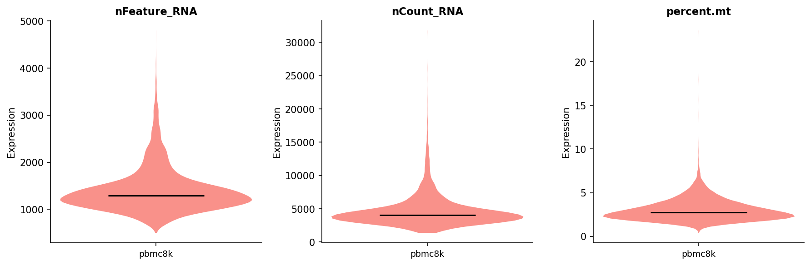</td></tr>
</table>

---

## Step 3 · Normalize → HVG → Scale → PCA

<table>
<tr><th>R (Seurat)</th><th>Python (Shanuz)</th></tr>
<tr><td>

```r
pbmc <- NormalizeData(pbmc)
pbmc <- FindVariableFeatures(pbmc, nfeatures = 2000)
pbmc <- ScaleData(pbmc, features = rownames(pbmc))
pbmc <- RunPCA(pbmc, npcs = 50)
ElbowPlot(pbmc, ndims = 30)
```

</td><td>

```python
from shanuz.preprocessing import normalize_data, find_variable_features, scale_data
from shanuz.reduction import run_pca
from shanuz.plotting import elbow_plot

normalize_data(pbmc)
find_variable_features(pbmc, selection_method="vst", nfeatures=2000)
scale_data(pbmc, features=pbmc.assays["RNA"]._all_feature_names)
run_pca(pbmc, n_pcs=50, features=pbmc.assays["RNA"].variable_features)
elbow_plot(pbmc, ndims=30)
```

</td></tr>
<tr><td colspan="2">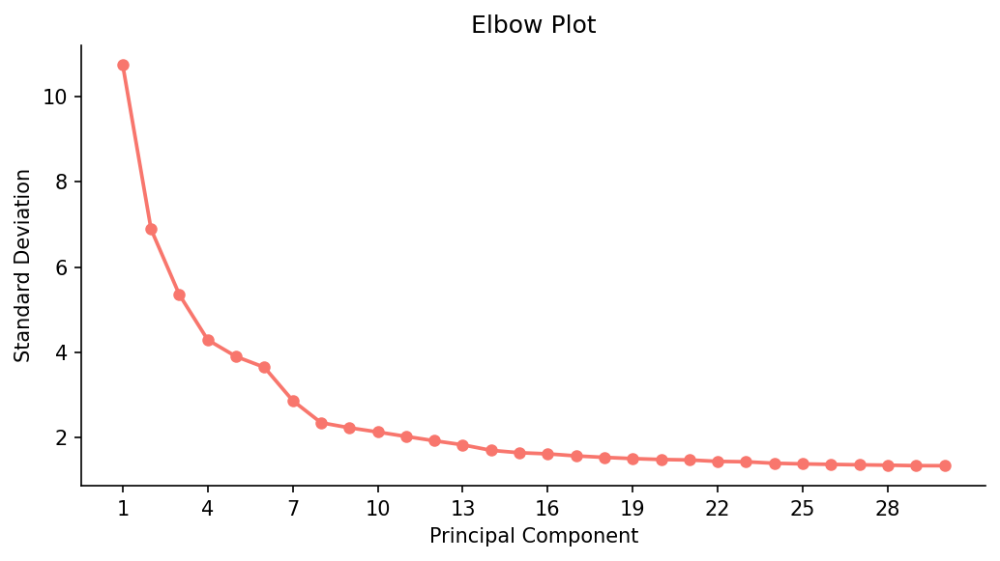</td></tr>
</table>

---

## Step 4 · Global Clustering & UMAP

<table>
<tr><th>R (Seurat)</th><th>Python (Shanuz)</th></tr>
<tr><td>

```r
pbmc <- FindNeighbors(pbmc, dims = 1:10)
pbmc <- FindClusters(pbmc, resolution = 0.5)   # 12 clusters
pbmc <- RunUMAP(pbmc, dims = 1:10)
DimPlot(pbmc, reduction = "umap", label = TRUE)
```

</td><td>

```python
from shanuz.neighbors import find_neighbors
from shanuz.clustering import find_clusters
from shanuz.umap import run_umap
from shanuz.plotting import dim_plot

find_neighbors(pbmc, dims=range(10), k_param=20)
find_clusters(pbmc, resolution=0.5, random_seed=0)   # 12 clusters
run_umap(pbmc, dims=range(10), seed=42)
dim_plot(pbmc, reduction="umap", group_by="seurat_clusters", label=True)
```

</td></tr>
<tr><td colspan="2">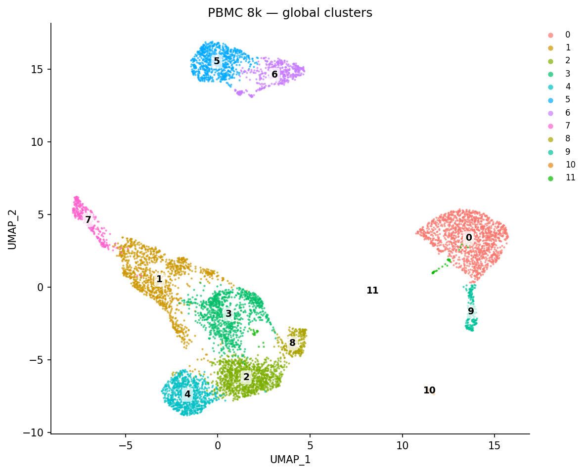</td></tr>
</table>

---

## Step 5 · Lineage Markers & Broad Annotation

Canonical lineage markers identify the major PBMC populations. Shanuz's
`annotate_clusters()` helper z-scores each marker across clusters and assigns
every cluster to its most-enriched lineage.

<table>
<tr><th>R (Seurat)</th><th>Python (Shanuz)</th></tr>
<tr><td>

```r
FeaturePlot(pbmc, c("CD3D","CD8A","IL7R","MS4A1",
                    "LYZ","FCGR3A","GNLY","FCER1A","PPBP"))

new.ids <- c("CD14+ Mono","CD4 T","CD8 T","CD4 T","CD8 T",
             "B","B","NK","CD4 T","FCGR3A+ Mono","DC","Platelet")
names(new.ids) <- levels(pbmc)
pbmc <- RenameIdents(pbmc, new.ids)
DimPlot(pbmc, label = TRUE)
```

</td><td>

```python
from shanuz.plotting import feature_plot
from tutorials.pbmc8k_subclustering_tutorial import annotate_clusters, BROAD_MARKERS

feature_plot(pbmc, ["CD3D","CD8A","IL7R","MS4A1",
                    "LYZ","FCGR3A","GNLY","FCER1A","PPBP"], ncol=3)

broad = annotate_clusters(pbmc, BROAD_MARKERS)
pbmc.stash_ident("global_clusters")
pbmc.rename_idents(broad)
dim_plot(pbmc, reduction="umap", label=True)
```

</td></tr>
<tr><td colspan="2"><em>Shanuz — lineage-marker FeaturePlots (<code>feature_plot</code>)</em><br>
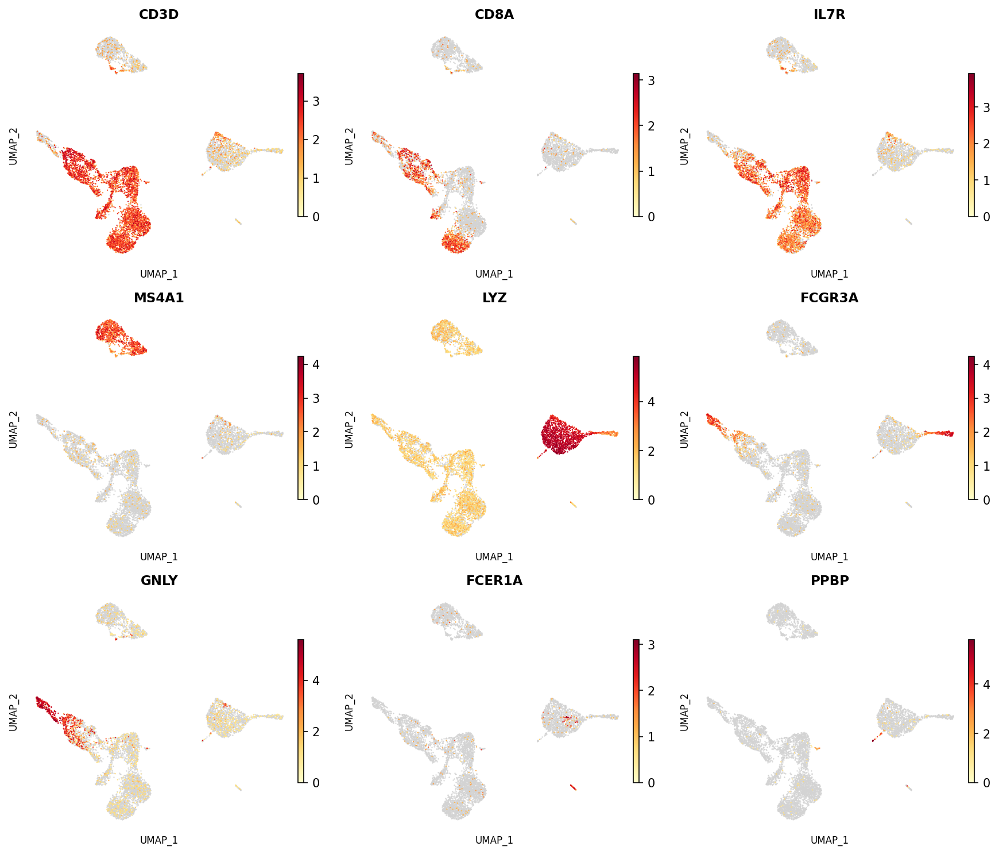</td></tr>
<tr><td colspan="2"><em>Shanuz — broad cell types on the global UMAP (<code>dim_plot</code>)</em><br>
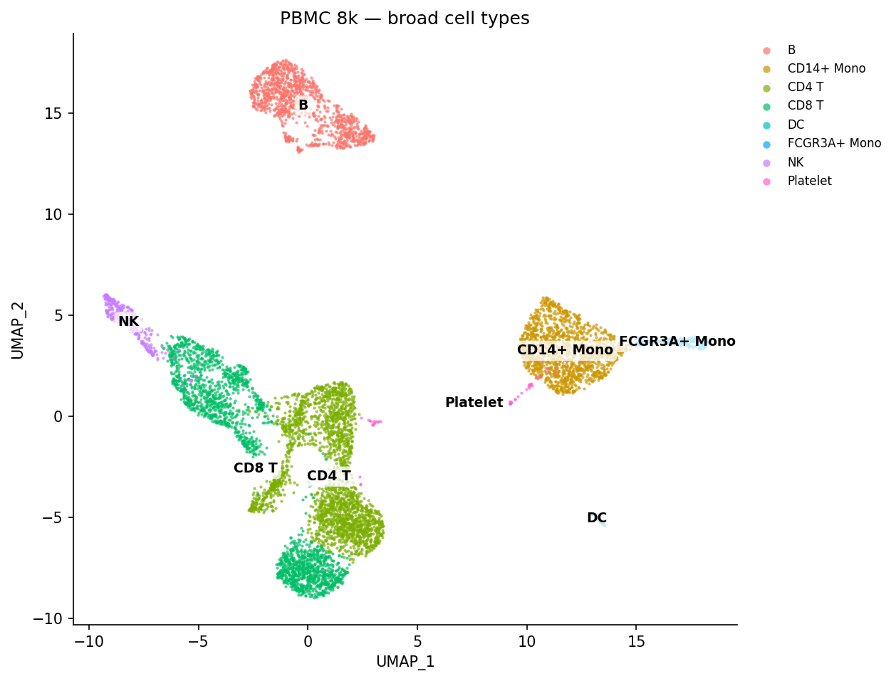</td></tr>
</table>

Top markers per cluster (DoHeatmap → `do_heatmap`):

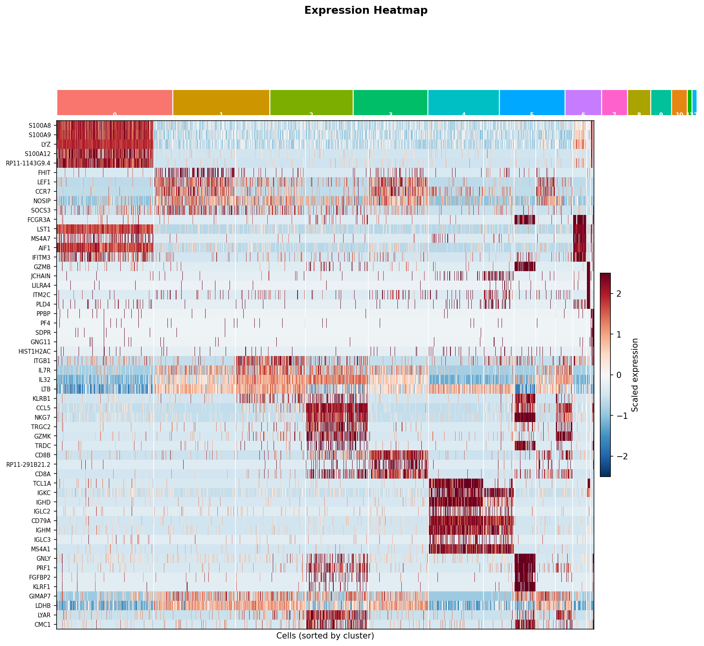

---

## Step 6 · Subcluster the T/NK Compartment  ⭐

This is the advanced step. The global clustering lumps several T-cell states
together. We **isolate the T/NK lineages and re-run the entire workflow** on just
those cells — recomputing variable genes, PCA, neighbours, clusters, and UMAP
within the compartment. This is the standard Seurat subclustering recipe.

<table>
<tr><th>R (Seurat)</th><th>Python (Shanuz)</th></tr>
<tr><td>

```r
tnk <- subset(pbmc, idents = c("CD4 T","CD8 T","NK"))

tnk <- FindVariableFeatures(tnk, nfeatures = 2000)
tnk <- ScaleData(tnk, features = rownames(tnk))
tnk <- RunPCA(tnk, npcs = 30)
tnk <- FindNeighbors(tnk, dims = 1:10)
tnk <- FindClusters(tnk, resolution = 0.6)
tnk <- RunUMAP(tnk, dims = 1:10)
DimPlot(tnk, label = TRUE)
```

</td><td>

```python
# cells in the T/NK lineages (from the broad annotation above)
gid = pbmc.meta_data["global_clusters"].astype(str).values
lymphoid = {c for c, lin in broad.items() if lin in {"CD4 T","CD8 T","NK"}}
tnk_cells = [c for c, g in zip(pbmc.cell_names(), gid) if g in lymphoid]

tnk = pbmc.subset(cells=tnk_cells)              # ~4,600 cells
# data layer already normalised → re-run from HVG onward
find_variable_features(tnk, selection_method="vst", nfeatures=2000)
scale_data(tnk, features=tnk.assays["RNA"]._all_feature_names)
run_pca(tnk, n_pcs=30, features=tnk.assays["RNA"].variable_features)
find_neighbors(tnk, dims=range(10), k_param=20)
find_clusters(tnk, resolution=0.6, random_seed=0)
run_umap(tnk, dims=range(10), seed=42)
dim_plot(tnk, reduction="umap", group_by="seurat_clusters", label=True)
```

</td></tr>
<tr><td colspan="2">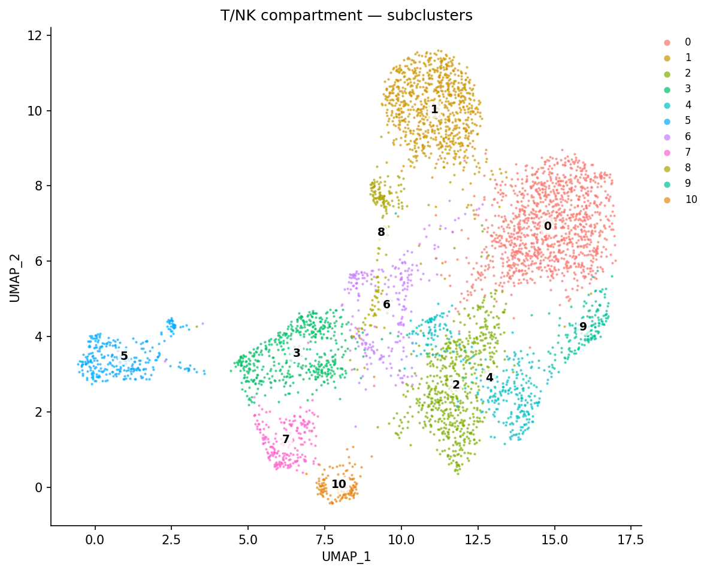</td></tr>
</table>

> The whole pipeline is wrapped in `run_pipeline()` /  `run_full()` in
> [pbmc8k_subclustering_tutorial.py](pbmc8k_subclustering_tutorial.py), so the
> subclustering is a single `pbmc.subset(...)` followed by the same calls.

---

## Step 7 · Annotate the Fine T/NK Subsets

Flat marker-argmax fails for fine T subsets (the high-magnitude naive markers
`CCR7`/`SELL` outscore the low-magnitude but definitive `CD8B`), so
`annotate_tnk_subsets()` gates in lineage-priority order — NK (CD3⁻, NKG7/GNLY⁺)
→ CD8/cytotoxic T (CD8A/B or a CD3⁺ NKG7/GZMK program, which also captures
MAIT/γδ T) → CD4 Naive (CCR7/SELL/LEF1) → CD4 Memory (IL7R/S100A4).

<table>
<tr><th>R (Seurat)</th><th>Python (Shanuz)</th></tr>
<tr><td>

```r
FeaturePlot(tnk, c("CCR7","SELL","IL7R","S100A4",
                   "CD8A","GZMK","GNLY","NKG7"))
VlnPlot(tnk, c("CCR7","S100A4","CD8A","GNLY"))

# manual annotation by canonical markers
tnk <- RenameIdents(tnk, sub.ids)
DimPlot(tnk, label = TRUE)
```

</td><td>

```python
from tutorials.pbmc8k_subclustering_tutorial import annotate_tnk_subsets

feature_plot(tnk, ["CCR7","SELL","IL7R","S100A4",
                   "CD8A","GZMK","GNLY","NKG7"], ncol=4)
vln_plot(tnk, ["CCR7","S100A4","CD8A","GNLY"], ncol=2)

sub_anno = annotate_tnk_subsets(tnk)
tnk.stash_ident("sub_clusters")
tnk.rename_idents(sub_anno)
dim_plot(tnk, reduction="umap", label=True)
```

</td></tr>
<tr><td colspan="2"><em>Shanuz — T/NK subset marker FeaturePlots (<code>feature_plot</code>)</em><br>
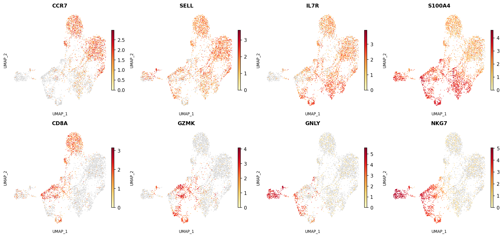</td></tr>
<tr><td colspan="2"><em>Shanuz — annotated T/NK subsets on the compartment UMAP (<code>dim_plot</code>)</em><br>
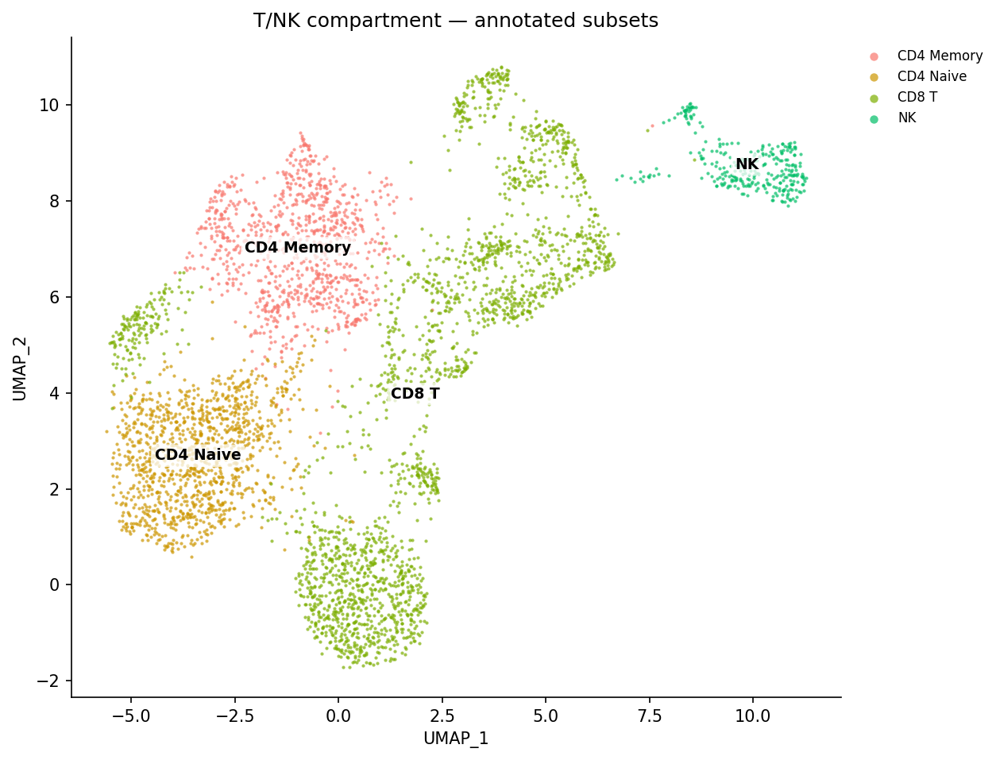</td></tr>
<tr><td colspan="2"><em>Shanuz — subset marker violins (<code>vln_plot</code>)</em><br>
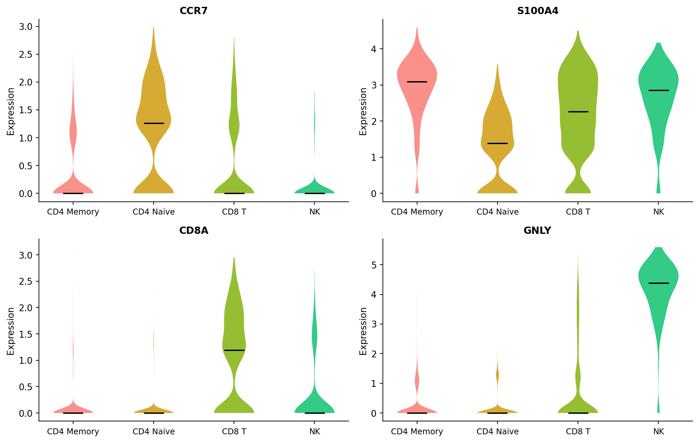</td></tr>
<tr><td colspan="2"><em>Shanuz — top subcluster markers heatmap (<code>do_heatmap</code>)</em><br>
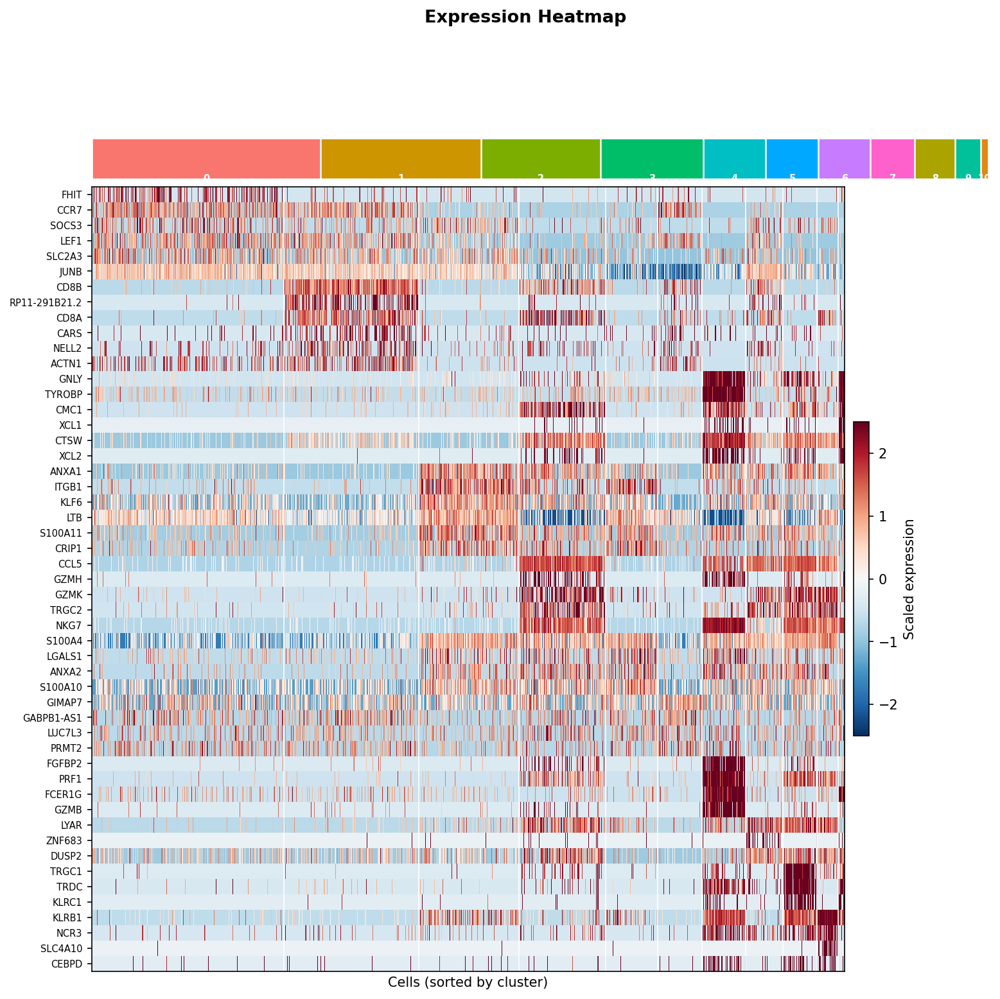</td></tr>
</table>

### What the subclustering reveals

Substructure that the 12 global clusters did **not** separate:

| Subset | Defining markers | Notes |
|--------|------------------|-------|
| **CD4 Naive**  | `CCR7`, `SELL`, `LEF1` (+ ribosomal) | quiescent helper T |
| **CD4 Memory** | `IL7R`, `S100A4`, `LTB` | activated/memory helper T |
| **CD8 T**      | `CD8A`, `CD8B`, `GZMK`, `CCL5` | naive + cytotoxic effector |
| **NK**         | `GNLY`, `NKG7`, `KLRD1`, `PRF1` | CD3-negative cytotoxic |

The CD8/cytotoxic group also resolves a `TRDC`/`TRGC1` **γδ-T** subcluster and a
`KLRB1`/`NCR3` **MAIT** subcluster — unconventional cytotoxic T cells that are
invisible at the global resolution.

---

## API Translation (additions beyond the PBMC 3k tutorial)

| Task | R (Seurat) | Python (Shanuz) |
|------|-----------|-----------------|
| Load PBMC 8k | `Read10X("…/GRCh38/")` | `pbmc8k()` |
| Subset a lineage | `subset(pbmc, idents = …)` | `pbmc.subset(cells = …)` |
| Stash current ids | `pbmc$old <- Idents(pbmc)` | `pbmc.stash_ident("old")` |
| Re-cluster subset | re-run `FindVariableFeatures…FindClusters` | re-run `find_variable_features…find_clusters` |

---

## References

> Satija R, Farrell JA, Gennert D, Schier AF, Regev A (2015).
> **Spatial reconstruction of single-cell gene expression data.**
> *Nature Biotechnology* 33, 495–502. https://doi.org/10.1038/nbt.3192

> Butler A, Hoffman P, Smibert P, Papalexi E, Satija R (2018).
> **Integrating single-cell transcriptomic data across different conditions,
> technologies, and species.** *Nature Biotechnology* 36, 411–420.
> https://doi.org/10.1038/nbt.4096

> Hao Y, Hao S, Andersen-Nissen E, et al. (2021).
> **Integrated analysis of multimodal single-cell data.**
> *Cell* 184, 3573–3587. https://doi.org/10.1016/j.cell.2021.04.048

> 10x Genomics (2017). *8k PBMCs from a Healthy Donor.*
> https://www.10xgenomics.com/datasets/8-k-pbm-cs-from-a-healthy-donor-2-standard-2-1-0
