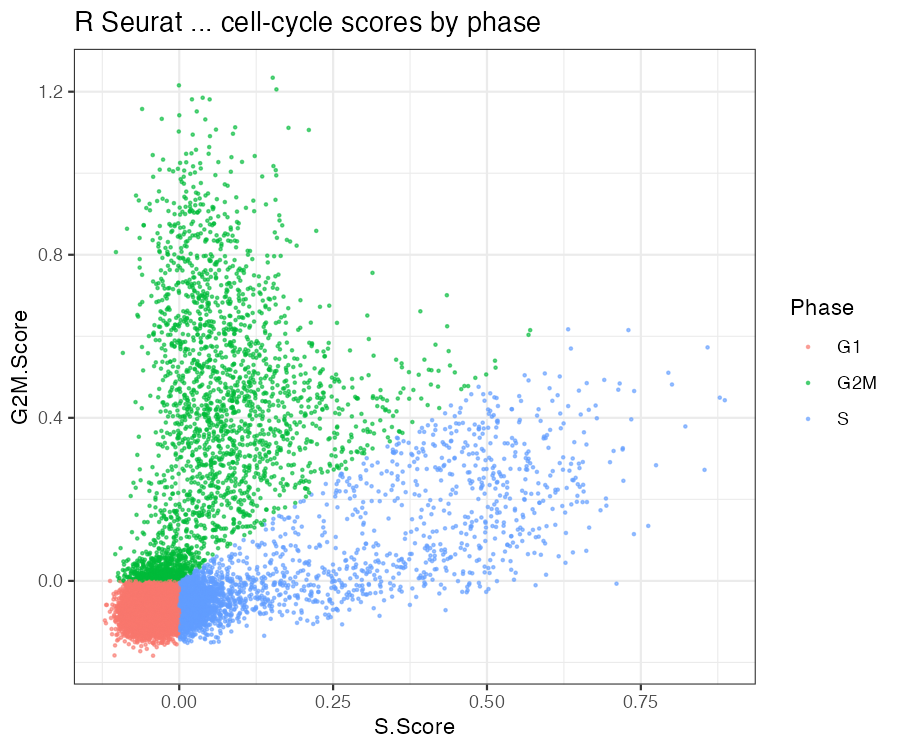
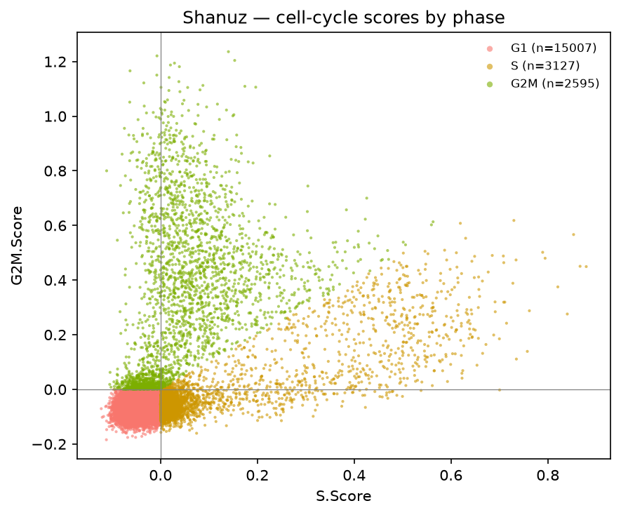
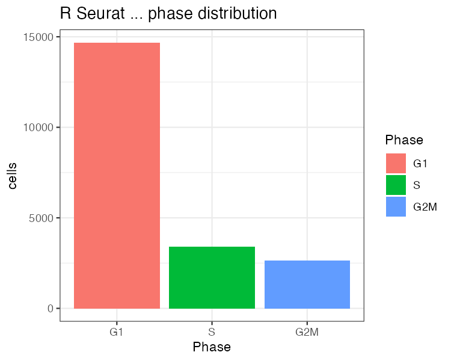
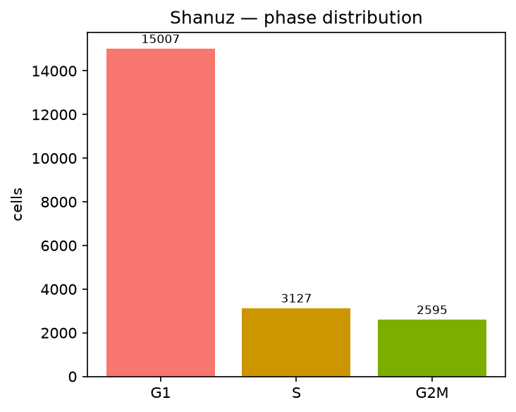
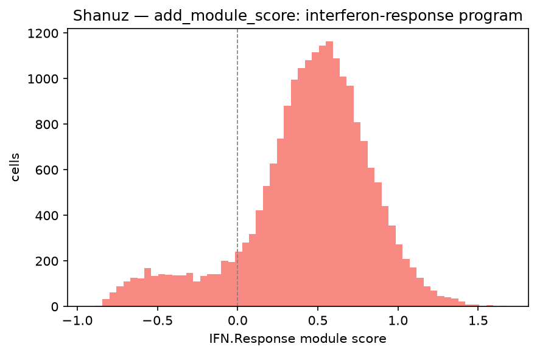

# Cell-cycle & module scoring (R Seurat vs Shanuz)

A side-by-side port of Seurat's [cell-cycle vignette](https://satijalab.org/seurat/articles/cell_cycle_vignette)
and `AddModuleScore`, run on the THP-1 ECCITE-seq dataset (**GSE153056**,
Papalexi et al. 2021). THP-1 is a proliferating monocytic-leukemia line, so —
unlike the resting PBMCs of the earlier tutorials — it carries substantial S and
G2/M populations, which is what makes cell-cycle scoring a *meaningful* test
rather than "everything is G1". (We reuse the [Mixscape tutorial](mixscape_vignette.md)'s
counts; the perturbation labels are irrelevant here — only the raw RNA matters.)

The task these two functions solve: **score a gene program per cell against a
matched control set**, so the score reflects the program and not a cell's overall
depth or its genes' baseline abundance.

- **`add_module_score`** ↔ `AddModuleScore` — the general primitive: a program's
  score is its genes' mean expression minus the mean of control genes drawn from
  the *same average-expression bins*, so highly- and lowly-expressed programs are
  put on the same footing.
- **`cell_cycle_scoring`** ↔ `CellCycleScoring` — module scoring applied to the
  Tirosh 2016 S and G2/M gene sets (Seurat's `cc.genes.updated.2019`), then a
  discrete `Phase` per cell: `G1` when both scores are ≤ 0, else whichever of
  S / G2M is larger.

> **Why this tutorial exists.** `add_module_score` / `cell_cycle_scoring` landed
> with only synthetic fixtures. This is the first time they meet a real dataset
> with a Seurat reference. The wrinkle worth stating up front: both functions
> **sample control genes at random** (binned by expression), and NumPy's RNG is
> not R's — so on identical counts and identical gene lists the per-cell *scores*
> are **not** byte-identical. They do correlate almost perfectly (the algorithm
> is the same; only the control draw differs), and the discrete `Phase` — a
> thresholding of those scores — is robust to the small score wobble. So the
> comparison targets are **per-cell Phase concordance** and **score correlation**,
> the same "faithful port, RNG-driven residual" story as `clara` (hashing) and
> the KDE step (MULTI-seq).

---

## The data — THP-1, a proliferating line

Both tools read the **same GEO counts** the Mixscape tutorial caches. THP-1
divides actively in culture, so a real minority of cells sit in S and G2/M:

```
~18.4k genes × 20,729 cells   ·   G1 72% / S 15% / G2M 13%
```

To rule out gene-list drift as a second source of divergence, the Python run
writes the exact S / G2M / interferon gene symbols it resolved against the assay
to `figures_cellcycle/*.txt`, and the R script reads them back — so the only
thing left to differ is the control-gene RNG. The dataset also ships Papalexi's
own published `Phase` (from their Seurat run); we keep it for a bonus external
sanity check, but the controlled comparison is shanuz vs a fresh R
`CellCycleScoring` on identical input.

---

## Step 1 · Load and normalize

Cell-cycle and module scoring run on the log-normalized `data` layer — no
variable features, scaling or PCA required.

<table>
<tr><th>R (Seurat)</th><th>Python (Shanuz)</th></tr>
<tr><td>

```r
counts <- <the same GEO cDNA matrix Python reads>
obj <- CreateSeuratObject(counts, min.cells = 3, meta.data = meta)
obj <- NormalizeData(obj, verbose = FALSE)
```

</td><td>

```python
from shanuz.datasets import thp1_eccite
from shanuz.shanuz import create_shanuz_object
from shanuz.preprocessing import normalize_data

rna, genes, *_ , cells = thp1_eccite()
obj = create_shanuz_object(counts=rna, assay="RNA", min_cells=3,
        feature_names=genes, cell_names=cells)
normalize_data(obj, assay="RNA")
```

</td></tr>
</table>

---

## Step 2 · Score the cell cycle and a module

`CellCycleScoring` writes `S.Score` / `G2M.Score` / `Phase`; `AddModuleScore`
scores any program — here a compact interferon-response signature, apt for a
dataset whose screen targets interferon-γ regulators. Both tools score the
**same resolved gene lists** (written by the Python run).

<table>
<tr><th>R (Seurat)</th><th>Python (Shanuz)</th></tr>
<tr><td>

```r
s   <- readLines("figures_cellcycle/s_genes.txt")
g2m <- readLines("figures_cellcycle/g2m_genes.txt")
ifn <- readLines("figures_cellcycle/ifn_genes.txt")

obj <- CellCycleScoring(obj, s.features = s, g2m.features = g2m)
obj <- AddModuleScore(obj, features = list(ifn),
                      name = "IFN.Response", seed = 1)
```

</td><td>

```python
from shanuz.module_score import (
    add_module_score, cell_cycle_scoring, CC_GENES)

cell_cycle_scoring(obj, s_features=s, g2m_features=g2m)   # S.Score/G2M.Score/Phase
add_module_score(obj, features={"IFN.Response": ifn})
# cell_cycle_scoring defaults to CC_GENES (= cc.genes.updated.2019)
```

</td></tr>
</table>

---

## Step 3 · Read the scores

The classic read is `S.Score` against `G2M.Score`, coloured by the assigned
phase: G1 cells cluster near the origin (both scores ≤ 0), S cells fan out along
the x-axis, G2/M cells up the y-axis.

<table>
<tr><th>R — scores by phase</th><th>Shanuz — scores by phase</th></tr>
<tr>
<td></td>
<td></td>
</tr>
</table>

The phase split is the same on both sides — a genuinely cycling population, not
the flat all-G1 that resting PBMCs would give:

<table>
<tr><th>R — phase distribution</th><th>Shanuz — phase distribution</th></tr>
<tr>
<td></td>
<td></td>
</tr>
</table>

| phase | Shanuz | R Seurat |
|-------|---:|---:|
| G1 | 72.4 % | 70.8 % |
| S | 15.1 % | 16.5 % |
| G2M | 12.5 % | 12.8 % |

`add_module_score` on the interferon program produces the expected distribution —
most cells near zero, a positive tail of responders:



---

## The headline · R-vs-Python concordance

Both functions sample control genes at random, and NumPy's RNG is not R's, so the
per-cell scores are **not** expected to be identical — only to track. They track
extremely tightly, and the discrete phase is robust to the residual wobble:

| metric | Pearson | Spearman |
|--------|---:|---:|
| `S.Score` | **0.9982** | 0.9834 |
| `G2M.Score` | **0.9993** | 0.9853 |
| `IFN.Response` (`add_module_score`) | **0.9995** | 0.9993 |

> **Per-cell Phase concordance: 0.9662 (20,028 / 20,729 cells).**
> (Agreement with Papalexi's *published* phase — a different pipeline — is 0.88,
> for context.)

The scores correlate at Pearson ≥ 0.998 — the algorithm is faithfully ported, and
the only reason the numbers are not bit-identical is the random control set.
**96.62 % of cells get the same phase call**, and the ~3.4 % that differ sit right
on the phase boundary (`S.Score` or `G2M.Score` near 0), where the small
RNG-driven score shift tips the discrete call one way or the other — the same
boundary-sensitivity as Mixscape's weak guides. **No defect found**:
`cell_cycle_scoring` and `add_module_score` reproduce Seurat on their first
real-data benchmark, with a residual that is the documented control-gene RNG and
nothing more (the same "don't chase the RNG" spirit as `clara` and the MULTI-seq
KDE).

---

## Running it yourself

```bash
python  tutorials/thp1_cellcycle_tutorial.py    # downloads ~66 MB (shared with Mixscape), writes gene lists
Rscript tutorials/thp1_cellcycle_verify.R       # Seurat reference → r_calls.csv + r_*.png
python  tutorials/thp1_cellcycle_tutorial.py    # re-run → prints the R-vs-Python concordance
python  tutorials/generate_cellcycle_plots.py   # Shanuz figures → figures_cellcycle/py_*.png
```

**Figures** (`tutorials/figures_cellcycle/`, `r_*` = R Seurat, `py_*` = Shanuz):

| Figure | Description |
|---|---|
| `py_01_score_scatter.png` | S.Score vs G2M.Score, coloured by assigned phase |
| `py_02_phase_bar.png` | Cell count per phase (G1/S/G2M) |
| `py_03_ifn_hist.png` | Interferon-response module-score distribution (AddModuleScore) |

---

## R Seurat → Shanuz API

| Task | R (Seurat) | Python (Shanuz) |
|------|-----------|-----------------|
| Module score | `AddModuleScore(obj, features=list(program), name="X")` | `add_module_score(obj, features={"X": program})` |
| Cell-cycle score | `CellCycleScoring(obj, s.features, g2m.features)` | `cell_cycle_scoring(obj, s_features, g2m_features)` |
| Bundled cc genes | `cc.genes.updated.2019$s.genes` / `$g2m.genes` | `shanuz.module_score.CC_GENES["s_genes"]` / `["g2m_genes"]` |
| Set phase as identity | `CellCycleScoring(..., set.ident = TRUE)` | `cell_cycle_scoring(..., set_ident=True)` |
| Regress out cell cycle | `ScaleData(obj, vars.to.regress=c("S.Score","G2M.Score"))` | `scale_data(obj, vars_to_regress=["S.Score","G2M.Score"])` |

---

## References

Tirosh I, Izar B, Prakadan SM, et al. (2016) **Dissecting the multicellular
ecosystem of metastatic melanoma by single-cell RNA-seq.** *Science* 352,
189-196. <https://doi.org/10.1126/science.aad0501>

Papalexi E, Mimitou EP, Butler AW, et al. (2021) **Characterizing the molecular
regulation of inhibitory immune checkpoints with multimodal single-cell
screens.** *Nature Genetics* 53, 322-331. <https://doi.org/10.1038/s41588-021-00778-2>
