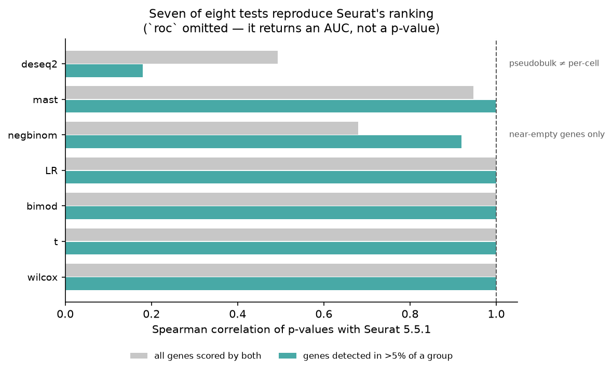
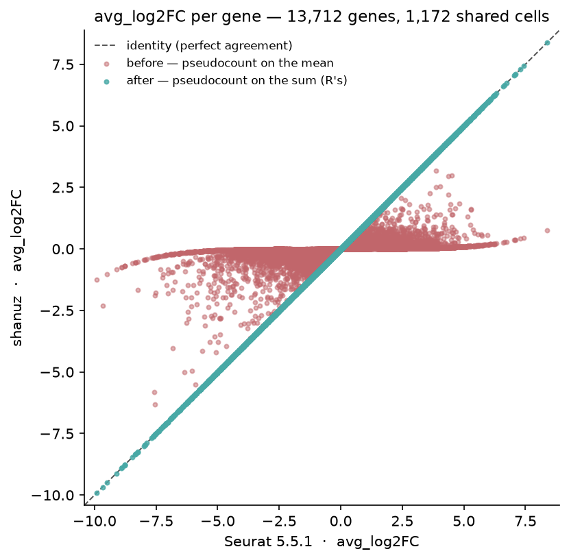
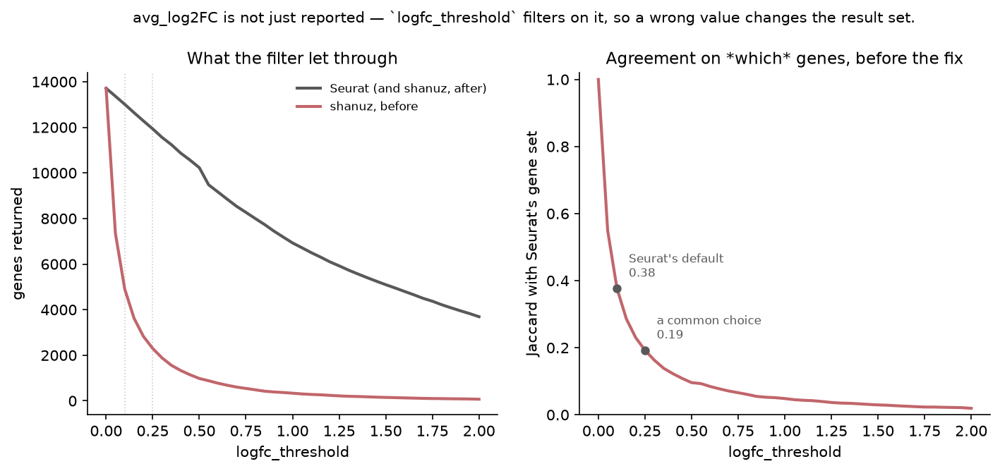

# The Differential-Expression Test Suite — R Seurat vs Shanuz (Python)

Wave 3's first side-by-side, and the last large untested surface in the library:
`find_markers` offers **eight statistical tests and none of them had ever been
compared to R**. Their unit tests assert self-consistency on synthetic fixtures —
the same shape of coverage that let the CLR and SCTransform defects survive.

> **Dataset:** pbmc3k — 2,700 PBMCs, 10x Genomics (2016). The comparison runs on
> **clusters 0 and 1** (695 and 477 cells, 13,714 genes).
> **R reference:** Seurat 5.5.1 · MAST 1.38.0 · DESeq2 1.52.0 · **Python:** Shanuz

| Seurat | Shanuz |
|---|---|
| `FindMarkers(obj, test.use = "wilcox")` | `find_markers(obj, test_use="wilcox")` |
| `test.use = "t"` · `"bimod"` · `"LR"` | `test_use="t"` · `"bimod"` · `"LR"` |
| `test.use = "negbinom"` · `"roc"` | `test_use="negbinom"` · `"roc"` |
| `test.use = "MAST"` | `test_use="mast"` |
| `test.use = "DESeq2"` | `test_use="deseq2"` |

> **This tutorial found and fixed two defects.** `avg_log2FC` put Seurat's
> pseudocount on the group *mean* rather than the group *sum*, which floored
> every fold change and — because `logfc_threshold` filters on that value —
> changed which genes were returned at all. And `negbinom` ran a
> moment-dispersion likelihood-ratio test where Seurat runs an ML-dispersion
> Wald test. Both are written up in
> [what this tutorial found](#what-this-tutorial-found).

Both tools test the **same cells**: Python clusters pbmc3k and writes the
assignment to `figures_de/groups.csv`, which the R side reads. Louvain numbering
is not guaranteed to agree across implementations, and a clustering difference
would look exactly like a DE difference.

---

## Headline

| Metric | Result |
|---|---|
| **`avg_log2FC` vs Seurat**, all 13,712 shared genes | **max abs diff 7.11e-15** |
| **Tests reproducing Seurat's top 50 genes** | **7 of 7** per-cell tests (`roc` scores AUC, not p) |
| `wilcox` · `t` · `bimod` · `LR` — p-value Spearman | **1.000000** · 0.999971 · 0.999996 · 0.999984 |
| `mast` — Spearman (all genes / detected >5%) | 0.9468 / **0.9993** |
| `negbinom` — Spearman (all genes / detected >5%) | 0.6796 / **0.9194** |
| `roc` — max abs AUC difference | 5.0e-04, which is Seurat's own 3-dp rounding |
| *Before the fix* — genes returned at `logfc_threshold=0.25` | shanuz **2,298** vs Seurat **11,931** (Jaccard 0.193) |

---

## Setup

<table>
<tr><th>R (Seurat)</th><th>Python (Shanuz)</th></tr>
<tr>
<td>

```r
library(Seurat)

obj <- CreateSeuratObject(
  Read10X(".../hg19"), project = "pbmc3k_de",
  min.cells = 3, min.features = 200)
obj[["percent.mt"]] <- PercentageFeatureSet(
  obj, pattern = "^MT-")
obj <- subset(obj, subset =
  nFeature_RNA > 200 & nFeature_RNA < 2500 &
  percent.mt < 5)
obj <- NormalizeData(obj, verbose = FALSE)

# groups written by the Python side
g <- read.csv("figures_de/groups.csv", row.names = 1)
obj <- subset(obj, cells = rownames(g))
Idents(obj) <- factor(g[colnames(obj), "group"])
```

</td>
<td>

```python
from shanuz.datasets import pbmc3k
from shanuz import create_shanuz_object
from shanuz.preprocessing import normalize_data
from shanuz.markers import find_markers

obj = build()          # same QC, then cluster
groups = shared_groups(obj)
groups.to_csv("figures_de/groups.csv")

sub = obj.subset(cells=list(groups.index))
sub.idents = list(groups.values)
```

</td>
</tr>
</table>

Both sides then run with `logfc.threshold = 0` and `min.pct = 0`, so the
comparison sees every gene rather than only those surviving a filter whose
*input* is one of the numbers under test. Seurat's defaults would have hidden
exactly the disagreement worth seeing.

---

## Running the tests

<table>
<tr><th>R (Seurat)</th><th>Python (Shanuz)</th></tr>
<tr>
<td>

```r
res <- FindMarkers(obj, ident.1 = "0", ident.2 = "1",
                   test.use = "wilcox",
                   logfc.threshold = 0, min.pct = 0)
head(res[order(res$p_val), c("p_val","avg_log2FC")], 3)
#>                p_val avg_log2FC
#> TYROBP  9.227207e-214  -6.344352
#> S100A9  7.261389e-212  -7.544582
#> S100A8  2.286958e-209  -7.580939
```

</td>
<td>

```python
res = find_markers(sub, "0", "1", test_use="wilcox",
                   logfc_threshold=0, min_pct=0)
res.head(3)[["p_val", "avg_log2FC"]]
#>                p_val  avg_log2FC
#> TYROBP  9.227207e-214   -6.344352
#> S100A9  7.261389e-212   -7.544582
#> S100A8  2.286958e-209   -7.580939
```

</td>
</tr>
</table>

Both columns are identical to seven significant figures — the same p-values and
the same fold changes, on the same cells.



---

## What this tutorial found

### 1. `avg_log2FC` put the pseudocount in the wrong place

Seurat 5's `log1pdata.mean.fxn` is, verbatim:

```r
log(x = (rowSums(x = expm1(x = x)) + pseudocount.use) / NCOL(x), base = base)
```

One pseudocount added to the group's **sum**, then divided by n — so on the mean
scale it is worth `1/n`, not 1. shanuz computed `log2(mean(expm1(x)) + 1)`,
adding a whole count to the **mean**. That is Seurat *4*'s formula; the repo
targets Seurat 5.

The effect is to floor every fold change toward zero. A gene detected in 0 % of
cluster 0 and 24 % of cluster 1 read **−1.26** where Seurat reads **−9.92**.



**Why this is a defect and not a cosmetic difference.** `logfc_threshold`
filters on this value, so the error did not merely misreport fold changes — it
changed which genes came back:

| `logfc_threshold` | shanuz (before) | Seurat | Jaccard |
|---|---|---|---|
| 0.1 *(Seurat's default)* | 4,903 | 13,009 | 0.377 |
| 0.25 | **2,298** | **11,931** | **0.193** |
| 0.5 | 981 | 10,228 | 0.096 |
| 1.0 | 335 | 6,928 | 0.048 |

At a common 0.25 threshold, fewer than one gene in five agreed.



The most telling part: where **both** groups express a gene, the two formulas
nearly agree (Spearman 0.990 on the 1,362 genes with pct > 0.1 in both). The
error was concentrated in sparse, marker-like genes — precisely what
differential expression exists to find. After the fix, **7.11e-15 across all
13,712 genes**.

**There was already a test for this.** `test_avg_log2fc_matches_seurat_formula`
re-implemented the same wrong formula and checked that shanuz agreed with
itself. It was green throughout while carrying a name that claimed Seurat
parity — the same shape as #48's `test_fetch_data`. It is corrected here.

### 2. `negbinom` was running a different test

Seurat's `GLMDETest` fits `MASS::glm.nb` — which estimates the dispersion by
**maximum likelihood** — and reads the **Wald** p-value off the group
coefficient (`summary(...)$coef[2, 4]`). shanuz used a fixed method-of-moments
dispersion and a **likelihood-ratio** test: a different estimator *and* a
different statistic. HLA-DRA read **5.5e-128** against R's **1.1e-321**.

After the fix the p-values agree **exactly** for every gene anyone would look at:

| detection (max of the two groups) | genes | median \|log10 ratio\| | Spearman |
|---|---|---|---|
| > 25 % | 919 | **0.000** | 0.988 |
| 10 – 25 % | 1,478 | **0.000** | 0.959 |
| 5 – 10 % | 1,925 | **0.000** | 0.766 |
| 1 – 5 % | 5,231 | 0.118 | 0.239 |
| < 1 % | 1,792 | 0.087 | 0.051 |

What disagreement remains sits below 5 % detection, where the negative-binomial
GLM is fitting almost-empty rows and neither tool is estimating anything
meaningful. Seurat agrees: its `min.cells.feature` default drops those genes, and
in this run R returned 11,360 genes against shanuz's 13,714 — **every one of the
2,354 it dropped was below 1 % detection in both groups**. The headline Spearman
of 0.68 is that tail; on genes Seurat would actually have tested, it is 0.92.

### Differences left standing, and why

**`deseq2` is not Seurat's DESeq2.** `DESeq2DETest` builds a `DESeqDataSet` with
**one column per cell** and tests cells as replicates. shanuz sums counts per
sample and tests at the sample level. Treating cells as replicates is the
practice [Squair et al. (2021)](https://doi.org/10.1038/s41467-021-25960-2)
showed inflates false positives, so pseudobulk is the better statistics — and
because it **requires `sample_col`**, it cannot be silently mistaken for the
per-cell test: it raises. Reported rather than changed in either direction.

**`mast` is a hand-rolled hurdle model**, not a call to the MAST package, which
has no Python equivalent to depend on. Spearman 0.947 across all genes, **0.9993
on genes detected above 5 %**, and the same top 50. Worth knowing: Seurat's
`MASTDETest` fits `~ condition` alone — it adds **no** cellular detection rate
term unless you pass one. shanuz's docstring previously advised passing CDR "to
match Seurat's default CDR covariate", which had it backwards; that is corrected.

**Seurat rounds `myAUC` to three decimals** inside `DifferentialAUC`, so the ROC
comparison cannot be tighter than 5e-4 however correct both sides are. That is
R's rounding, not a divergence — stated because it looks like one.

**R's `wilcox` returns `NaN`** for genes with no expression in either group (437
of them here); shanuz returns `p = 1`. A test that cannot be run has no evidence
against the null, so 1 is the more useful answer, and R's NaN set is a subset of
shanuz's. R also underflows 168 p-values to exactly 0 where scipy keeps
precision down to 9.2e-214.

---

## Parity — verified against R Seurat

| Test | Genes | max \|Δlog2FC\| | p Spearman (all) | p Spearman (detected >5 %) | Top 50 |
|---|---|---|---|---|---|
| `wilcox` | 13,712 | 7.1e-15 | **1.000000** | 1.0000 | 50/50 |
| `t` | 13,712 | 7.1e-15 | 0.999971 | 1.0000 | 50/50 |
| `bimod` | 13,712 | 7.1e-15 | 0.999996 | 1.0000 | 50/50 |
| `LR` | 13,712 | 7.1e-15 | 0.999984 | 1.0000 | 50/50 |
| `negbinom` | 11,360 | 7.1e-15 | 0.679646 | **0.9194** | 50/50 |
| `roc` | 13,712 | 7.1e-15 | *AUC 5.0e-04* | — | — |
| `mast` | 13,712 | 7.1e-15 | 0.946802 | **0.9993** | 50/50 |
| `deseq2` | 13,712 | *3.34* | 0.493458 | 0.1795 | 25/50 |

`deseq2`'s row is the pseudobulk-vs-per-cell divergence described above, not a
defect; its fold change differs too because a pseudobulk fold change is computed
on summed counts.

Runtime, for scale: Seurat's slowest test here is `negbinom` at 91.8 s
(`MAST` 60.5 s, `DESeq2` 60.3 s); shanuz's are 36.0 s, 28.5 s and 3.4 s.

---

## Running it

```bash
# 1. Python side — writes figures_de/groups.csv and py_<test>.csv
python tutorials/pbmc3k_de_tutorial.py

# 2. R side — writes figures_de/r_<test>.csv (needs MAST + DESeq2)
Rscript tutorials/pbmc3k_de_verify.R

# 3. Compare
python tutorials/pbmc3k_de_tutorial.py --report

# 4. Figures
python tutorials/generate_de_plots.py
```

The R side needs `MAST` and `DESeq2`:

```r
BiocManager::install(c("MAST", "DESeq2"))
```

**Not `glmGamPoi`.** It is a *Suggests* of DESeq2 rather than an Imports,
`FindMarkers` never calls it, and installing it flips `sctransform`'s `vst` onto
a different backend — which would move the SCTransform R reference that
[`sctransform_vignette.md`](sctransform_vignette.md) is pinned against.
Installing with default dependencies leaves Suggests alone, which is what you
want. This was verified rather than assumed: an SCTransform fingerprint taken
before and after the install is byte-identical.
