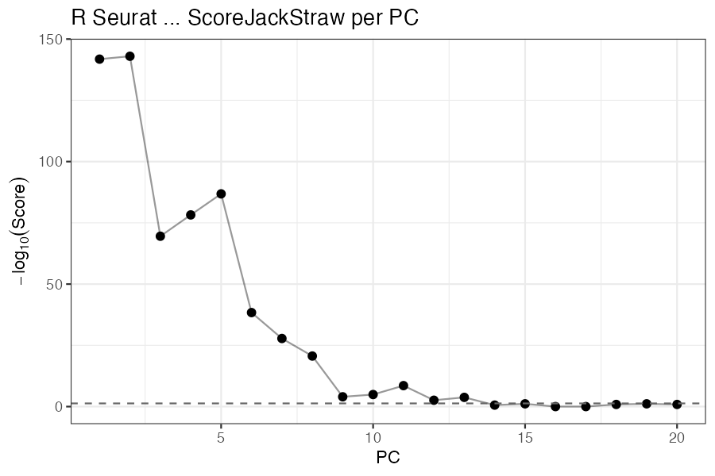
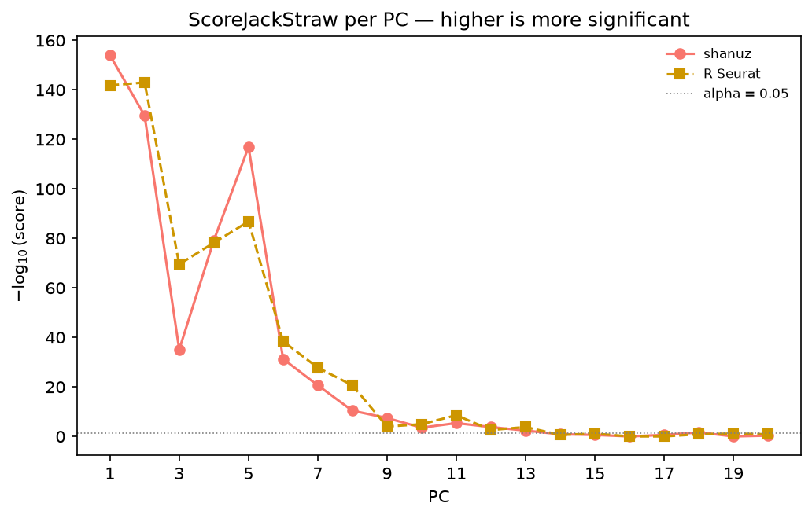
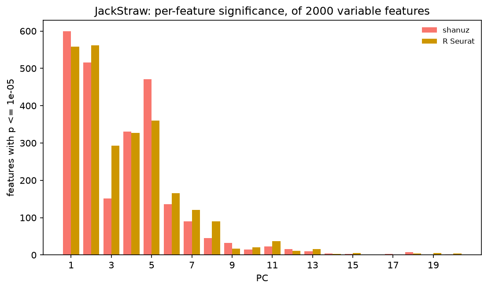
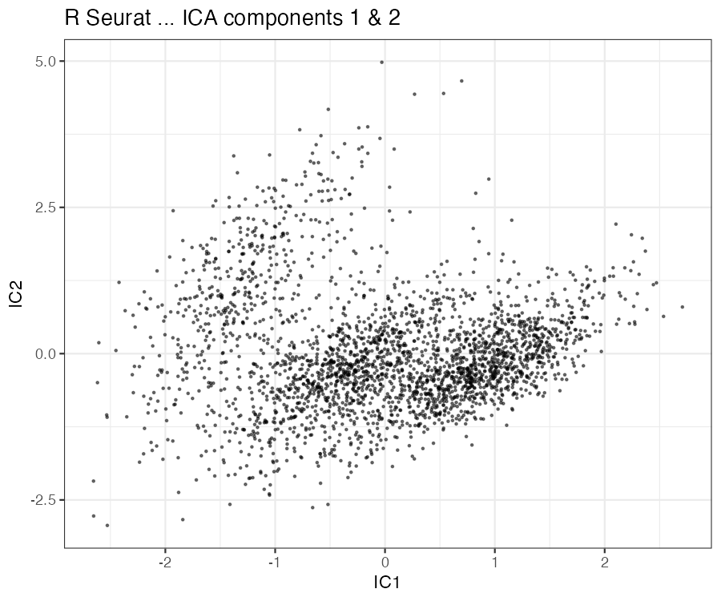
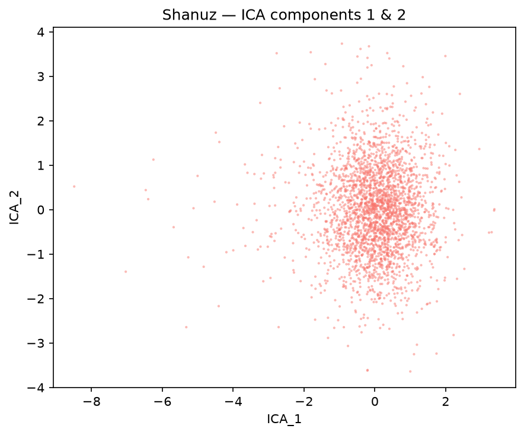
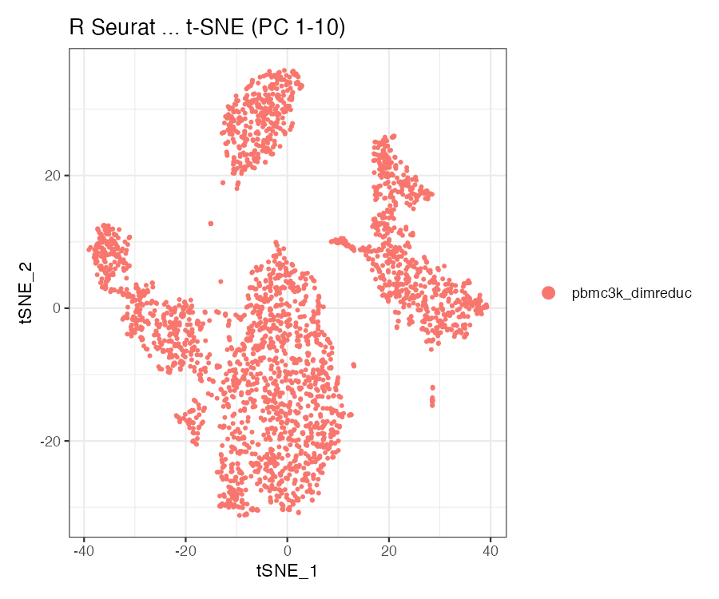
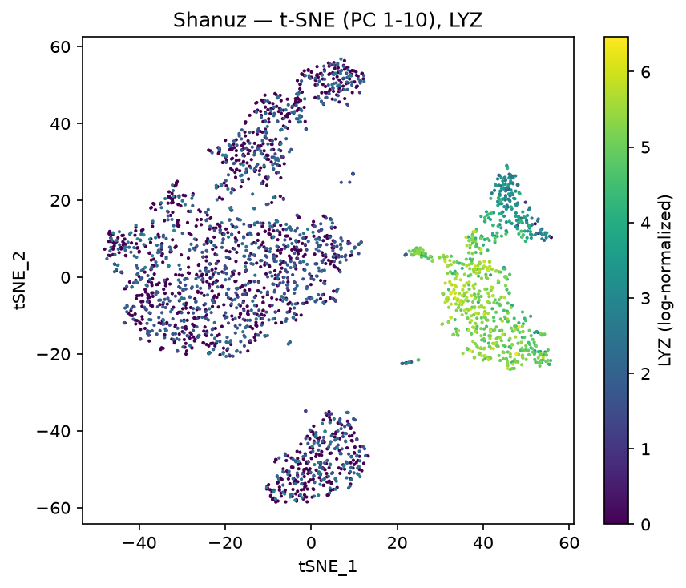

# Dimensional-Reduction Extras — R Seurat vs Shanuz (Python)

The three reductions that sit *beside* the standard PCA → UMAP path, and the one
question every guided-clustering run has to answer first: **how many PCs are
real?** Every R Seurat call is paired with the Shanuz equivalent and both outputs
are shown side by side.

> **Dataset:** PBMC 3k — 2,700 peripheral blood mononuclear cells, 10x Genomics
> (2016), the same section used in [Tutorial 1](pbmc3k_tutorial.md).
> Auto-downloads (~8 MB).
> **R reference:** Seurat 5.5.1 · **Python:** Shanuz

| Seurat | Shanuz |
|---|---|
| `JackStraw(obj, dims = 20)` | `jack_straw(obj, dims=20)` |
| `ScoreJackStraw(obj, dims = 1:20)` | `score_jackstraw(obj, dims=20)` |
| `RunICA(obj, nics = 20)` | `run_ica(obj, nics=20)` |
| `RunTSNE(obj, dims = 1:10)` | `run_tsne(obj, dims=range(10))` |

> **This tutorial found and fixed two defects.** `jack_straw` built its
> permutation null the wrong way, and `score_jackstraw` aggregated it with the
> wrong statistic. Together they made shanuz keep **all 20** PCs where Seurat
> keeps 13 — the function could not do the one thing it exists for. Both are
> fixed in the same pull request; the [findings](#what-this-tutorial-found) are
> written up below with before-and-after numbers.

---

## Headline

| Metric | Result |
|---|---|
| **PCs kept** (run before the drop-off) | **shanuz 13 · R 13** |
| PCs significant at α = 0.05 | shanuz 1-13 + 18 · R 1-13 (Jaccard **0.93**) |
| ICA, matched \|Pearson r\| over 20 components | **0.982** (worst pair 0.831) |
| t-SNE, 30-NN retained from PCA | shanuz **0.470** · R **0.477** |
| t-SNE, 30-NN shared between the two tools | 0.681 |

---

## Setup

<table>
<tr><th>R (Seurat)</th><th>Python (Shanuz)</th></tr>
<tr>
<td>

```r
library(Seurat)

pbmc <- CreateSeuratObject(
  Read10X(data.dir), min.cells = 3, min.features = 200)
pbmc <- NormalizeData(pbmc)
VariableFeatures(pbmc) <- hvg      # shared with Python
pbmc <- ScaleData(pbmc, features = hvg)
pbmc <- RunPCA(pbmc, features = hvg, npcs = 50)
```

</td>
<td>

```python
from shanuz.datasets import pbmc3k
from shanuz.shanuz import create_shanuz_object
from shanuz.preprocessing import (
    normalize_data, find_variable_features, scale_data)
from shanuz.reduction import run_pca

counts, genes, cells = pbmc3k()
obj = create_shanuz_object(
    counts=counts, assay="RNA", min_cells=3, min_features=200,
    feature_names=genes, cell_names=cells)
normalize_data(obj)
find_variable_features(obj, nfeatures=2000)
hvg = list(obj.assays["RNA"].variable_features)
scale_data(obj, features=hvg)
run_pca(obj, n_pcs=50, features=hvg)
```

</td>
</tr>
</table>

### The shared basis, and why it comes first

JackStraw's null is built from the scaled matrix and the PCA basis, so if the two
tools disagree about which cells or genes are in play, nothing downstream is
interpretable. The Python run writes the exact barcodes and HVGs it used to
`figures_dimreduc/cells.txt` and `hvg_features.txt`; the R script reads them back
and subsets to them. (`Read10X` rewrites underscores in gene symbols — pbmc3k's
`Y_RNA` becomes `Y-RNA` — so both sides normalise through that rule before
matching.)

Step 0 of the comparison then checks the bases actually agree:

```
Per-PC |correlation| over 20 PCs: median 0.9759
Matched one-to-one and in the same order through PC 15 (min |r| there: 0.8866).
Beyond PC 15 the noise-tail PCs reorder (py16~R19, py17~R18, py18~R16, py19~R17, ...)
```

PC 1-15 match one-to-one; only the noise tail permutes, which is ordinary — those
components carry no stable ordering. **The comparison is therefore decisive
through PC 15**, which is where the whole question lives (R's drop-off is at PC
14). A bare "min |r| = 0.15 over 20 PCs" would have looked alarming and meant
nothing.

---

## JackStraw — how many PCs are significant?

<table>
<tr><th>R (Seurat)</th><th>Python (Shanuz)</th></tr>
<tr>
<td>

```r
pbmc <- JackStraw(pbmc, dims = 20, num.replicate = 100)
pbmc <- ScoreJackStraw(pbmc, dims = 1:20)

score <- JS(pbmc[["pca"]], slot = "overall")[, "Score"]
which(score <= 0.05)
#>  [1]  1  2  3  4  5  6  7  8  9 10 11 12 13
```

</td>
<td>

```python
from shanuz.jackstraw import jack_straw, score_jackstraw
# significant_dims is this tutorial's helper, not a shanuz export
from tutorials.pbmc3k_dimreduc_tutorial import significant_dims

js = jack_straw(obj, dims=20, num_replicate=100)
scores = score_jackstraw(obj, dims=20)

significant_dims(scores, alpha=0.05)
#> array([ 1,  2,  3,  4,  5,  6,  7,  8,  9, 10, 11, 12, 13, 18])
```

</td>
</tr>
</table>

| PC | shanuz score | R score | shanuz features ≤ 1e-5 | R features ≤ 1e-5 |
|---:|---:|---:|---:|---:|
| 1 | 1.0e-154 | 1.5e-142 | 599 | 558 |
| 5 | 1.3e-117 | 1.5e-87 | 471 | 360 |
| 9 | 3.8e-08 | 1.0e-04 | 32 | 17 |
| 13 | 4.4e-03 | 1.7e-04 | 10 | 16 |
| **14** | **0.133** | **0.248** | 4 | 3 |
| 16 | 1.000 | 1.000 | 1 | 0 |
| 20 | 0.479 | 0.133 | 2 | 4 |

Both tools fall off the same cliff after PC 13 and both recommend keeping 13.

<table>
<tr><th>R (Seurat)</th><th>Python (Shanuz)</th></tr>
<tr>
<td></td>
<td></td>
</tr>
</table>

The `features ≤ 1e-5` column is the like-for-like one: it is computed the same
way from either tool's per-feature p-value matrix, so it separates a difference
in the *null* (these counts move) from a difference in the *aggregation* (only
the scores move). That distinction is what located both defects.



### The residual is permutation scatter

R's `JackRandom` seeds each replicate from its loop index, so `JackStraw` in R is
**deterministic** — verified here: `set.seed(1)` and `set.seed(999)` give
byte-identical scores. Shanuz seeds from its `seed` argument instead, so its
answer moves a little from run to run:

| seed | 0 | 1 | 7 | 42 | 2024 | R |
|---|---|---|---|---|---|---|
| PCs kept | 13 | 14 | 15 | 13 | 13 | **13** |

R's deterministic 13 sits at the bottom of shanuz's spread. The one PC where the
significance calls differ (PC 18: 0.023 vs 0.133) is *after* the drop-off, so it
does not move the cutoff.

---

## What this tutorial found

Both defects were caught by comparing against R, not by the test suite — which
was green through both, on synthetic fixtures. That is the third and fourth
defects this initiative has surfaced, after the two RPCA bugs.

### 1. The permutation null was too tight

R's `JackRandom` permutes the selected rows and then **re-runs a full PCA** on the
modified matrix, taking the null loadings from that refit basis. Shanuz projected
the permuted rows onto the **fixed** original embedding — much cheaper, but a
fixed basis cannot rotate to absorb the scrambled signal, so the permuted
loadings come out too small. Against a null that tight, ordinary noise features
look extreme.

| features ≤ 1e-5, PCs 14-20 (pure noise) | |
|---|---|
| shanuz, before | 167, 203, 112, 109, 182, 155, 120 |
| shanuz, after | 4, 3, 1, 3, 7, 1, 2 |
| **R Seurat** | **3, 5, 0, 1, 4, 5, 4** |

### 2. The aggregation was the wrong test

`ScoreJackStraw` in R runs `prop.test` on the count of features below
`score.thresh` against the count expected under a uniform null,
`floor(n × thresh)`. Shanuz ran a one-sided KS test against Uniform(0, 1) —
a far more sensitive statistic on thousands of features. Its **largest** score
across all 20 PCs was `8.1e-112`, so nothing ever failed the threshold:

| | shanuz, before | shanuz, after | R Seurat |
|---|---|---|---|
| PC 1 (real signal) | 0 | 1.0e-154 | 1.5e-142 |
| PC 16 (pure noise) | 1.1e-168 | **1.000** | **1.000** |
| PCs called significant | **20 of 20** | 14 | 13 |

R's `prop.test` is ported exactly rather than approximated — `ScoreJackStraw`'s
output *is* that p-value — and reproduces R to nine significant figures across
the full range (1e-143 to 1.0).

A third, smaller gap closed alongside them: `JackStrawData.fake_reduction_scores`
was declared but never populated, where R stores the null.

---

## ICA — the same components, differently named

Independent components are defined only up to sign and order, so a column-wise
comparison is meaningless: component 3 in R may be component 11, negated, in
Python. The components are matched one-to-one by \|Pearson r\| with the Hungarian
algorithm, which asks the question that *is* well posed.

<table>
<tr><th>R (Seurat)</th><th>Python (Shanuz)</th></tr>
<tr>
<td>

```r
pbmc <- RunICA(pbmc, features = hvg, nics = 20)
ica <- Embeddings(pbmc, "ica")
```

</td>
<td>

```python
from shanuz.reduction import run_ica

run_ica(obj, nics=20)
ica = obj.reductions["ica"].cell_embeddings
```

</td>
</tr>
</table>

**Mean matched \|r\| = 0.982**, worst matched pair 0.831 — the two runs find the
same subspace.

<table>
<tr><th>R (Seurat)</th><th>Python (Shanuz)</th></tr>
<tr>
<td></td>
<td></td>
</tr>
</table>

---

## t-SNE — structure, not coordinates

R's `Rtsne` is Barnes-Hut; shanuz calls scikit-learn. The coordinates are not
comparable across implementations and never will be, so the comparison is on
neighbourhood structure: what fraction of each cell's 30 nearest neighbours the
embedding preserves from the PCA space it was built from. That number is each
tool judged against its own input, so the two are directly comparable.

<table>
<tr><th>R (Seurat)</th><th>Python (Shanuz)</th></tr>
<tr>
<td>

```r
pbmc <- RunTSNE(pbmc, dims = 1:10)
```

</td>
<td>

```python
from shanuz.reduction import run_tsne

run_tsne(obj, dims=range(10), reduction="pca")
```

</td>
</tr>
</table>

| | shanuz | R Seurat |
|---|---|---|
| 30-NN retained from PCA | **0.470** | **0.477** |
| 30-NN shared between the tools | 0.681 | |

Both panels are coloured by *LYZ* rather than by cluster — cluster labels are
arbitrary integers that would not correspond between tools, whereas this gene's
value on this cell is the same number on both sides.

<table>
<tr><th>R (Seurat)</th><th>Python (Shanuz)</th></tr>
<tr>
<td></td>
<td></td>
</tr>
</table>

---

## Reproducing this

```bash
python tutorials/pbmc3k_dimreduc_tutorial.py   # downloads ~8 MB, writes the shared lists
Rscript tutorials/pbmc3k_dimreduc_verify.R     # slow: 100 PCA refits, ~2 min
python tutorials/generate_dimreduc_plots.py    # figures + the side-by-side numbers
```

`JackStraw` is genuinely expensive on both sides — it re-runs a full PCA per
replicate, 100 times by default. Lower `num_replicate` when iterating, but note
it also sets the p-value resolution: the smallest non-zero empirical p is
`1 / (num_replicate × n_permuted)`.

---

## Notes

- **The elbow plot is still the cheap first look.** `figures_dimreduc/py_03_elbow.png`
  and `r_02_elbow.png` show it; JackStraw is what you reach for when the elbow is
  ambiguous, which on pbmc3k it somewhat is.
- **`prop_freq` has a floor.** R falls back to 3 features when
  `nrow × prop.use < 3`; shanuz matches that, and also truncates rather than
  rounds up, as R's `sample(size = nrow * prop.use)` does.
- **`jack_straw` needs stored feature loadings** — it uses them as the observed
  statistic, exactly as R takes `Loadings(object[[reduction]], projected = FALSE)`.
  It raises rather than silently falling back if they are absent.
