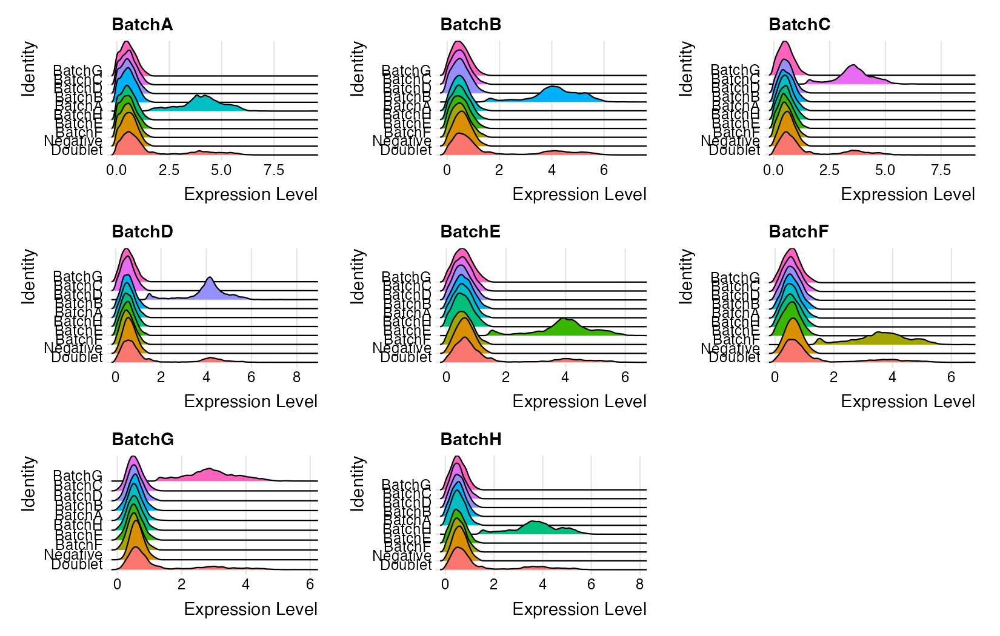
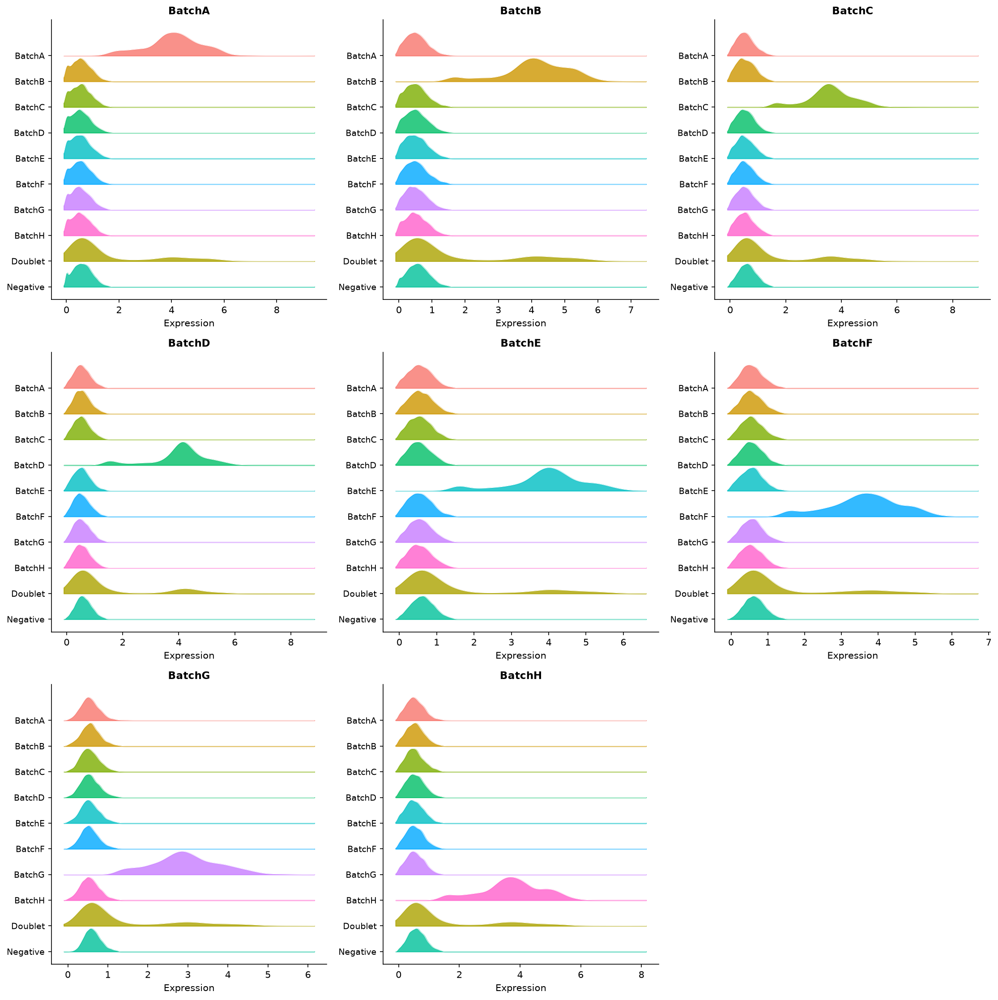
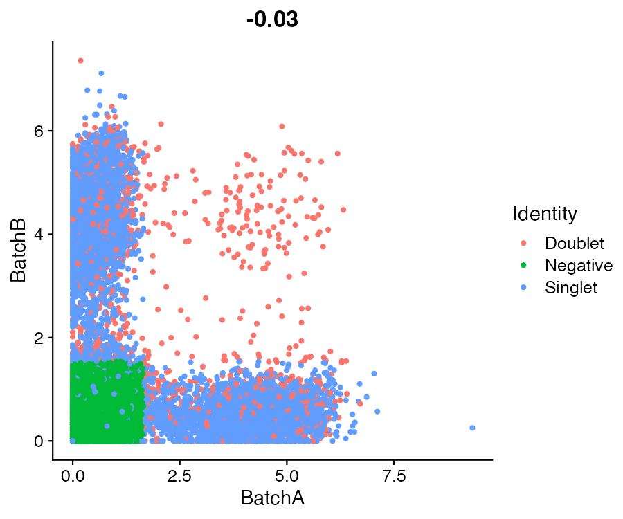
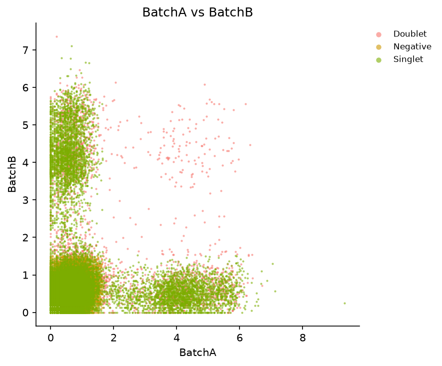
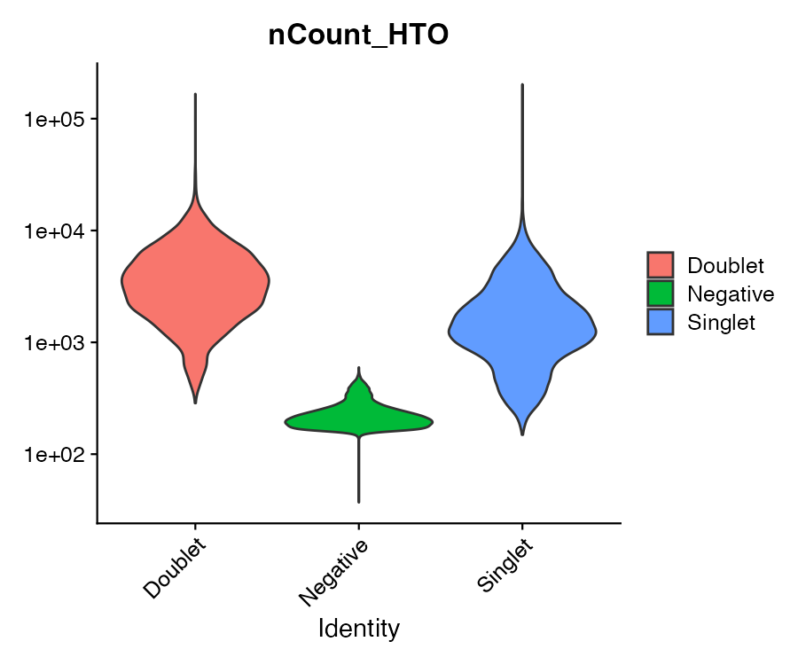
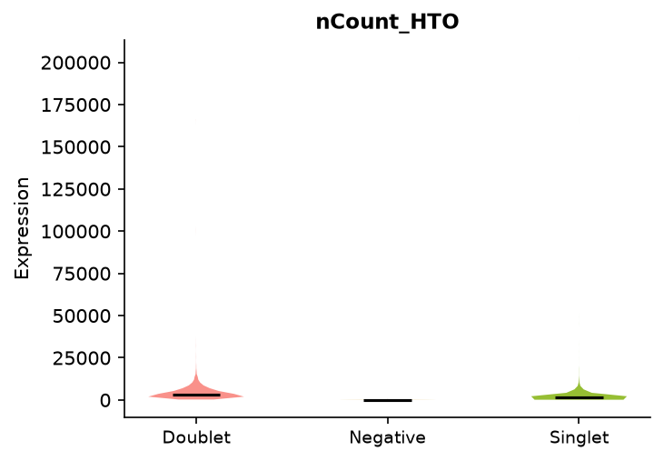
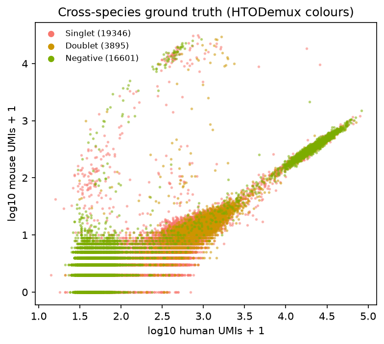

# Cell Hashing — Demultiplexing pooled samples (R Seurat vs Shanuz)

A side-by-side port of Seurat's [hashing vignette](https://satijalab.org/seurat/articles/hashing_vignette).
**Cell Hashing** (Stoeckius et al. 2018) tags each *sample* with a distinct
antibody-conjugated oligo — a **hashtag** (HTO) — before pooling many samples on
one droplet lane. Every droplet then carries, on top of its mRNA, a barcode of
hashtag counts saying which sample it came from. **Demultiplexing** turns that
back into a per-cell call: a **singlet** from sample 3, a **doublet** of samples
1 and 2, or a **negative** empty-ish droplet.

Shanuz ships both of Seurat's demultiplexers, and this walkthrough runs them
against their R references on byte-identical input:

- **`hto_demux`** ↔ `HTODemux` — a negative-binomial cutoff per hashtag, learned
  from the tag's background cluster.
- **`multiseq_demux`** ↔ `MULTIseqDemux` — a kernel-density cutoff per barcode
  instead (McGinnis et al.).

> **Why this tutorial exists.** Every hashing feature landed after PR #10 and had
> only ever been checked against synthetic fixtures. This is the first time
> `hto_demux` / `multiseq_demux` meet real data with a Seurat reference — a direct
> test of the CLR-margin fix (#32) and the `clara` k-medoids default (#34). The
> target is **R-vs-Python call concordance**, not a headline cell count.

---

## The data — a raw barnyard, not the vignette's filtered PBMC

The vignette downloads a pre-filtered `pbmc_umi_mtx.rds` from Dropbox — an R
binary with no clean cross-language form. So `shanuz.datasets.pbmc_hashing` uses
the **original GEO matrices** (GSE108313) instead, which both languages read
identically. Two consequences worth stating up front:

1. **These are raw, unfiltered barcodes.** The list is dominated by empty-ish
   droplets, so the **Negative** rate is high (~42 %). That is expected and does
   not affect the R-vs-Python comparison — both tools see the same droplets.
2. **The RNA is aligned to a combined human + mouse genome.** That is deliberate:
   a droplet with both human and mouse transcripts is a species-mixed multiplet
   *no hashtag was consulted for* — an independent doublet signal (used in Step 5).

```
40,899 genes × 39,842 cells   ·   8 hashtags: BatchA … BatchH
```

---

## Step 1 · Load, build the object, attach & CLR-normalise the HTO assay

Hashtag counts are compositional, so they are **centered-log-ratio (CLR)**
normalised — margin 1 (per hashtag across cells), which is Seurat's default and
what the hashing vignette uses. Both demultiplexers read that normalised layer.

<table>
<tr><th>R (Seurat)</th><th>Python (Shanuz)</th></tr>
<tr><td>

```r
# HTODemux needs only the HTO assay; the RNA text is
# ~41k x 50k dense (~13 GB), so read just its header
# for the barcode set the Python loader intersects to.
hdr <- readLines(gzfile(RNA_TSV), n = 1)
rna_cells <- strsplit(hdr, "\t")[[1]][-1]

hto <- read.csv(gzfile(HTO_CSV), row.names = 1,
                check.names = FALSE)
hto <- hto[!rownames(hto) %in%
           c("bad_struct","no_match","total_reads"), ]
common <- intersect(rna_cells, colnames(hto))
hto <- as.matrix(hto[, common])
rownames(hto) <- sub("-.*$", "", rownames(hto))

obj <- CreateSeuratObject(counts = as.sparse(hto),
                          assay = "HTO")
obj <- NormalizeData(obj, assay = "HTO",
        normalization.method = "CLR", margin = 1)
```

</td><td>

```python
from shanuz.datasets import pbmc_hashing
from shanuz.shanuz import create_shanuz_object
from shanuz.assay5 import create_assay5_object
from shanuz.preprocessing import normalize_data

# downloads ~34 MB, drops the 3 QC rows, aligns
# the RNA and HTO matrices on shared barcodes
rna, genes, hto, hto_names, cells = pbmc_hashing()

obj = create_shanuz_object(counts=rna, assay="RNA",
        min_cells=3, feature_names=genes, cell_names=cells)
obj.assays["HTO"] = create_assay5_object(
        counts=hto, feature_names=hto_names,
        cell_names=cells, key="hto_")
normalize_data(obj, assay="HTO",
        normalization_method="CLR", margin=1)
```

</td></tr>
</table>

The tutorial shortens each hashtag name (`BatchA-AGGACCATCCAA` → `BatchA`) on
both sides so names, `hash.ID` values and plot labels line up. The R reference
reads only the RNA *header* because the dense RNA text would need ~13 GB in
memory — and the RNA has no bearing on the hashtag calls anyway.

---

## Step 2 · HTODemux — negative-binomial threshold per hashtag

<table>
<tr><th>R (Seurat)</th><th>Python (Shanuz)</th></tr>
<tr><td>

```r
obj <- HTODemux(obj, assay = "HTO",
                positive.quantile = 0.99)
table(obj$HTO_classification.global)
#  Doublet Negative  Singlet
#     3916    16575    19351
```

</td><td>

```python
from shanuz.hto import hto_demux

hto_demux(obj, assay="HTO",
          positive_quantile=0.99, normalize=False)
obj.meta_data["HTO_classification.global"].value_counts()
#  Singlet     19346
#  Negative    16601
#  Doublet      3895
```

</td></tr>
</table>

| Global class | Shanuz | R Seurat |
|---|---:|---:|
| Singlet  | 19,346 | 19,351 |
| Doublet  |  3,895 |  3,916 |
| Negative | 16,601 | 16,575 |

The eight samples come out balanced (Shanuz `hash.ID`): BatchA 2,470 · BatchB
2,807 · BatchC 2,529 · BatchD 2,305 · BatchE 2,080 · BatchF 2,089 · BatchG
2,465 · BatchH 2,601.

The **ridge plot** is the canonical QC read: each hashtag lights up *only* in the
sample it was assigned to; the `Doublet` row shows elevated background, the
`Negative` row sits at zero.

<table>
<tr><th>R — <code>RidgePlot</code></th><th>Shanuz — <code>ridge_plot</code></th></tr>
<tr>
<td></td>
<td></td>
</tr>
</table>

Two hashtags against each other separate the singlet arms (on the axes) from the
doublet cloud (interior); total hashtag counts run higher for doublets.

<table>
<tr><th>R — <code>FeatureScatter</code></th><th>Shanuz — <code>feature_scatter</code></th></tr>
<tr>
<td></td>
<td></td>
</tr>
<tr><th>R — <code>VlnPlot(nCount_HTO)</code></th><th>Shanuz — <code>vln_plot("nCount_HTO")</code></th></tr>
<tr>
<td></td>
<td></td>
</tr>
</table>

---

## Step 3 · MULTIseqDemux — kernel-density threshold per barcode

Same normalised input, a different rule for the cutoff: a Gaussian KDE over each
barcode's values, thresholded between its background and positive modes.

<table>
<tr><th>R (Seurat)</th><th>Python (Shanuz)</th></tr>
<tr><td>

```r
obj <- MULTIseqDemux(obj, assay = "HTO",
                     quantile = 0.7)
#  Singlet 16388 · Negative 21231 · Doublet 2223
```

</td><td>

```python
from shanuz.multiseq import multiseq_demux

multiseq_demux(obj, assay="HTO",
               quantile=0.7, normalize=False)
#  Singlet 17644 · Negative 19560 · Doublet 2638
```

</td></tr>
</table>

The two methods agree strongly on the confident calls — every HTODemux Negative
is a MULTIseq Negative, and the singlet blocks overlap almost entirely — but
MULTIseq is the more conservative of the two here (more Negatives, fewer
Doublets).

---

## Step 4 · Cross-species ground truth

Because the RNA is a combined human+mouse alignment, a droplet's **species mix**
is a doublet signal the hashtags never saw. `pbmc_hashing` splits the genes by
symbol case (all-upper = human, title-case / `…Rik` / `mt-` = mouse) and labels
each cell human / mouse / `mixed`.



| HTODemux \ species | human | mixed | mouse |
|---|---:|---:|---:|
| Singlet  | 19,055 | 218 | 73 |
| Doublet  |  3,832 |  45 | 18 |
| Negative | 15,799 | 734 | 68 |

**Read this honestly:** of 997 species-`mixed` droplets, HTODemux calls only 45
`Doublet` — most (734) are `Negative`. At raw-barcode depth the mixed pool is
dominated by low-count ambient droplets, not genuine two-cell doublets, so this
is a **weak sanity check, not a clean doublet benchmark**. It confirms the
pipeline runs on real barnyard data; it does not adjudicate the demux calls.

---

## The headline · R-vs-Python call concordance

Every cell, compared call-for-call against the Seurat reference on identical
input (`report_concordance()` reads the `r_calls.csv` the verify script writes):

| Comparison | Agreement |
|---|---:|
| **HTODemux** global class (Singlet/Doublet/Negative) | **99.81 %** |
| **HTODemux** sample assignment (`hash.ID`)           | **99.81 %** |
| **MULTIseqDemux** call (`MULTI_ID`)                  | **94.67 %** |

HTODemux global — Shanuz (rows) × R (cols):

|          | R Doublet | R Negative | R Singlet |
|---|---:|---:|---:|
| **Doublet**  | 3,889 |     0 |     6 |
| **Negative** |     0 | 16,566 |    35 |
| **Singlet**  |    27 |     9 | 19,310 |

**HTODemux reproduces Seurat to 99.81 %** — just 77 of 39,842 cells differ, for
both the global class *and* the per-sample assignment. That residual is `clara`'s
sampling nondeterminism (R and Python draw different sub-samples and neither can
seed the other — see `shanuz._clara`), comfortably inside the ~1 % the docstring
promises. **This is the confirmation the initiative was built to get: the CLR fix
(#32) and the `clara` default (#34) hold up against real Seurat.**

**MULTIseqDemux agrees on 94.67 %** — materially lower, and legitimately so. Both
tools threshold the *same* CLR values (HTODemux at 99.81 % proves the input and
alignment are identical), so the gap is entirely in the KDE step: scipy's
`gaussian_kde` and R's `density()` differ in bandwidth selection *and* grid
construction. It does **not** reduce to a single knob — swapping scipy's default
bandwidth for R's `nrd0` (with R's 512-point grid) moves concordance the *wrong*
way, so faithfully matching R would mean reproducing R's whole density estimator,
not tuning one parameter. The practical takeaway: **HTODemux is the more
cross-tool-reproducible of the two demultiplexers**, and a ~5 % MULTIseq
disagreement at the margins is a genuine method-implementation difference, logged
here rather than papered over.

---

## Running it yourself

```bash
python tutorials/pbmc_hashing_tutorial.py     # downloads ~34 MB, prints the report
Rscript tutorials/pbmc_hashing_verify.R       # Seurat reference → r_calls.csv + r_*.png
python tutorials/pbmc_hashing_tutorial.py     # re-run: now prints the R-vs-Python concordance
python tutorials/generate_hashing_plots.py    # Shanuz figures → figures_hashing/py_*.png
```

**Figures** (`tutorials/figures_hashing/`, `r_*` = R Seurat, `py_*` = Shanuz):

| Figure | Description |
|---|---|
| `py_01_ridge.png` | Hashtag CLR enrichment per assigned sample |
| `py_02_scatter.png` | Two hashtags, coloured by HTODemux global class |
| `py_03_ncount_violin.png` | Total hashtag counts per global class |
| `py_04_species_scatter.png` | Human vs mouse UMIs — the barnyard ground truth |

---

## R Seurat → Shanuz API

| Task | R (Seurat) | Python (Shanuz) |
|------|-----------|-----------------|
| CLR-normalise hashtags | `NormalizeData(obj, assay="HTO", method="CLR", margin=1)` | `normalize_data(obj, assay="HTO", normalization_method="CLR", margin=1)` |
| Demultiplex (HTODemux) | `HTODemux(obj, assay="HTO", positive.quantile=0.99)` | `hto_demux(obj, assay="HTO", positive_quantile=0.99)` — both default `kfunc="clara"` |
| Demultiplex (MULTI-seq) | `MULTIseqDemux(obj, assay="HTO", quantile=0.7)` | `multiseq_demux(obj, assay="HTO", quantile=0.7)` |
| Global class | `obj$HTO_classification.global` | `obj.meta_data["HTO_classification.global"]` |
| Sample assignment | `obj$hash.ID` | `obj.meta_data["hash.ID"]` |

---

## Reference

Stoeckius M, Zheng S, Houck-Loomis B, et al. (2018) **Cell Hashing with barcoded
antibodies enables multiplexing and doublet detection for single cell genomics.**
*Genome Biology* 19, 224. <https://doi.org/10.1186/s13059-018-1603-1>
