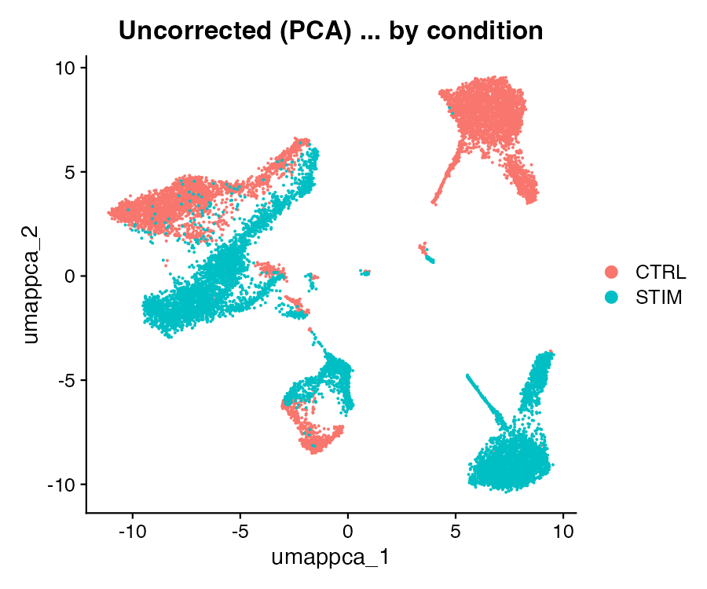
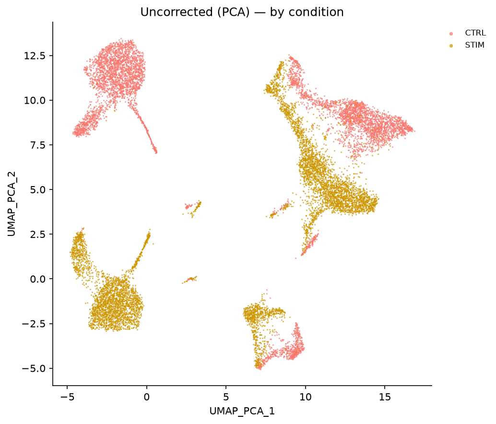
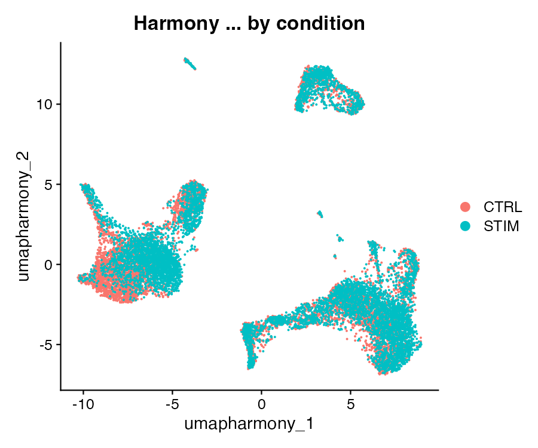
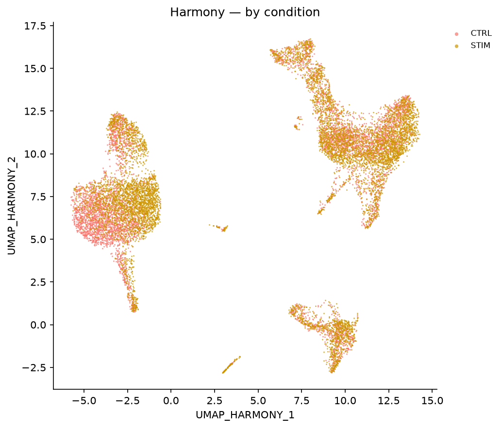
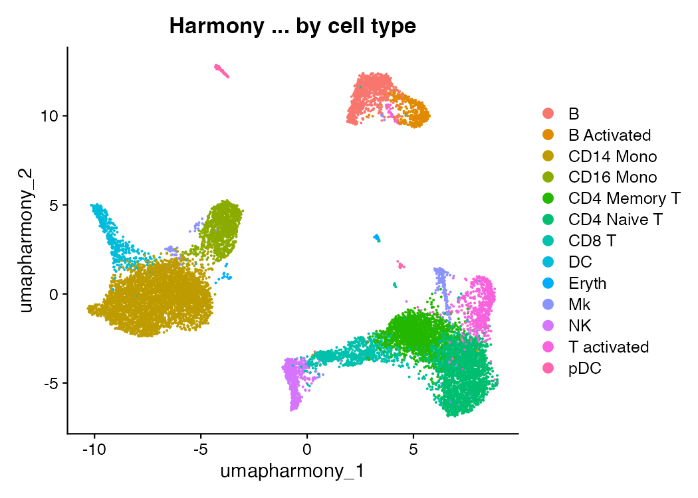
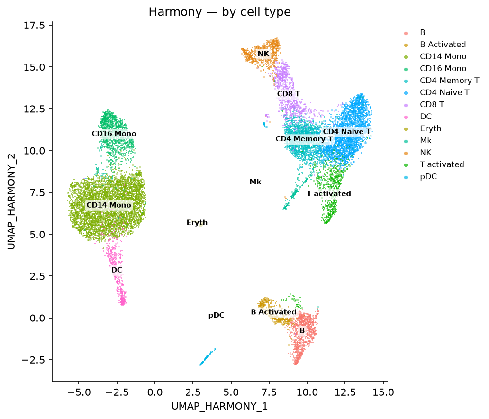

# Batch integration — Harmony, CCA & RPCA (R Seurat vs Shanuz)

A side-by-side port of Seurat's [integration vignette](https://satijalab.org/seurat/articles/integration_introduction)
on the Kang et al. 2018 PBMC dataset (`ifnb`): ~14,000 human blood cells, half
left resting (**CTRL**) and half stimulated for six hours with interferon-β
(**STIM**). Interferon drives a strong, near-global transcriptional response, so
without correction the cells split first by *condition* and only then by *cell
type* — the textbook batch effect.

The task integration solves: **make the same cell type from the two conditions
overlap, without erasing the biology that separates cell types.** Shanuz ships
three integration paths, and this walkthrough runs all three against their Seurat
references on identical counts:

- **`run_harmony`** ↔ `RunHarmony` / `HarmonyIntegration` — iteratively nudges the
  PCA embedding so batches mix while clusters hold.
- **`integrate_layers(method="cca")`** ↔ `FindIntegrationAnchors(reduction="cca")`
  + `IntegrateData` — anchors are mutual nearest neighbours in a shared
  canonical-correlation space.
- **`integrate_layers(method="rpca")`** ↔ `RPCAIntegration` — the reciprocal-PCA
  variant: each dataset is projected into the other's PCA space before the
  mutual-nearest-neighbour search.

> **Why this tutorial exists.** Every integration function landed in v0.2.0 and
> had only ever been checked against synthetic fixtures with *balanced* batches.
> This is the first time they meet a real dataset with a Seurat reference and
> unequal batch sizes (CTRL 6,548 vs STIM 7,451). Integration embeddings are
> *not* expected to be coordinate-identical — harmonypy and R's harmony are
> separate implementations — so the target is *do the two tools recover the same
> structure*: the same collapse in batch separation, the same recovery of cell
> type, cluster partitions that agree. **This tutorial is also the first in the
> initiative to find real defects** — see the concordance section.

---

## The data — ifnb, through the export bridge

`ifnb` is a curated SeuratData object with no clean raw source, so both languages
read the **same counts**, exported once from R by `tutorials/export_seuratdata.R`
into a 10x-style matrix folder. That guarantees byte-identical input and cell
order — the same discipline every other tutorial gets from a shared GEO download.

```
14,053 genes × 13,999 cells   ·   CTRL 6,548 / STIM 7,451   ·   13 cell types
```

The `stim` column is the batch to remove; `seurat_annotations` is the cell-type
label to preserve — both ship with the dataset, so the two tools start from the
identical annotated state.

---

## Step 1 · Load and prep to PCA — one shared variable-feature basis

Standard prep is the uncorrected starting point every method shares. One wrinkle
makes the cross-tool comparison fair, exactly as in the Mixscape tutorial: **both
tools use the same variable features.** The Python run writes the 2,000 HVGs it
selected to `figures_integration/hvg_features.txt`, and the R script reads them
back — so the only divergences left are the genuinely method-level ones (PCA
numerics, the integration algorithms, Louvain ties).

<table>
<tr><th>R (Seurat)</th><th>Python (Shanuz)</th></tr>
<tr><td>

```r
# same exported counts Python reads
counts <- Read10X("~/.shanuz_data/ifnb")
obj <- CreateSeuratObject(counts, min.cells = 3,
                          meta.data = meta)

hvg <- readLines("figures_integration/hvg_features.txt")
obj <- NormalizeData(obj, verbose = FALSE)
VariableFeatures(obj) <- hvg          # Python's HVGs
obj <- ScaleData(obj, features = hvg, verbose = FALSE)
obj <- RunPCA(obj, features = hvg, npcs = 30,
              verbose = FALSE)
```

</td><td>

```python
from shanuz.datasets import ifnb
from shanuz.shanuz import create_shanuz_object
from shanuz.preprocessing import (
    normalize_data, find_variable_features, scale_data)
from shanuz.reduction import run_pca

counts, genes, cells, meta = ifnb()
obj = create_shanuz_object(counts=counts, assay="RNA",
        min_cells=3, feature_names=genes,
        cell_names=cells, meta_data=meta)

normalize_data(obj, assay="RNA")
find_variable_features(obj, assay="RNA", nfeatures=2000)
scale_data(obj, assay="RNA")
run_pca(obj, assay="RNA", n_pcs=30)   # writes hvg file
```

</td></tr>
</table>

---

## Step 2 · Integrate — three ways

Harmony corrects the existing PCA in place; CCA and RPCA split the object by
condition, anchor the two batches, and rebuild a corrected reduction. Each result
is stored under its own name and clustered identically (Louvain, resolution 0.5,
neighbours on 30 dims) so the comparison is like-for-like.

<table>
<tr><th>R (Seurat)</th><th>Python (Shanuz)</th></tr>
<tr><td>

```r
obj[["RNA"]] <- split(obj[["RNA"]], f = obj$stim)

obj <- IntegrateLayers(obj, method = HarmonyIntegration,
        orig.reduction = "pca", new.reduction = "harmony")
obj <- IntegrateLayers(obj, method = CCAIntegration,
        orig.reduction = "pca", new.reduction = "cca")
obj <- IntegrateLayers(obj, method = RPCAIntegration,
        orig.reduction = "pca", new.reduction = "rpca")
```

</td><td>

```python
from shanuz.integration import run_harmony, integrate_layers

run_harmony(obj, group_by="stim", reduction="pca",
            reduction_name="harmony")
integrate_layers(obj, method="cca", group_by="stim",
                 new_reduction="cca")
integrate_layers(obj, method="rpca", group_by="stim",
                 new_reduction="rpca")
```

</td></tr>
</table>

---

## Step 3 · Score the integration

Two rotation-invariant summaries tell the story. **Batch separation** (silhouette
by `stim`, *lower is better* — a good integration mixes the conditions) and
**cell-type preservation** (silhouette by cell type, and the adjusted Rand index
of the clusters against the known annotations, *higher is better*). The Shanuz
scoreboard:

| method | sil_batch ↓ | sil_celltype ↑ | n_clusters | ARI→celltype ↑ | batch-mix ↑ |
|--------|---:|---:|---:|---:|---:|
| uncorrected (PCA) | 0.108 | 0.139 | 16 | 0.524 | 0.164 |
| **Harmony** | **0.008** | 0.192 | 12 | **0.917** | **0.991** |
| **CCA** | **0.007** | 0.181 | 14 | **0.867** | **0.990** |
| RPCA | 0.080 | 0.151 | 19 | 0.444 | 0.222 |

Uncorrected, the cells separate by condition (batch-mix 0.164 — clusters are
nearly single-condition). Harmony and CCA collapse that almost completely
(batch-mix 0.99) while *raising* cell-type recovery. RPCA is the outlier — hold
that thought for the concordance section.

<table>
<tr><th>R — uncorrected, by condition</th><th>Shanuz — uncorrected, by condition</th></tr>
<tr>
<td></td>
<td></td>
</tr>
</table>

The two conditions form two clouds — the interferon shift dominates the embedding.
After Harmony they interleave, while the cell types stay apart:

<table>
<tr><th>R — Harmony, by condition</th><th>Shanuz — Harmony, by condition</th></tr>
<tr>
<td></td>
<td></td>
</tr>
</table>

<table>
<tr><th>R — Harmony, by cell type</th><th>Shanuz — Harmony, by cell type</th></tr>
<tr>
<td></td>
<td></td>
</tr>
</table>

---

## The headline · R-vs-Python concordance, and two RPCA bugs

Because integration embeddings are not coordinate-comparable across tools, the
concordance is **partition-based**: the adjusted Rand index between the two tools'
clusterings (`ARI(py,R)`, 1 = identical), each tool's own cell-type recovery
(`ARI→type` — the biological check, the two columns should track), and each tool's
batch mixing (`mix`, 1 = fully mixed). All are computed from the cluster labels
`report_concordance()` reads out of the verify script's `r_calls.csv`.

| method | ARI(py,R) | py ARI→type | R ARI→type | py mix | R mix |
|--------|---:|---:|---:|---:|---:|
| PCA (baseline) | 0.96 | 0.524 | 0.520 | 0.164 | 0.164 |
| **Harmony** | 0.95 | 0.917 | 0.930 | **0.991** | **0.991** |
| **CCA** | 0.83 | 0.867 | 0.873 | **0.990** | **0.991** |
| **RPCA** | 0.46 | **0.444** | **0.735** | **0.222** | **0.914** |

**Harmony and CCA match Seurat almost exactly.** The uncorrected baseline is
identical to three decimals (mix 0.164 either way — the harness is calibrated),
and both real methods land their batch mixing and cell-type recovery right on top
of Seurat's. This is the confirmation the initiative was built to get: shanuz's
two primary integration paths reproduce Seurat's result on the standard benchmark.

**RPCA is a different story — and the tutorial's own concordance table caught it.**
The `mix` columns diverge sharply: Seurat's RPCA integrates ifnb nearly as well as
CCA (0.914), while shanuz's barely moves the batches (0.222), and its cell-type
recovery (0.444) actually falls *below* the uncorrected baseline. Investigating
that gap surfaced **two distinct defects in `shanuz/anchors.py`**:

1. **A crash on unequal batch sizes — fixed in this PR.** The reciprocal-PCA
   branch passed its mutual-nearest-neighbour helper the ref/query arrays in the
   wrong order, so whenever the query was larger than the reference (i.e. every
   real dataset) it indexed past the neighbour list and raised `IndexError`. The
   unit tests used *balanced* synthetic batches, which never trip it — precisely
   the blind spot this initiative exists to close. A one-line reorder plus two
   regression tests with unequal sizes.

2. **An anchor-quality gap — not fixed here, tracked separately.** With the crash
   gone, RPCA runs but under-integrates ~4×. The cause is anchor *quality*, not
   count: CCA finds 7,262 anchors and RPCA 992, but CCA *subsampled to 992*
   anchors still integrates fine (sil_batch 0.012) while RPCA's own 992 give
   0.080 — the reciprocal projection is producing incorrect pairs. Closing it
   means aligning the reciprocal-PCA construction with Seurat's, a change to the
   core anchor machinery that belongs in its own PR rather than this tutorial.
   Until then, **prefer Harmony or CCA on Shanuz**; both match Seurat.

That is the R-fidelity net doing exactly its job — three feature PRs into Wave 1,
the first real integration benchmark turns a green synthetic suite into a fixed
crash and a documented, tracked defect.

---

## Running it yourself

```bash
Rscript tutorials/export_seuratdata.R ifnb        # one-time counts export (~394 MB SeuratData pkg)
python  tutorials/ifnb_integration_tutorial.py    # writes HVGs, prints the scoreboard
Rscript tutorials/ifnb_integration_verify.R       # Seurat reference → r_calls.csv + r_*.png
python  tutorials/ifnb_integration_tutorial.py    # re-run: now prints the R-vs-Python concordance
python  tutorials/generate_integration_plots.py   # Shanuz figures → figures_integration/py_*.png
```

The R reference needs the `harmony` package and enough headroom for Seurat v5's
parallel integration (`options(future.globals.maxSize = 3 * 1024^3)`, set in the
script).

**Figures** (`tutorials/figures_integration/`, `r_*` = R Seurat, `py_*` = Shanuz):

| Figure | Description |
|---|---|
| `py_01_uncorrected_stim.png` | UMAP of raw PCA, coloured by condition — the batch effect |
| `py_02_harmony_stim.png` | UMAP after Harmony, by condition — now mixed |
| `py_03_harmony_celltype.png` | Same map by cell type — the biology survived |
| `py_04_scoreboard.png` | Batch mixing vs cell-type recovery, per method |

---

## R Seurat → Shanuz API

| Task | R (Seurat) | Python (Shanuz) |
|------|-----------|-----------------|
| Harmony | `RunHarmony(obj, "stim")` / `IntegrateLayers(method=HarmonyIntegration)` | `run_harmony(obj, group_by="stim")` / `integrate_layers(method="harmony")` |
| CCA anchors | `FindIntegrationAnchors(list, reduction="cca")` + `IntegrateData` / `IntegrateLayers(method=CCAIntegration)` | `find_integration_anchors(objs, reduction="cca")` + `integrate_data` / `integrate_layers(method="cca")` |
| RPCA | `IntegrateLayers(method=RPCAIntegration)` | `integrate_layers(method="rpca")` |
| Neighbours on a reduction | `FindNeighbors(obj, reduction="harmony", dims=1:30)` | `find_neighbors(obj, reduction="harmony", dims=range(30))` |
| Cluster | `FindClusters(obj, resolution=0.5)` | `find_clusters(obj, resolution=0.5)` |
| UMAP on a reduction | `RunUMAP(obj, reduction="harmony", dims=1:30)` | `run_umap(obj, reduction="harmony", dims=range(30))` |

---

## References

Kang HM, Subramaniam M, Targ S, et al. (2018) **Multiplexed droplet single-cell
RNA-sequencing using natural genetic variation.** *Nature Biotechnology* 36,
89-94. <https://doi.org/10.1038/nbt.4042>

Korsunsky I, Millard N, Fan J, et al. (2019) **Fast, sensitive and accurate
integration of single-cell data with Harmony.** *Nature Methods* 16, 1289-1296.
<https://doi.org/10.1038/s41592-019-0619-0>
