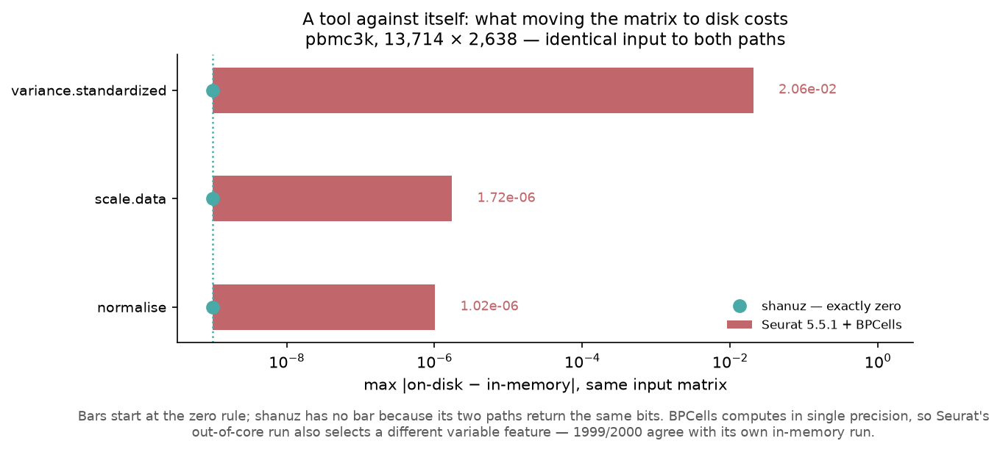
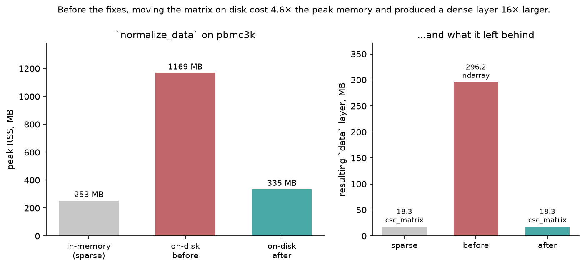
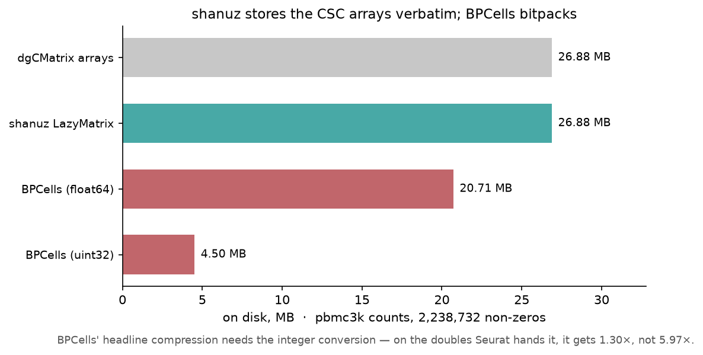

# Out of Core: `LazyMatrix` against BPCells

**Dataset** — pbmc3k, 13,714 features × 2,638 cells (10x Genomics, 2016)
**R side** — Seurat 5.5.1 + BPCells 0.3.1 · `tutorials/lazy_bpcells_verify.R`
**Python side** — `tutorials/lazy_bpcells_tutorial.py`

---

## What this compares, and what it cannot

Seurat's answer to a matrix that does not fit in memory is **BPCells**: a
bitpacked on-disk format plus a *deferred operation graph*. `LogNormalize`,
`VST` and `ScaleData` are queued rather than executed, and nothing is
materialised until a reduction asks for a number. Seurat ships dedicated
`IterableMatrix` methods for exactly the functions that touch the matrix —
fourteen of them, including `.CalcN`, `LogNormalize`, `VST`, `ScaleData`,
`RunPCA`, `FindMarkers` and `LeverageScore`.

shanuz's `LazyMatrix` is a different design aimed at the same problem: three
memory-mapped `.npy` arrays in CSC layout, with the analysis functions streaming
over them a block of cells at a time. It is lazy in **storage**, not in
operations.

So this is not a port comparison. There is no `LazyMatrix` inside Seurat to
match value-for-value, and no amount of tolerance-fiddling would make one. What
*can* be compared, and is:

1. **Do the two tools compute the same analysis out of core?**
2. **Does each tool agree with itself** — does moving a matrix to disk change
   the answer it gives?
3. **What does each format cost on disk?**

The second question turned out to be the interesting one.

---

## Result

**14 of 14 compared anchors match**, 7 of them exactly. shanuz's out-of-core
pipeline reproduces Seurat's *in-memory* pipeline to ~1e-15 on normalisation,
mean, variance and scaled data, and selects **1998 of Seurat's 2000** variable
features.

But the headline is the control, which is Seurat run against itself:



| on-disk vs in-memory, same input | shanuz | Seurat 5.5.1 + BPCells |
|---|---|---|
| normalised values | **0 — bit-identical** | 1.02e-06 |
| `scale.data` | **0** | 1.72e-06 |
| `variance.standardized` | **0** | 2.06e-02 |
| variable features agreeing with own in-memory run | **2000 / 2000** | 1999 / 2000 |
| DE tests supported out of core | **all 8** | `wilcox` only |

**Seurat's own two paths disagree.** BPCells computes in single precision, so
moving a matrix to disk changes Seurat's numbers and changes which gene it calls
variable. That is not a bug — it is the price of a format built for matrices
where single precision is the right trade — but it is worth knowing before
assuming an on-disk run reproduces an in-memory one.

shanuz's two paths are bit-identical. That is not luck: it is the direct result
of a decision made while building this, described under *One implementation, not
two* below.

---

## The one real residual

`variance.standardized` differs from Seurat by **7.6e-3**. It traces cleanly:

- `variance.standardized` is proportional to `1 / variance.expected`
- `variance.expected` is `10^loess_fitted`
- shanuz's `_loess2` is a NumPy local-quadratic fit; R's `loess` is the cloess
  Fortran with kd-tree interpolation
- the two differ by up to **2.5e-2** on the expected variance

The inputs are not in question — mean and variance agree to **1.5e-13**. This is
a pre-existing smoother difference and has nothing to do with going out of core.
It is the reason `vst_selected_head` is reported rather than matched: genes whose
standardized variance sits within 7.6e-3 of each other reorder, so the *head* of
the ranked list is not a stable comparison. The *set* is, and 1998/2000 agree.

---

## What the work found

Assessing whether this tutorial was even possible turned up seven defects. None
was in code anyone suspected; all of it returned plausible output.

### The out-of-core path densified everything

Five functions read a lazy layer through `np.asarray(whole)[idx]` when
subsetting first would have been cheap — `_log_normalize`, `_vst_hvg`,
`scale_data`, `find_markers`, `add_module_score`. `percentage_feature_set` did
not merely densify, it **crashed**: `sp.issparse(LazyMatrix)` is `False` so it
took the dense branch, but indexing a `LazyMatrix` returns *scipy*, whose
`.sum(axis=0)` is a `(1, n)` matrix rather than a vector.

The result was that backing a matrix on disk made things **worse**:



`normalize_data` on a lazy layer used **4.6× the peak memory** of the sparse
path and left behind a dense `ndarray` **16× larger** than the sparse layer it
replaced. The very first step of every pipeline destroyed the property the
feature exists for.

`col_blocks` — which the module docstring calls "the primitive for an
out-of-core reduction" — had **no callers at all**.

### The constructor ended laziness before analysis began

`create_assay5_object` ran `sp.csc_matrix(np.asarray(matrix))` on anything not
already scipy, and `calc_n` densified again to compute `nCount`/`nFeature`. So
the obvious way to use the feature — open a store, build an object on it — was
the one path that could not work.

This was found only because a memory measurement came out backwards. Every test
written up to that point swapped a layer in *after* construction, which is the
unnatural path, and missed it. Seurat has a `.CalcN.IterableMatrix` for exactly
this reason.

### `_loess2` was chaotically sort-dependent

Pre-existing, unrelated to laziness, and the largest of the set.

On pbmc3k **85.5 % of genes share their `log10(mean)`** with another gene —
13,714 genes over only 2,837 distinct values, the largest tied run being 627
genes. `np.argsort` defaults to unstable quicksort, and the LOESS window was
chosen by *position* in the sorted array. So members of a tied run received
different neighbourhoods and therefore different fitted values.

R's `loess` cannot do that: a fitted value is a function of `x` alone. Measured
spread of fitted values within a single tied `x`:

| | within-tie spread |
|---|---|
| R `loess` | 1.8e-15 (interpolation noise) |
| shanuz, before | **1.3e-3** |
| shanuz, after | **0** |

And the sensitivity that followed from it: perturbing `x` by **1e-15** moved
fitted values by up to **28.8 %**, affecting 10,615 of 13,714 genes. Any
difference in BLAS, summation order or platform was enough to move the HVG
statistics.

The fix evaluates the fit once per distinct `x`, chooses neighbourhoods by
distance rather than position, and sorts lexicographically so tied runs order
themselves by `y`. Checked against R before being adopted:

| | median \|diff\| vs R `loess` | correlation |
|---|---|---|
| before | 0.000333 | 0.99999757 |
| after | **0.000103** | **0.99999933** |

It moved *toward* R. Of the 6 genes it swapped in HVG selection, **all 6 it
added are ones Seurat picks**, and only 1 of 6 it dropped was — overlap with
Seurat 99.65 % → **99.90 %**.

A related one: `argsort(v)[::-1]` breaks ties by *descending* index, where R's
`head(order(x, decreasing = TRUE), n)` breaks them ascending. Both HVG selectors
now use `argsort(-v, kind="stable")`.

---

## One implementation, not two

The first version of the streaming path ran a block reduction for lazy layers
and scipy's row reduction for sparse ones. They agreed to **1e-14**, which
sounds like enough.

It is not. `variance.standardized` carries exact ties; a tie-break decides which
of two tied genes is selected; and genes tied under one summation order are not
tied under the other. On pbmc3k that reordered **147 of 2000** features, changed
the PCA row order, and produced **9 clusters against 8**.

Both layer types now go through the same block reduction, so the two paths
cannot disagree — which is what makes the bit-identical column in the table
above true. It also changed the in-memory path's numbers, so that was
re-verified against R: the 99.90 % HVG overlap is post-unification.

The general shape is worth naming, because it recurs: **when a computed
statistic feeds a filter or a tie-break, agreement "to 1e-14" is not agreement.**
The same lesson produced the `avg_log2FC` finding in the DE tutorial, where a
wrong fold change changed which genes `logfc_threshold` returned.

---

## Where shanuz loses



shanuz writes the three CSC arrays verbatim, so the store is the size of the
matrix — **1.00×**, mmap laziness with no size reduction. BPCells bitpacks.

| store | pbmc3k counts |
|---|---|
| dgCMatrix arrays (float64) | 26.88 MB |
| **shanuz `LazyMatrix`** | **26.88 MB** |
| BPCells, bitpacked float64 | 20.71 MB |
| BPCells, bitpacked uint32 | **4.50 MB** |

**6.0× more disk.** Two honest qualifications. First, BPCells' headline
compression *needs the integer conversion* — on the doubles Seurat hands it, it
manages 1.30×, not 5.97×. Second, the cheap half of the gap is available to
shanuz: storing counts as `uint32` rather than `float64` takes 26.88 MB to
**17.92 MB**. The remaining 4× is BP128 SIMD delta encoding, which is a format,
not a tolerance — implementing it is a project of its own and is **not** done
here.

Two other design differences the R side names:

- **`FindMarkers` on an IterableMatrix supports `wilcox` alone.** Everything
  else raises. shanuz runs all eight tests on a lazy layer.
- Seurat **warns** that column-major storage is the wrong orientation for DE and
  recommends `transpose_storage_order()`. shanuz's `LazyMatrix` is CSC —
  cell-major — with no row-major option. Its own docstring already flagged this
  as "a natural future extension"; the R side confirms it matters.

---

## Reproducing

```bash
# Python side — writes anchors and the cell list
python tutorials/lazy_bpcells_tutorial.py

# R side — needs BPCells, which is not on CRAN and needs libhdf5 at build time
brew install hdf5 pkg-config
Rscript -e 'remotes::install_github("bnprks/BPCells/r")'
Rscript tutorials/lazy_bpcells_verify.R

# compare
python tutorials/lazy_bpcells_tutorial.py --report

# figures
python tutorials/generate_lazy_plots.py
```

### On installing BPCells

glmGamPoi is the precedent for treating an R install as a hazard: a *Suggests*
of DESeq2 that `FindMarkers` never calls, whose mere presence flips
`sctransform`'s `vst` onto a different backend and moves the SCT reference.

BPCells is **not** that shape. Every reference to it inside Seurat is gated on
`inherits(x, "IterableMatrix")` — dispatch on the matrix *type* — never on
`requireNamespace`. A `dgCMatrix` cannot enter a BPCells branch. Verified rather
than assumed: ten Seurat references were fingerprinted before and after
installing it, covering `NormalizeData`, `FindVariableFeatures`, `ScaleData`,
`RunPCA`, `FindNeighbors`/`FindClusters`, `FindMarkers` and `SCTransform`.
**None moved.**

One correction to the record: BPCells **hard-requires HDF5**. Its configure
script aborts rather than building without it, even though the HDF5 readers are
not needed when the store is written from a `dgCMatrix`.

---

## A note on measurement

Three of the five initial anchor mismatches were **an artefact of the R script's
own JSON serialisation**, which rounded to 10 decimal places. For a mean of
0.0034 that is a 2.9e-8 relative floor — larger than several of the differences
under test:

| anchor | with the rounding | true |
|---|---|---|
| `normalize_head` | 2.32e-11 | **2.85e-15** |
| `vst_mean_head` | 2.59e-08 | **3.81e-15** |
| `vst_variance_head` | 3.85e-08 | **3.65e-15** |

They would have been reported as findings. The tolerances in
`lazy_bpcells_tutorial.py` are each set one decade above a *measured* residual,
and `test_lazy_bpcells_parity.py` asserts none exceeds 1e-2.
