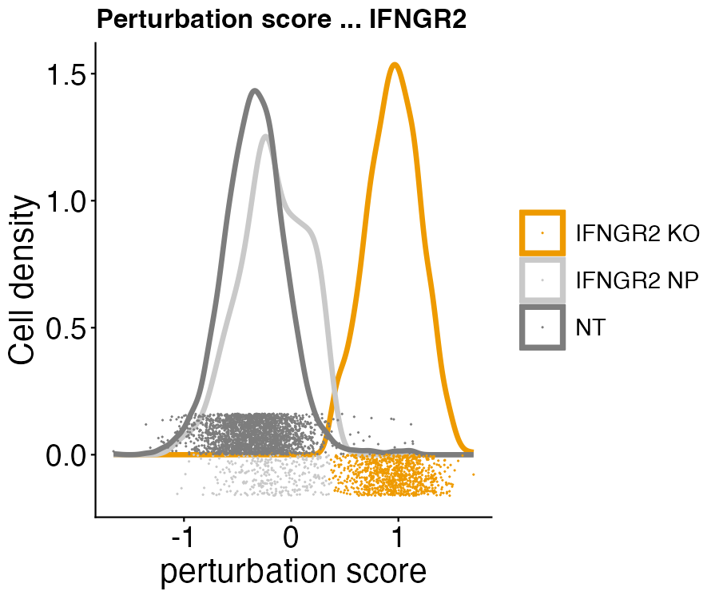
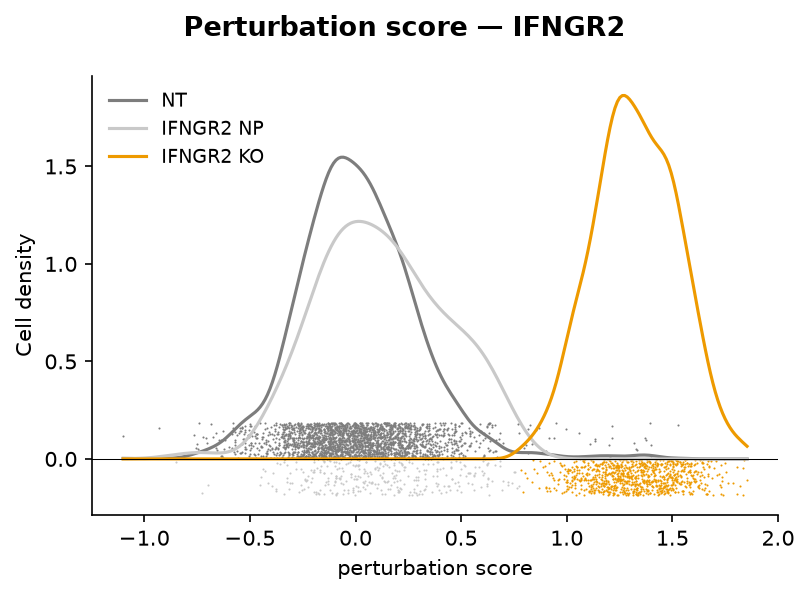
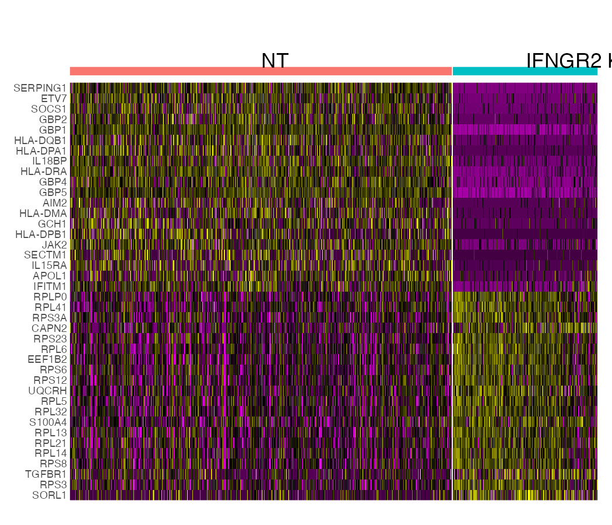
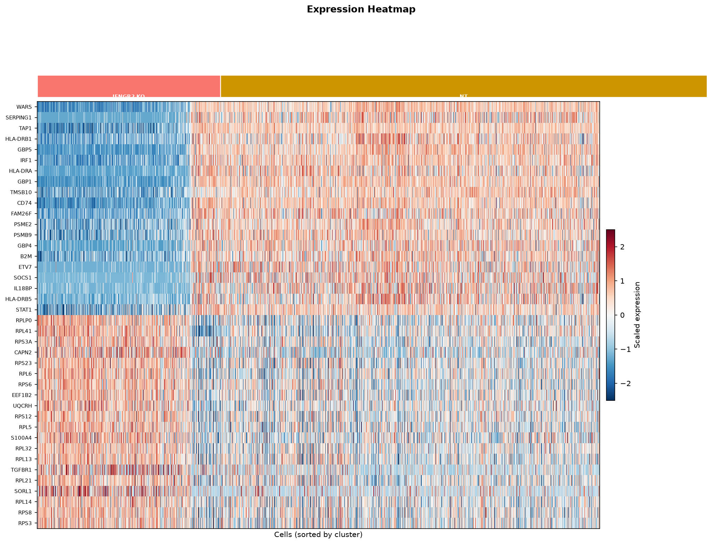
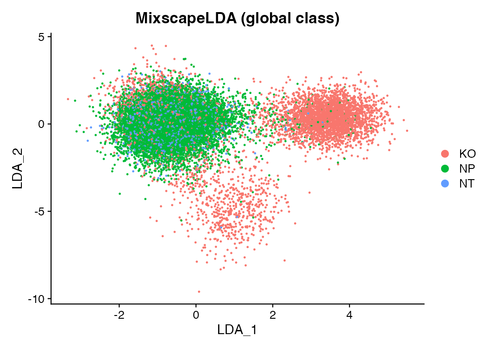
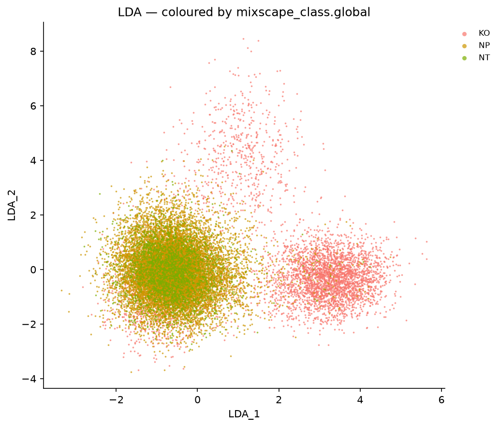

# Mixscape — Separating true knockouts from escapers (R Seurat vs Shanuz)

A side-by-side port of Seurat's [Mixscape vignette](https://satijalab.org/seurat/articles/mixscape_vignette).
In a **pooled CRISPR screen** (Perturb-seq / ECCITE-seq) every cell receives one
guide RNA against one gene, and the whole pool is sequenced together. The catch:
**carrying a guide is not the same as being perturbed.** A cell can pick up a
`STAT1` guide and still escape the knockout — the edit fails, one allele survives
— so the cells labelled `STAT1` are a *mixture* of true knockouts (**KO**) and
non-perturbed escapers (**NP**) that look just like controls. Averaging over that
mixture dilutes, and can entirely mask, the phenotype.

**Mixscape** (Papalexi, Mimitou et al. 2021) separates the two. Shanuz ships all
three of its steps, and this walkthrough runs them against their R references on
the same GEO bytes:

- **`calc_perturb_sig`** ↔ `CalcPerturbSig` — subtract from each cell the mean of
  its nearest non-targeting (NT) neighbours, leaving the **local perturbation
  signature** with technical variation cancelled out.
- **`run_mixscape`** ↔ `RunMixscape` — per target gene, an iterative
  two-component Gaussian mixture over the perturbation score splits KO from NP, so
  each guide gets a knockout *rate* instead of an assumption.
- **`mixscape_lda`** ↔ `MixscapeLDA` — one supervised map on which each guide
  population forms its own cloud.

> **Why this tutorial exists.** Every Mixscape feature landed after PR #10 and had
> only ever been checked against synthetic fixtures with a *known* KO/NP truth.
> This is the first time the three functions meet real screen data with a Seurat
> reference. Mixscape is a stochastic, multi-stage pipeline (kNN, per-gene DE, an
> EM-refined mixture), so the target is **not** byte-identical calls but *do the
> two tools recover the same biology* — the same guides called strong-effect,
> KO/NP/NT proportions in step, per-cell class concordance.

---

## The data — THP-1 ECCITE-seq, from raw GEO

`shanuz.datasets.thp1_eccite` reads the **original GEO matrices** (GSE153056,
Papalexi et al. 2021) — the cDNA + protein counts and the published per-cell
metadata — *not* SeuratData's pre-built `thp1.eccite` object, whose internal
processing has no clean cross-language form. Both languages read identical counts.
The metadata already carries each cell's guide assignment, so both tools start
from the same annotated state.

```
18,649 genes × 20,729 cells   ·   25 target guides + NT   ·   3 replicates
```

The `gene` column is the label Mixscape works from: `NT` for the 2,386 controls,
or the targeted gene for the rest. Twenty-five genes were targeted — immune
checkpoints and the interferon-γ response pathway that regulates them.

---

## Step 1 · Load, build the object, prep to PCA

Standard RNA prep (the reduction the signature needs), with one wrinkle that makes
the cross-tool comparison fair: **both tools use the same variable-feature set.**
The Python run writes the 2,000 HVGs it selected to `figures_mixscape/hvg_features.txt`,
and the R script reads them back — so the perturbation-signature basis is
byte-identical and the only divergences left are genuinely method-level (PCA
numerics, kNN ties, the DE test, the EM mixture).

<table>
<tr><th>R (Seurat)</th><th>Python (Shanuz)</th></tr>
<tr><td>

```r
# same GEO cDNA bytes Python reads (dense, fread'd
# then sparsified); metadata carries the guide labels
obj <- CreateSeuratObject(counts = counts, min.cells = 3,
                          meta.data = meta)

hvg <- readLines("figures_mixscape/hvg_features.txt")
obj <- NormalizeData(obj, verbose = FALSE)
VariableFeatures(obj) <- hvg          # Python's HVGs
obj <- ScaleData(obj, features = hvg, verbose = FALSE)
obj <- RunPCA(obj, features = hvg, npcs = 50,
              verbose = FALSE)
```

</td><td>

```python
from shanuz.datasets import thp1_eccite
from shanuz.shanuz import create_shanuz_object
from shanuz.preprocessing import (
    normalize_data, find_variable_features, scale_data)
from shanuz.reduction import run_pca

rna, genes, adt, adt_names, meta, cells = thp1_eccite()
obj = create_shanuz_object(counts=rna, assay="RNA",
        min_cells=3, feature_names=genes,
        cell_names=cells, meta_data=meta)

normalize_data(obj, assay="RNA")
find_variable_features(obj, assay="RNA", nfeatures=2000)
scale_data(obj, assay="RNA")
run_pca(obj, assay="RNA", n_pcs=50)   # writes hvg file
```

</td></tr>
</table>

---

## Step 2 · CalcPerturbSig — the local perturbation signature

Guide assignment is confounded by everything else that varies between cells: cell
cycle, sequencing depth, replicate, ambient RNA. To strip that away, each cell has
subtracted from it the mean expression of its 20 nearest **NT** cells — found in
PCA space (first 40 PCs), *within its own replicate* so batch is never mistaken
for signal. What remains is the deviation from the controls the cell most
resembles, stored as a new `PRTB` assay.

<table>
<tr><th>R (Seurat)</th><th>Python (Shanuz)</th></tr>
<tr><td>

```r
obj <- CalcPerturbSig(obj, assay = "RNA",
        features = hvg, slot = "data",
        gd.class = "gene", nt.cell.class = "NT",
        reduction = "pca", ndims = 40,
        num.neighbors = 20, split.by = "replicate",
        new.assay.name = "PRTB")
```

</td><td>

```python
from shanuz.mixscape import calc_perturb_sig

calc_perturb_sig(obj, assay="RNA", features=hvg,
        labels="gene", nt_class="NT",
        reduction="pca", ndims=40,
        num_neighbors=20, split_by="replicate",
        new_assay="PRTB")
```

</td></tr>
</table>

---

## Step 3 · RunMixscape — knockout vs escaper, per guide

Working on the signature, each target gene is handled independently: its cells are
tested for differential expression against NT (a gene with too few DE genes has no
detectable phenotype, and all its cells are called NP); then an **iterative
two-component Gaussian mixture** over the cells' projection onto the perturbation
vector splits the high (KO) mode from the low (NP, anchored by the NT cells).

<table>
<tr><th>R (Seurat)</th><th>Python (Shanuz)</th></tr>
<tr><td>

```r
obj <- RunMixscape(obj, assay = "PRTB",
        slot = "scale.data", labels = "gene",
        nt.class.name = "NT", de.assay = "RNA",
        min.de.genes = 5, iter.num = 10,
        prtb.type = "KO")
table(obj$mixscape_class.global)
#     KO    NP    NT
#   5107 13236  2386
```

</td><td>

```python
from shanuz.mixscape import run_mixscape

run_mixscape(obj, assay="PRTB", labels="gene",
        nt_class="NT", de_assay="RNA",
        min_de_genes=5, iter_num=10,
        prtb_type="KO")
obj.meta_data["mixscape_class.global"].value_counts()
#  NP    13398
#  NT     2386
#  KO     4945
```

</td></tr>
</table>

| Global class | Shanuz | R Seurat |
|---|---:|---:|
| KO | 4,945 | 5,107 |
| NP | 13,398 | 13,236 |
| NT | 2,386 | 2,386 |

The **per-guide knockout rate** is the headline: how often the edit actually took.
Both tools sort the *same eleven* guides into "has a detectable phenotype" and the
*same fourteen* to a flat zero — the checkpoint genes whose effect is at the
protein, not RNA, level (`CD86`, `PDCD1LG2`, `CMTM6` …), which is exactly why the
original screen also measured protein.

| gene | Shanuz KO rate | R KO rate |    | gene | Shanuz | R |
|------|---:|---:|---|------|---:|---:|
| STAT2  | 0.83 | 0.80 | | IRF1 | 0.57 | 0.68 |
| JAK2   | 0.78 | 0.78 | | MYC  | 0.58 | 0.23 |
| SMAD4  | 0.76 | 0.82 | | SPI1 | 0.52 | 0.44 |
| STAT1  | 0.75 | 0.75 | | CUL3 | 0.34 | 0.38 |
| IFNGR2 | 0.74 | 0.74 | | BRD4 | 0.32 | 0.45 |
| IFNGR1 | 0.72 | 0.73 | | *(14 more)* | 0.00 | 0.00 |

The **perturbation-score density** for `IFNGR2` is the diagnostic for *why*
Mixscape split a guide the way it did: NT controls and the NP escapers share the
low mode, while genuine knockouts pull away into a high mode. The mixture model
finds exactly that structure.

<table>
<tr><th>R — <code>PlotPerturbScore</code></th><th>Shanuz — <code>plot_perturb_score</code></th></tr>
<tr>
<td></td>
<td></td>
</tr>
</table>

The genes underneath the score — DE between `NT` and `IFNGR2 KO`, every cell
ordered by its knockout probability — show the expression block turning on in step
with the posterior, the escapers at the low-probability end still looking like
control.

<table>
<tr><th>R — <code>MixscapeHeatmap</code></th><th>Shanuz — <code>mixscape_heatmap</code></th></tr>
<tr>
<td></td>
<td></td>
</tr>
</table>

---

## Step 4 · MixscapeLDA — separating the guide populations

Where `run_mixscape` asks *which cells are perturbed*, the LDA asks *how do the
whole guide populations differ from each other and from control*, and answers with
one supervised map. It reads only the perturbation signature and the raw guide
labels — the KO/NP calls are not used.

<table>
<tr><th>R — <code>MixscapeLDA</code> → <code>DimPlot</code></th><th>Shanuz — <code>mixscape_lda</code> → <code>dim_plot</code></th></tr>
<tr>
<td></td>
<td></td>
</tr>
</table>

Read this map **visually, not as a per-cell accuracy.** Escaper (NP) cells resemble
NT *by design* — that is the whole point of separating them — so they fall onto
the NT cloud, and any "how often does the LDA label a guide cell with its own
guide" score is meant to be low. What the map shows is the genuine knockouts of the
strong guides pulling away into their own territory.

---

## The headline · R-vs-Python concordance

Every cell, compared call-for-call against the Seurat reference on shared input and
a shared variable-feature basis (`report_concordance()` reads the `r_calls.csv` the
verify script writes):

| Comparison | Agreement |
|---|---:|
| **Mixscape** global class (KO/NP/NT)       | **97.45 %** |
| **Mixscape** full class (`<gene> KO`/`NP`) | **97.45 %** |

Mixscape global — Shanuz (rows) × R (cols):

|          | R KO | R NP | R NT |
|---|---:|---:|---:|
| **KO** | 4,762 |   183 |     0 |
| **NP** |   345 | 13,053 |    0 |
| **NT** |     0 |     0 | 2,386 |

**Shanuz reproduces Seurat to 97.45 %** — 528 of 20,729 cells differ — with the
disagreement landing exactly where a mixture model is least certain. All 2,386 NT
cells agree; all 14 zero-phenotype guides agree 100 %; the strong interferon-γ
hits agree tightly (`STAT1` 98.6 %, `JAK2` 97.8 %, `IFNGR2` 97.7 %, `IFNGR1`
96.8 %). The divergence concentrates in the **weak, boundary guides** — `MYC`
(42 % of its cells differ), `SPI1` (29 %), `BRD4` (17 %), `CUL3` (14 %) — whose
perturbation score sits close to the NT mode, so a small difference in the DE gene
set or the EM initialisation flips a cell KO↔NP. That is the genuinely
method-level residual, not a bug: scipy's `GaussianMixture` and R's `mixtools`
seed and iterate their EM differently, and the per-gene Wilcoxon DE breaks ties its
own way in each language.

**No defect found — the Mixscape port recovers the same biology as Seurat**, down
to the same responsive-guide ranking and KO/NP/NT proportions. This is the
confirmation the initiative was built to get, on a pipeline far more stochastic
than the hashing demultiplexers.

---

## Running it yourself

```bash
python tutorials/thp1_mixscape_tutorial.py    # downloads ~66 MB, writes HVGs, prints the report
Rscript tutorials/thp1_mixscape_verify.R      # Seurat reference → r_calls.csv + r_*.png
python tutorials/thp1_mixscape_tutorial.py    # re-run: now prints the R-vs-Python concordance
python tutorials/generate_mixscape_plots.py   # Shanuz figures → figures_mixscape/py_*.png
```

The R reference needs the `mixtools` package (`RunMixscape`'s mixture backend):
`install.packages("mixtools")`.

**Figures** (`tutorials/figures_mixscape/`, `r_*` = R Seurat, `py_*` = Shanuz):

| Figure | Description |
|---|---|
| `py_01_perturb_score.png` | IFNGR2 perturbation-score density — KO vs NP vs NT |
| `py_02_lda.png` | MixscapeLDA map, coloured by global class |
| `py_03_heatmap.png` | DE heatmap, NT vs IFNGR2 KO, cells by KO probability |
| `py_04_ko_rate.png` | Per-guide knockout rate — which edits actually took |

---

## R Seurat → Shanuz API

| Task | R (Seurat) | Python (Shanuz) |
|------|-----------|-----------------|
| Perturbation signature | `CalcPerturbSig(obj, gd.class="gene", nt.cell.class="NT", ndims=40, num.neighbors=20, split.by="replicate")` | `calc_perturb_sig(obj, labels="gene", nt_class="NT", ndims=40, num_neighbors=20, split_by="replicate")` |
| Classify KO / NP | `RunMixscape(obj, labels="gene", nt.class.name="NT", min.de.genes=5, prtb.type="KO")` | `run_mixscape(obj, labels="gene", nt_class="NT", min_de_genes=5, prtb_type="KO")` |
| LDA visualization | `MixscapeLDA(obj, labels="gene", nt.label="NT", npcs=10)` | `mixscape_lda(obj, labels="gene", nt_class="NT", npcs=10)` |
| Global / full class | `obj$mixscape_class.global` / `obj$mixscape_class` | `obj.meta_data["mixscape_class.global"]` / `["mixscape_class"]` |
| Perturbation-score plot | `PlotPerturbScore(obj, target.gene.ident="IFNGR2")` | `plot_perturb_score(obj, "IFNGR2")` |
| DE heatmap | `MixscapeHeatmap(obj, ident.1="NT", ident.2="IFNGR2 KO")` | `mixscape_heatmap(obj, ident_1="NT", ident_2="IFNGR2 KO")` |

---

## Reference

Papalexi E, Mimitou EP, Butler AW, et al. (2021) **Characterizing the molecular
regulation of inhibitory immune checkpoints with multimodal single-cell screens.**
*Nature Genetics* 53, 322-331. <https://doi.org/10.1038/s41588-021-00778-2>
