# Multimodal Tutorial — CITE-seq (RNA + Protein) with R Seurat vs Shanuz

A Python port of Seurat's
[multimodal vignette](https://satijalab.org/seurat/articles/multimodal_vignette)
using the **CBMC CITE-seq** dataset (GSE100866): ~8,600 cord-blood mononuclear
cells profiled simultaneously for the transcriptome and **13 surface proteins**
(antibody-derived tags, "ADT"). It showcases Shanuz's **multi-assay** support:
cluster on RNA, attach the protein counts as a second assay, CLR-normalise them,
and read protein levels on the RNA-derived UMAP.

> **Dataset:** 8k CBMCs, CITE-seq — Stoeckius et al. 2017 (GSE100866)
> **Python:** Shanuz v0.2.0

> **Scope note.** Shanuz stores and normalises multiple assays, visualises one
> against another, **and** performs multimodal *integration* via Weighted
> Nearest Neighbor (WNN) analysis (Step 8) — learning a per-cell RNA-vs-protein
> weight and clustering both modalities jointly.

```bash
python tutorials/cbmc_citeseq_tutorial.py     # printed validation
python tutorials/generate_multimodal_plots.py # writes figures_multimodal/  (Shanuz figures)
Rscript tutorials/cbmc_citeseq_verify.R       # writes figures_multimodal/r_*  (R Seurat figures)
```

> **About the figures.** Each step shows a genuine **side-by-side comparison**:
> the **left** image is real **R Seurat** output (`cbmc_citeseq_verify.R`, titled
> *"R Seurat – …"*) and the **right** image is **Shanuz**
> (`generate_multimodal_plots.py`). Both run the identical RNA workflow, the same
> CLR transform, and the same protein-gated annotation — with the same
> thresholds — on the same data. Clustering is still stochastic and the two
> Louvain implementations are not the same code, so compare the *structure*, not
> exact positions or cluster numbers.

---

## Step 1 · Load RNA + Protein, align barcodes

The RNA matrix mixes human and mouse spike-in genes; both Seurat and Shanuz keep
the human genes. RNA and ADT are aligned to their shared cell barcodes.

<table>
<tr><th>R (Seurat)</th><th>Python (Shanuz)</th></tr>
<tr><td>

```r
library(Seurat)
cbmc.rna <- as.sparse(read.csv("GSE100866_...RNA_umi.csv.gz", row.names = 1))
cbmc.rna <- CollapseSpeciesExpressionMatrix(cbmc.rna)   # keep human
cbmc.adt <- as.sparse(read.csv("GSE100866_...ADT_umi.csv.gz", row.names = 1))

joint <- intersect(colnames(cbmc.rna), colnames(cbmc.adt))
cbmc.rna <- cbmc.rna[, joint]
cbmc.adt <- cbmc.adt[, joint]
```

</td><td>

```python
from shanuz.datasets import cbmc_citeseq
# downloads ~15 MB, keeps human genes, aligns shared barcodes
rna, genes, adt, proteins, cells = cbmc_citeseq()
# rna: (20379 genes x 8617 cells)   adt: (13 proteins x 8617 cells)
# proteins: CD3 CD4 CD8 CD45RA CD56 CD16 CD10 CD11c CD14 CD19 CD34 CCR5 CCR7
```

</td></tr>
</table>

---

## Step 2 · Create the object & run the RNA workflow

<table>
<tr><th>R (Seurat)</th><th>Python (Shanuz)</th></tr>
<tr><td>

```r
cbmc <- CreateSeuratObject(counts = cbmc.rna)
cbmc <- NormalizeData(cbmc)
cbmc <- FindVariableFeatures(cbmc)
cbmc <- ScaleData(cbmc)
cbmc <- RunPCA(cbmc, npcs = 30)
cbmc <- FindNeighbors(cbmc, dims = 1:15)
cbmc <- FindClusters(cbmc, resolution = 0.6)
cbmc <- RunUMAP(cbmc, dims = 1:15)
```

</td><td>

```python
from shanuz.shanuz import create_shanuz_object
from shanuz.preprocessing import normalize_data, find_variable_features, scale_data
from shanuz.reduction import run_pca
from shanuz.neighbors import find_neighbors
from shanuz.clustering import find_clusters
from shanuz.umap import run_umap

obj = create_shanuz_object(counts=rna, assay="RNA", min_cells=3,
                           feature_names=genes, cell_names=cells, project="cbmc")
normalize_data(obj)
find_variable_features(obj, selection_method="vst", nfeatures=2000)
scale_data(obj, features=obj.assays["RNA"]._all_feature_names)
run_pca(obj, n_pcs=30, features=obj.assays["RNA"].variable_features)
find_neighbors(obj, dims=range(15), k_param=20)
find_clusters(obj, resolution=0.6, random_seed=0)
run_umap(obj, dims=range(15), seed=42)
```

</td></tr>
<tr>
<td>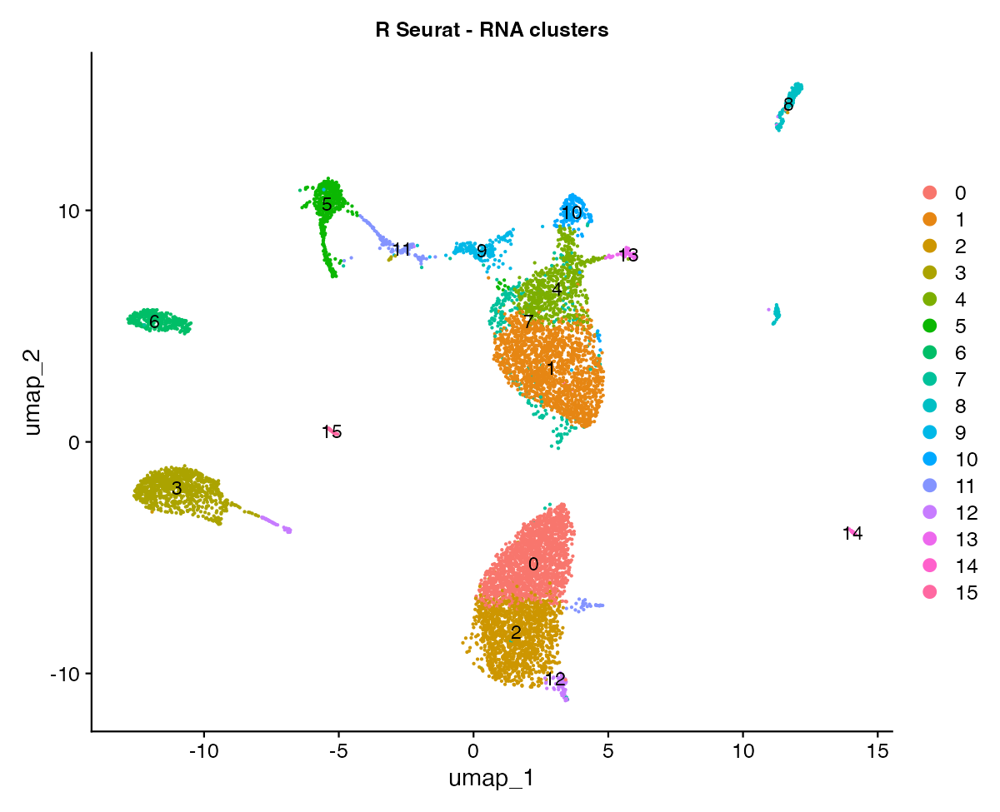</td>
<td></td>
</tr>
</table>

---

## Step 3 · Add the protein (ADT) assay & CLR-normalise

The antibody counts become a **second assay**. Proteins are normalised with the
centered-log-ratio transform, applied per cell across the 13-protein panel
(`margin = 2`) — the recommended setting for small ADT panels.

<table>
<tr><th>R (Seurat)</th><th>Python (Shanuz)</th></tr>
<tr><td>

```r
adt_assay <- CreateAssayObject(counts = cbmc.adt)
cbmc[["ADT"]] <- adt_assay

cbmc <- NormalizeData(cbmc, assay = "ADT",
                      normalization.method = "CLR", margin = 2)
```

</td><td>

```python
from shanuz.assay5 import create_assay5_object

obj.assays["ADT"] = create_assay5_object(
    counts=adt_aligned, feature_names=proteins,
    cell_names=obj.cell_names(), key="adt_",
)
normalize_data(obj, assay="ADT", normalization_method="CLR", margin=2)
# obj.assay_names() -> ['RNA', 'ADT']
```

</td></tr>
</table>

> `margin` means exactly what it means in Seurat, axis included: Seurat's
> `CustomNormalize` runs `apply(data, MARGIN = margin, clr_function)`, and R's
> `apply` treats `MARGIN = 1` as rows and `MARGIN = 2` as columns. So with counts
> stored features × cells, **`margin = 1` normalises each protein across cells**
> (Seurat's default) and **`margin = 2` normalises each cell across its
> proteins** (what ADT panels want). Shanuz had these two swapped until the fix
> described at the end of Step 8.

---

## Step 4 · Visualise protein on the RNA UMAP

In R you switch `DefaultAssay()` (or use the `adt_`/`rna_` key prefixes); in
Shanuz you pass `assay="ADT"`.

<table>
<tr><th>R (Seurat)</th><th>Python (Shanuz)</th></tr>
<tr><td>

```r
DefaultAssay(cbmc) <- "ADT"
FeaturePlot(cbmc, c("CD3","CD4","CD8","CD19",
                    "CD14","CD16","CD56","CD11c"))
```

</td><td>

```python
from shanuz.plotting import feature_plot

feature_plot(obj, ["CD3","CD4","CD8","CD19",
                   "CD14","CD16","CD56","CD11c"],
             assay="ADT", reduction="umap",
             min_cutoff="q05", max_cutoff="q95", ncol=4)
```

</td></tr>
<tr>
<td>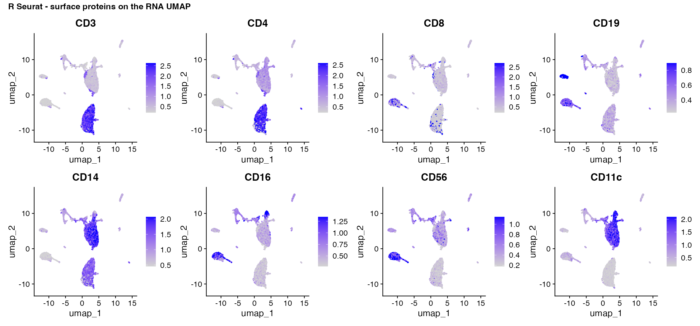</td>
<td></td>
</tr>
</table>

The surface proteins cleanly mark their lineages: CD3/CD4 the T-cell mass,
CD19 the B-cell island, CD8/CD16/CD56 the NK cluster, CD14/CD11c the monocytes.

---

## Step 5 · Protein vs RNA for the same marker

The CITE-seq payoff: protein gives a smooth, high signal-to-noise readout where
the encoding mRNA is sparse and noisy.

<table>
<tr><th>R (Seurat)</th><th>Python (Shanuz)</th></tr>
<tr><td>

```r
# adt_ / rna_ key prefixes pull from each assay
FeaturePlot(cbmc, c("adt_CD19", "rna_CD19",
                    "adt_CD3",  "rna_CD3E"), ncol = 2)
```

</td><td>

```python
# left column assay="ADT", right column assay="RNA"
feature_plot(obj, ["CD19"], assay="ADT", reduction="umap")
feature_plot(obj, ["CD19"], assay="RNA", reduction="umap")
# (generate_multimodal_plots.py draws them paired)
```

</td></tr>
<tr>
<td>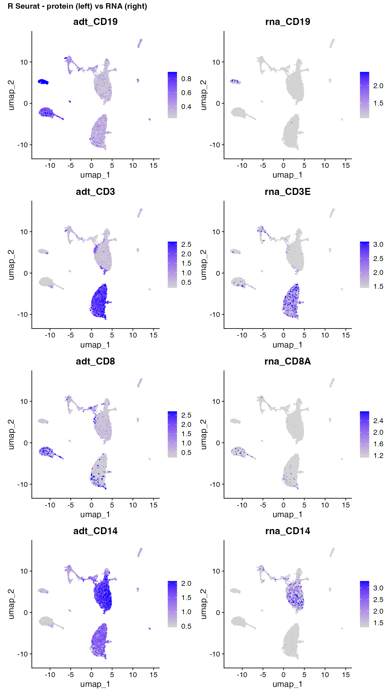</td>
<td></td>
</tr>
</table>

---

## Step 6 · Ridge plots & protein bivariates

<table>
<tr><th>R (Seurat)</th><th>Python (Shanuz)</th></tr>
<tr><td>

```r
RidgePlot(cbmc, features = c("adt_CD3","adt_CD19",
                             "adt_CD14","adt_CD56"), ncol = 2)

FeatureScatter(cbmc, "adt_CD19", "adt_CD3")
FeatureScatter(cbmc, "adt_CD4",  "adt_CD8")
```

</td><td>

```python
from shanuz.plotting import ridge_plot, feature_scatter

ridge_plot(obj, ["CD3","CD19","CD14","CD56"], assay="ADT",
           group_by="protein_celltype", ncol=2)

feature_scatter(obj, "CD19", "CD3", assay="ADT")
feature_scatter(obj, "CD4",  "CD8", assay="ADT")
```

</td></tr>
<tr>
<td>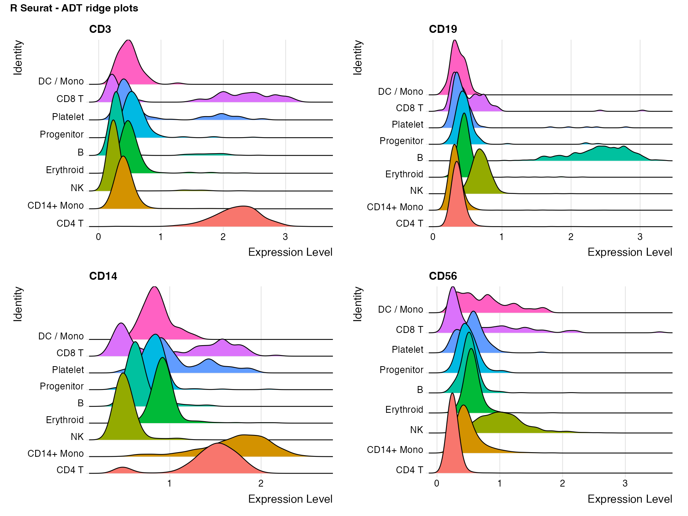</td>
<td></td>
</tr>
<tr>
<td>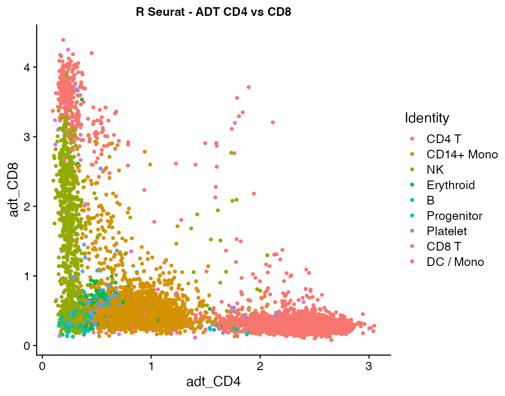</td>
<td></td>
</tr>
<tr>
<td>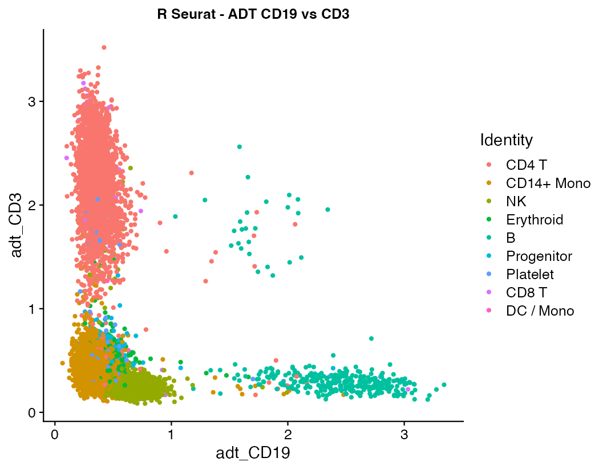</td>
<td></td>
</tr>
</table>

The CD4-vs-CD8 and CD19-vs-CD3 protein scatters separate the major lineages on
just two axes.

---

## Step 7 · Annotate cell types (protein + RNA)

CITE-seq proteins are cleaner lineage markers than RNA, so `annotate_cells()`
gates on the ADT assay (T→NK→B→monocyte→DC→progenitor) and falls back to RNA
markers for populations the 13-protein panel can't resolve — platelets (`PPBP`),
erythroid (`HBB`), pDC (`IGJ`/`PLD4`), and cycling cells.

<table>
<tr><th>R (Seurat)</th><th>Python (Shanuz)</th></tr>
<tr><td>

```r
# manual, by inspecting protein + RNA markers
cbmc <- RenameIdents(cbmc, ...)
DimPlot(cbmc, label = TRUE)
```

</td><td>

```python
from tutorials.cbmc_citeseq_tutorial import annotate_cells
from shanuz.plotting import dim_plot

anno = annotate_cells(obj)
obj.stash_ident("rna_clusters")
obj.rename_idents(anno)
dim_plot(obj, reduction="umap", group_by="protein_celltype", label=True)
```

</td></tr>
<tr>
<td>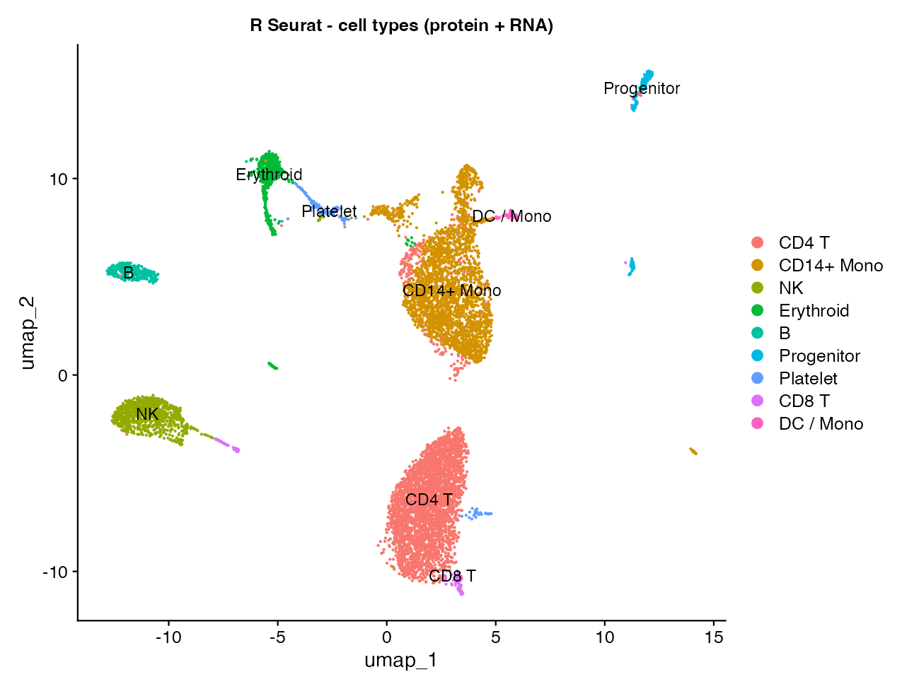</td>
<td></td>
</tr>
</table>

---

## Step 8 · Weighted Nearest Neighbor (WNN) multimodal clustering

Steps 2–7 cluster on **RNA alone** and read protein on top. WNN (Hao et al.,
*Cell* 2021) goes further: it learns, **per cell**, how much to trust each
modality and clusters on a *joint* graph. A cell whose lineage is crisp in
protein space is weighted toward ADT; a cell the antibody panel can say nothing
useful about is weighted toward RNA.

Crucially the weights are **decisive, not hedged**: they use the full 0–1 range,
and most cells commit to one modality rather than sitting at 0.5. That is by
design — the modality score is clipped at 200 before the softmax, so a cell with
a clear preference saturates.

Which cells end up on which side is an empirical result, not something you can
read off the panel design. Mostly the table below tracks the panel, but not
everywhere: **CD8 T leans on RNA (0.37) even though CD8 is one of the 13
antibodies**, while CD4 T leans the other way at 0.64. Seurat says the same
(0.38 / 0.64), so it is a property of the data and the method rather than of
this port — but this tutorial does not explain it.

The protein modality first gets its own reduction (`"apca"`); then
`find_multi_modal_neighbors` builds the joint `wknn`/`wsnn` graphs and writes
a per-cell weight for each modality. Clustering and UMAP then run **on the joint
graph** instead of the RNA PCA.

<table>
<tr><th>R (Seurat)</th><th>Python (Shanuz)</th></tr>
<tr><td>

```r
DefaultAssay(cbmc) <- "ADT"
VariableFeatures(cbmc) <- rownames(cbmc[["ADT"]])
cbmc <- ScaleData(cbmc)
# 13 proteins, so npcs must stay well under that; irlba needs
# the gap, hence approx = FALSE
cbmc <- RunPCA(cbmc, reduction.name = "apca", reduction.key = "apca_",
               npcs = 12, approx = FALSE)

cbmc <- FindMultiModalNeighbors(
  cbmc, reduction.list = list("pca", "apca"),
  dims.list = list(1:15, 1:12), k.nn = 20
)
cbmc <- FindClusters(cbmc, graph.name = "wsnn", resolution = 0.6)
cbmc <- RunUMAP(cbmc, nn.name = "weighted.nn",
                reduction.name = "wnn.umap")

# per-cell modality weights land in metadata:
#   cbmc$RNA.weight , cbmc$ADT.weight
```

</td><td>

```python
from shanuz.reduction import run_pca
from shanuz.preprocessing import scale_data
from shanuz.multimodal import find_multi_modal_neighbors

# protein modality needs its own reduction
adt_features = obj.assays["ADT"]._all_feature_names
scale_data(obj, assay="ADT", features=adt_features)
run_pca(obj, assay="ADT", reduction_name="apca",
        reduction_key="apca_", n_pcs=12, features=adt_features)

find_multi_modal_neighbors(
    obj, reduction_list=["pca", "apca"],
    dims_list=[range(15), range(12)], k_nn=20,
)
find_clusters(obj, graph_name="wsnn", resolution=0.6, random_seed=0)
run_umap(obj, graph="wsnn", reduction_name="wnn_umap", seed=42)

# per-cell modality weights land in meta_data:
#   obj.meta_data["RNA.weight"] , obj.meta_data["ADT.weight"]
```

</td></tr>
</table>

Because the ADT panel has only 13 proteins, `apca` keeps every informative
component (`n_pcs ≤ 12`). Inspect the learned weights by grouping `ADT.weight`
by the Step-7 labels:

```python
obj.meta_data.groupby("protein_celltype")["ADT.weight"].mean().sort_values(ascending=False)
```

The lineages the antibody panel targets head-on lean on protein, and the
ordering tracks how well the panel covers each type. Seurat's numbers on the
same data are alongside:

| Cell type | Shanuz `ADT.weight` | R Seurat | in the panel? |
|-----------|--------------------|----------|---------------|
| NK | 0.65 | 0.65 | CD16 + CD56 |
| CD4 T | 0.64 | 0.64 | CD4 — and CD4/CD8 is a protein call, not an RNA one |
| B | 0.55 | 0.54 | CD19 |
| CD14+ Mono | 0.49 | 0.49 | CD14 |
| Erythroid | 0.38 | 0.40 | ✗ |
| CD8 T | 0.37 | 0.38 | CD8 |
| Progenitor | 0.35 | 0.29 | CD34 only |
| Platelet | 0.29 | 0.30 | ✗ |
| DC / Mono | 0.21 | 0.21 | ✗ — no clean DC probe |

The panel's targets sit at the top and the populations it cannot see sit at the
bottom, which is the result you would hope for. `DC / Mono` is the case worth
dwelling on: protein tells WNN almost nothing about those cells, so nearly all
the weight goes to RNA. A weighting pinned near 0.5 could never express that.
Erythroid and platelet carry no antibody either, and both duly fall back toward
RNA.

**Progenitor is the one row that does not line up** — 0.35 here against R's 0.29,
where every other type agrees to 0.02. It is a 146-cell population, and the two
sides do not cut quite the same cells into it (R's progenitor cluster carries
mean CD34 1.31, Shanuz's 1.5), so this looks like small-population clustering
noise rather than a difference in the WNN maths. That is a reading, not
something this tutorial establishes.

### Reading the plots

`08_wnn_umap_clusters.png` is the joint embedding. The comparison that matters
is `09_wnn_vs_rna_umap.png` — the *same cells with the same labels*, embedded on
RNA alone (left) and on the joint graph (right):

<table>
<tr><th>R (Seurat)</th><th>Python (Shanuz)</th></tr>
<tr>
<td>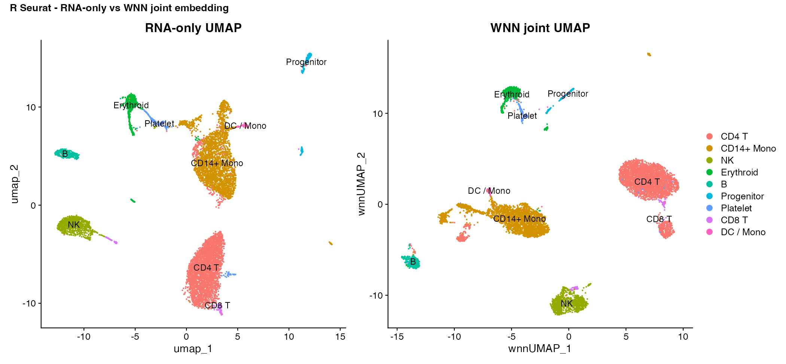</td>
<td>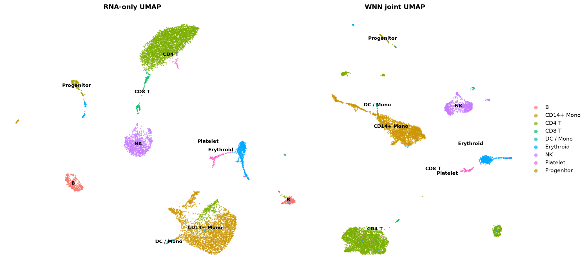</td>
</tr>
</table>

UMAP has no canonical rotation, so don't read the orientation — read which
populations form their own islands. Both sides resolve CD4 T, CD14+ Mono, NK and
B as separate territories, with erythroid/platelet/progenitor grouped away from
the immune lineages.

`10_adt_weight_by_celltype.png` plots the weights themselves. The violins are
**bimodal against the 0 and 1 rails** rather than a bump at 0.5 — individual
cells commit, and the per-type mean is a summary of that split, not a
description of a typical cell:

<table>
<tr><th>R (Seurat)</th><th>Python (Shanuz)</th></tr>
<tr>
<td>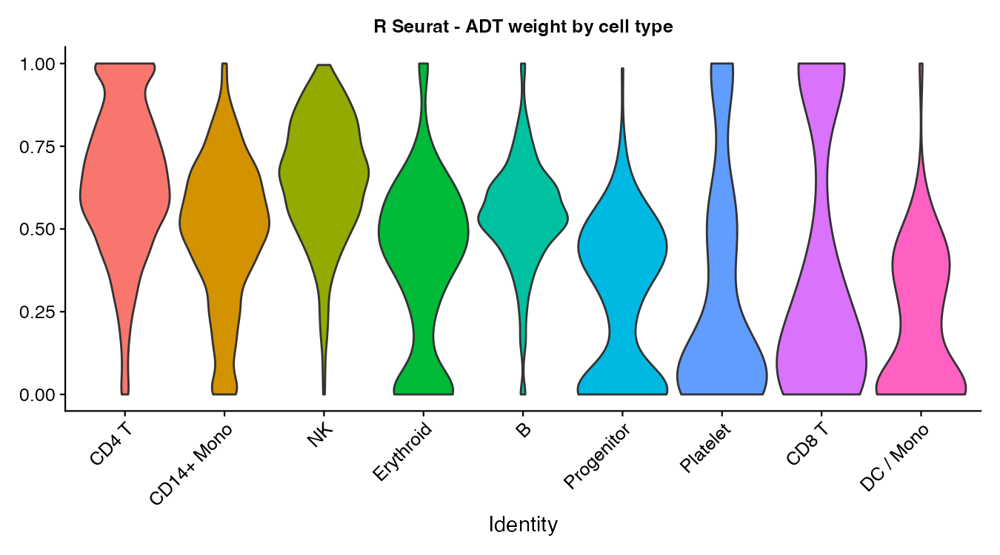</td>
<td>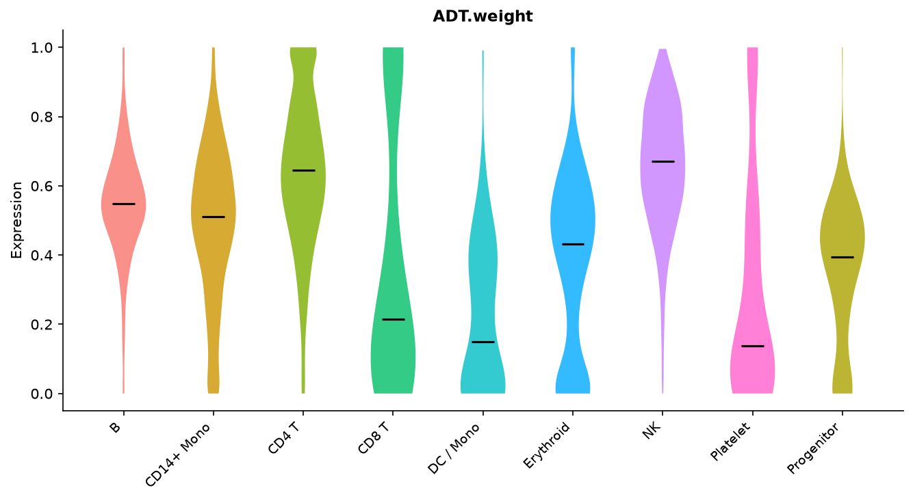</td>
</tr>
</table>

> `ADT.weight` is a metadata column, not a gene, but `vln_plot` resolves it the
> same way Seurat's `VlnPlot` does — hence the generic `Expression` y-axis label.

> The whole flow is wrapped as `run_wnn(obj)` in
> [`cbmc_citeseq_tutorial.py`](cbmc_citeseq_tutorial.py); `run_full()` prints the
> WNN cluster count and the mean modality weights per cell type.

### How close is this to Seurat?

Close. Both WNN stages are ported from the R/C++ source and both sides run the
same CLR, so the weights are comparable rather than merely correlated: eight of
the nine cell types agree with Seurat to **0.02 or better**, with progenitor
(0.06, discussed above) the exception. Both sides find 16 RNA clusters and 21
WNN clusters at `resolution = 0.6`, and both resolve the same nine lineages with
the same multiplicities — three CD4 T clusters, five CD14+ Mono, two erythroid,
one each of the rest.

The remaining gaps are real but small. The neighbour search is exact here and
approximate (annoy) in R, and the two Louvain implementations are not the same
code, so cluster boundaries differ slightly and small populations feel it most.
Each side still groups by *its own* `annotate_cells` output — but the thresholds
are now identical between the two scripts, so the labels describe the same cells.

> **This table used to look much worse, and the cause was not in the WNN code.**
> Shanuz's CLR had its `margin` flag inverted relative to Seurat: `margin=2`
> computed what Seurat's `margin=1` computes and vice versa, so the protein
> matrix feeding `apca` — and therefore every weight — was the wrong transform.
> The published numbers ran 0.10–0.74 against R's 0.21–0.65, and erythroid and
> platelet sat at 0.62/0.53 against R's 0.40/0.30, on the *protein* side despite
> having no antibody in the panel. That inversion is fixed; the annotation
> thresholds in [`cbmc_citeseq_tutorial.py`](cbmc_citeseq_tutorial.py) and
> [`cbmc_citeseq_verify.R`](cbmc_citeseq_verify.R) had been retuned around it and
> are now shared verbatim. The bug survived because its unit test verified the
> CLR kernel but derived the axis mapping in Python rather than checking it
> against R — right formula, assumed axis. The guard that replaces it
> (`test_clr_margin_matches_r_ground_truth`) pins both margins to fixed output
> from a real Seurat run.

---

## API Translation (multimodal additions)

| Task | R (Seurat) | Python (Shanuz) |
|------|-----------|-----------------|
| Load CITE-seq | `read.csv` + `CollapseSpeciesExpressionMatrix` | `cbmc_citeseq()` |
| Add a 2nd assay | `cbmc[["ADT"]] <- CreateAssayObject(counts)` | `obj.assays["ADT"] = create_assay5_object(counts, key="adt_")` |
| CLR-normalise protein | `NormalizeData(..., method="CLR", margin=2)` | `normalize_data(..., normalization_method="CLR", margin=2)` |
| Switch modality | `DefaultAssay(cbmc) <- "ADT"` / `adt_`/`rna_` keys | `feature_plot(..., assay="ADT")` |
| WNN neighbours | `FindMultiModalNeighbors(reduction.list, dims.list)` | `find_multi_modal_neighbors(obj, reduction_list, dims_list)` |
| Cluster on joint graph | `FindClusters(graph.name = "wsnn")` | `find_clusters(obj, graph_name="wsnn")` |
| UMAP on joint graph | `RunUMAP(nn.name = "weighted.nn")` | `run_umap(obj, graph="wsnn")` |

---

## References

> Stoeckius M, Hafemeister C, Stephenson W, Houck-Loomis B, Chattopadhyay PK,
> Swerdlow H, Satija R, Smibert P (2017).
> **Simultaneous epitope and transcriptome measurement in single cells.**
> *Nature Methods* 14, 865–868. https://doi.org/10.1038/nmeth.4380

> Hao Y, Hao S, Andersen-Nissen E, et al. (2021).
> **Integrated analysis of multimodal single-cell data.**
> *Cell* 184, 3573–3587. https://doi.org/10.1016/j.cell.2021.04.048  *(WNN)*

> Seurat multimodal vignette:
> https://satijalab.org/seurat/articles/multimodal_vignette
> Seurat WNN vignette: https://satijalab.org/seurat/articles/weighted_nearest_neighbor_analysis
