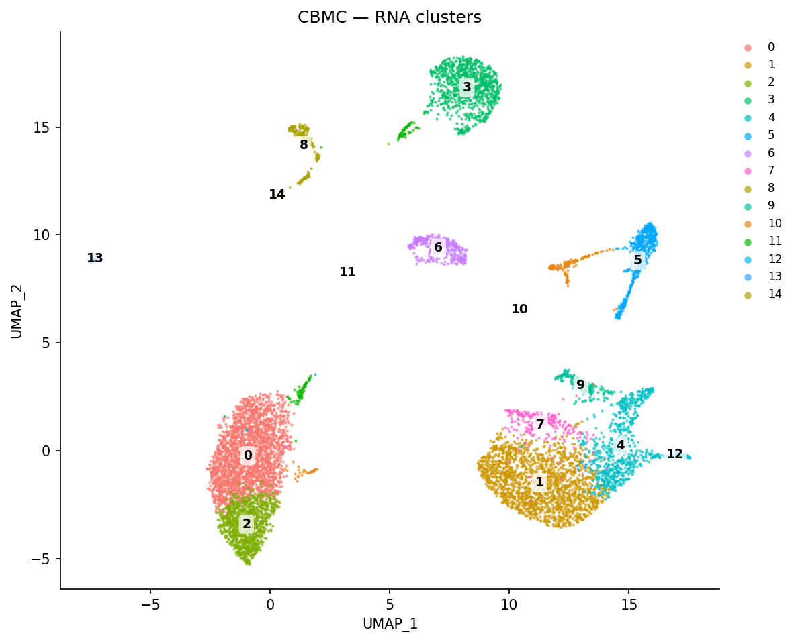
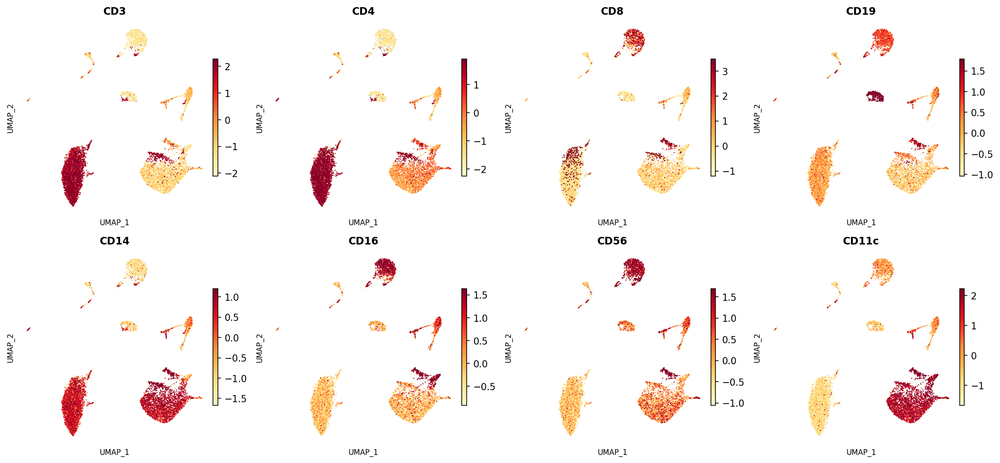
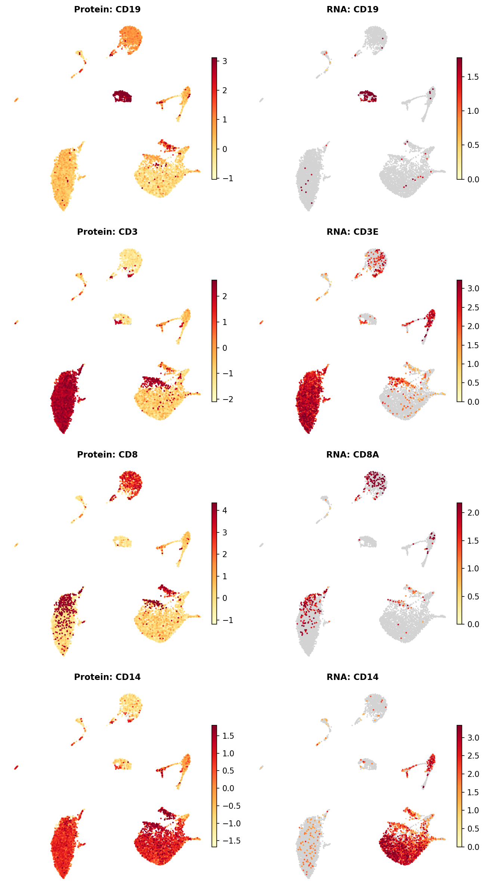
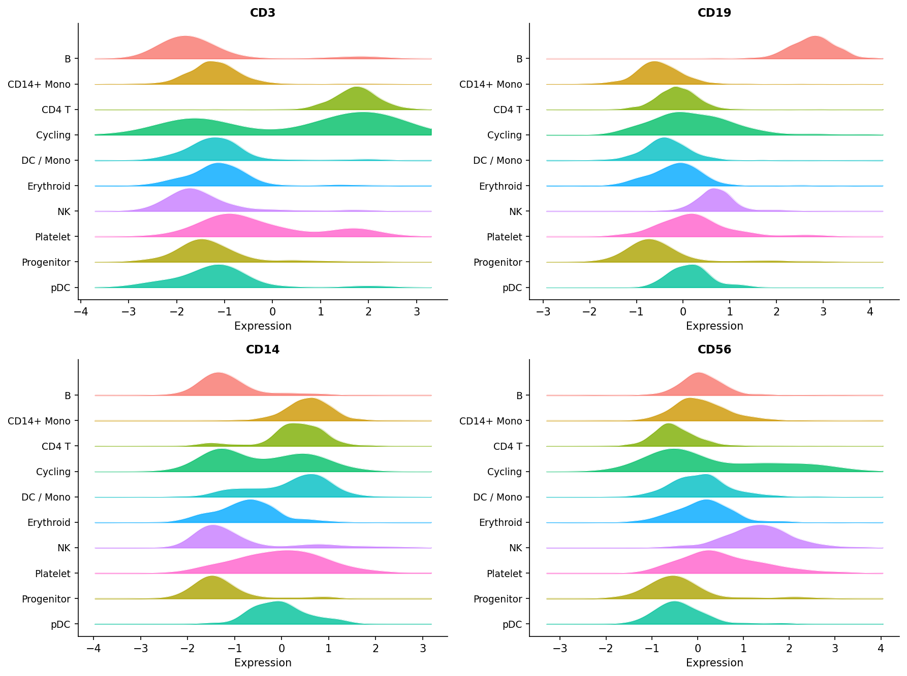
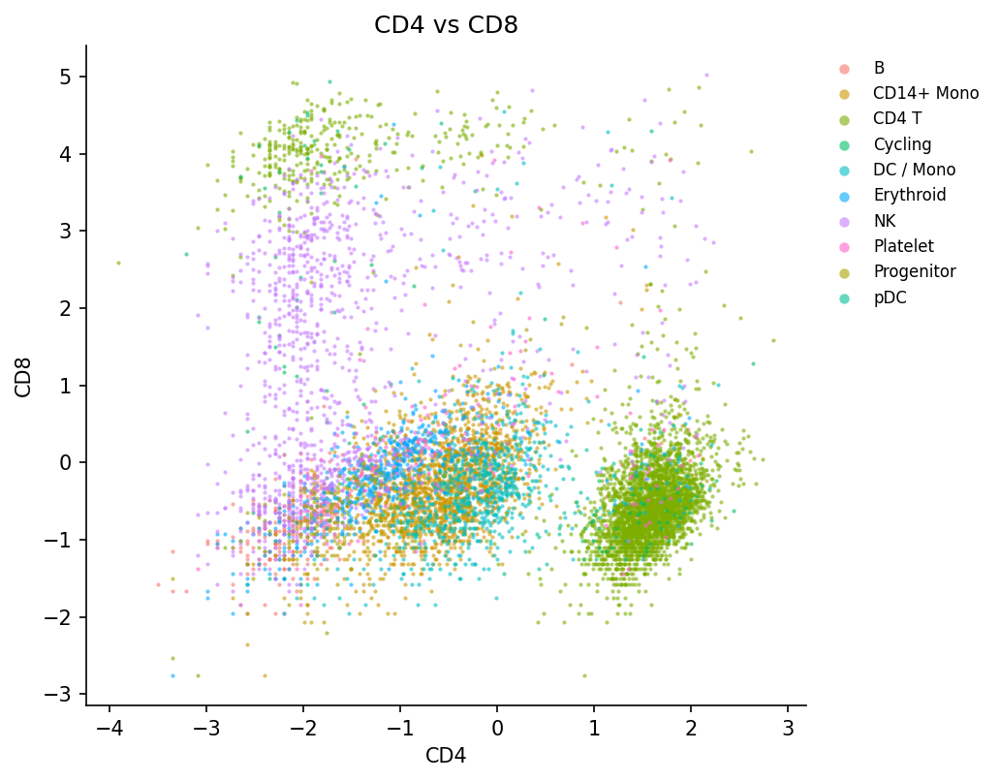
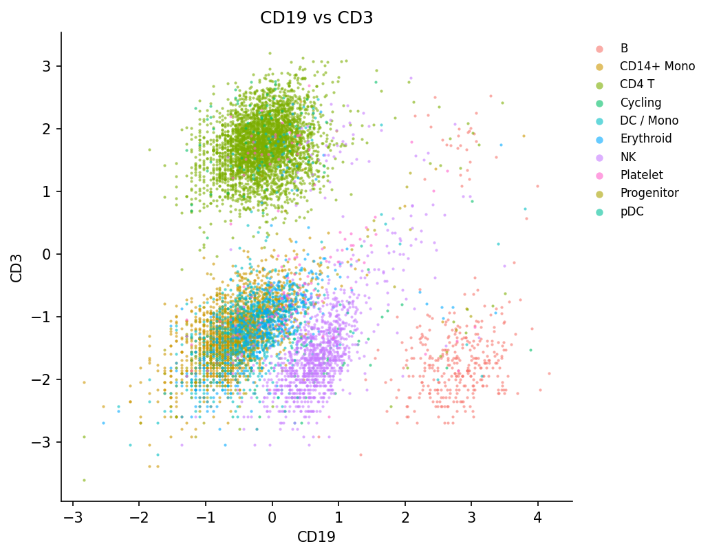
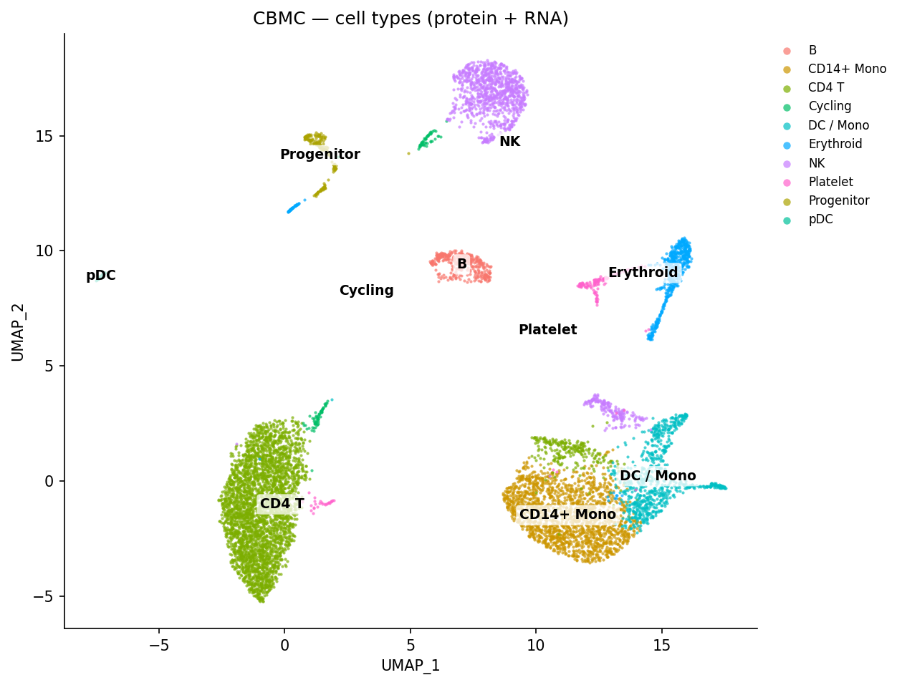

# Multimodal Tutorial — CITE-seq (RNA + Protein) with R Seurat vs Shanuz

A Python port of Seurat's
[multimodal vignette](https://satijalab.org/seurat/articles/multimodal_vignette)
using the **CBMC CITE-seq** dataset (GSE100866): ~8,600 cord-blood mononuclear
cells profiled simultaneously for the transcriptome and **13 surface proteins**
(antibody-derived tags, "ADT"). It showcases Shanuz's **multi-assay** support:
cluster on RNA, attach the protein counts as a second assay, CLR-normalise them,
and read protein levels on the RNA-derived UMAP.

> **Dataset:** 8k CBMCs, CITE-seq — Stoeckius et al. 2017 (GSE100866)
> **Python:** Shanuz v0.1.0

> **Scope note.** Shanuz stores and normalises multiple assays and visualises one
> against another. It does not implement multimodal *integration* (WNN); RNA
> clustering + protein overlay is exactly what this vignette demonstrates.

```bash
python tutorials/cbmc_citeseq_tutorial.py     # printed validation
python tutorials/generate_multimodal_plots.py # writes figures_multimodal/
```

---

## Step 1 · Load RNA + Protein, align barcodes

The RNA matrix mixes human and mouse spike-in genes; both Seurat and Shanuz keep
the human genes. RNA and ADT are aligned to their shared cell barcodes.

<table>
<tr><th>R (Seurat)</th><th>Python (Shanuz)</th></tr>
<tr><td>

```r
library(Seurat)
cbmc.rna <- as.sparse(read.csv("GSE100866_...RNA_umi.csv.gz", row.names = 1))
cbmc.rna <- CollapseSpeciesExpressionMatrix(cbmc.rna)   # keep human
cbmc.adt <- as.sparse(read.csv("GSE100866_...ADT_umi.csv.gz", row.names = 1))

joint <- intersect(colnames(cbmc.rna), colnames(cbmc.adt))
cbmc.rna <- cbmc.rna[, joint]
cbmc.adt <- cbmc.adt[, joint]
```

</td><td>

```python
from shanuz.datasets import cbmc_citeseq
# downloads ~15 MB, keeps human genes, aligns shared barcodes
rna, genes, adt, proteins, cells = cbmc_citeseq()
# rna: (20379 genes x 8617 cells)   adt: (13 proteins x 8617 cells)
# proteins: CD3 CD4 CD8 CD45RA CD56 CD16 CD10 CD11c CD14 CD19 CD34 CCR5 CCR7
```

</td></tr>
</table>

---

## Step 2 · Create the object & run the RNA workflow

<table>
<tr><th>R (Seurat)</th><th>Python (Shanuz)</th></tr>
<tr><td>

```r
cbmc <- CreateSeuratObject(counts = cbmc.rna)
cbmc <- NormalizeData(cbmc)
cbmc <- FindVariableFeatures(cbmc)
cbmc <- ScaleData(cbmc)
cbmc <- RunPCA(cbmc, npcs = 30)
cbmc <- FindNeighbors(cbmc, dims = 1:15)
cbmc <- FindClusters(cbmc, resolution = 0.6)
cbmc <- RunUMAP(cbmc, dims = 1:15)
```

</td><td>

```python
from shanuz.shanuz import create_shanuz_object
from shanuz.preprocessing import normalize_data, find_variable_features, scale_data
from shanuz.reduction import run_pca
from shanuz.neighbors import find_neighbors
from shanuz.clustering import find_clusters
from shanuz.umap import run_umap

obj = create_shanuz_object(counts=rna, assay="RNA", min_cells=3,
                           feature_names=genes, cell_names=cells, project="cbmc")
normalize_data(obj)
find_variable_features(obj, selection_method="vst", nfeatures=2000)
scale_data(obj, features=obj.assays["RNA"]._all_feature_names)
run_pca(obj, n_pcs=30, features=obj.assays["RNA"].variable_features)
find_neighbors(obj, dims=range(15), k_param=20)
find_clusters(obj, resolution=0.6, random_seed=0)
run_umap(obj, dims=range(15), seed=42)
```

</td></tr>
<tr><td colspan="2"></td></tr>
</table>

---

## Step 3 · Add the protein (ADT) assay & CLR-normalise

The antibody counts become a **second assay**. Proteins are normalised with the
centered-log-ratio transform across cells (`margin = 2`), the recommended setting
for small ADT panels.

<table>
<tr><th>R (Seurat)</th><th>Python (Shanuz)</th></tr>
<tr><td>

```r
adt_assay <- CreateAssayObject(counts = cbmc.adt)
cbmc[["ADT"]] <- adt_assay

cbmc <- NormalizeData(cbmc, assay = "ADT",
                      normalization.method = "CLR", margin = 2)
```

</td><td>

```python
from shanuz.assay5 import create_assay5_object

obj.assays["ADT"] = create_assay5_object(
    counts=adt_aligned, feature_names=proteins,
    cell_names=obj.cell_names(), key="adt_",
)
normalize_data(obj, assay="ADT", normalization_method="CLR", margin=2)
# obj.assay_names() -> ['RNA', 'ADT']
```

</td></tr>
</table>

> Shanuz's `normalize_data(..., margin=2)` was added for this tutorial — CLR can
> now center each protein across cells (margin 2) or each cell across features
> (margin 1, the default).

---

## Step 4 · Visualise protein on the RNA UMAP

In R you switch `DefaultAssay()` (or use the `adt_`/`rna_` key prefixes); in
Shanuz you pass `assay="ADT"`.

<table>
<tr><th>R (Seurat)</th><th>Python (Shanuz)</th></tr>
<tr><td>

```r
DefaultAssay(cbmc) <- "ADT"
FeaturePlot(cbmc, c("CD3","CD4","CD8","CD19",
                    "CD14","CD16","CD56","CD11c"))
```

</td><td>

```python
from shanuz.plotting import feature_plot

feature_plot(obj, ["CD3","CD4","CD8","CD19",
                   "CD14","CD16","CD56","CD11c"],
             assay="ADT", reduction="umap",
             min_cutoff="q05", max_cutoff="q95", ncol=4)
```

</td></tr>
<tr><td colspan="2"></td></tr>
</table>

The surface proteins cleanly mark their lineages: CD3/CD4 the T-cell mass,
CD19 the B-cell island, CD8/CD16/CD56 the NK cluster, CD14/CD11c the monocytes.

---

## Step 5 · Protein vs RNA for the same marker

The CITE-seq payoff: protein gives a smooth, high signal-to-noise readout where
the encoding mRNA is sparse and noisy.

<table>
<tr><th>R (Seurat)</th><th>Python (Shanuz)</th></tr>
<tr><td>

```r
# adt_ / rna_ key prefixes pull from each assay
FeaturePlot(cbmc, c("adt_CD19", "rna_CD19",
                    "adt_CD3",  "rna_CD3E"), ncol = 2)
```

</td><td>

```python
# left column assay="ADT", right column assay="RNA"
feature_plot(obj, ["CD19"], assay="ADT", reduction="umap")
feature_plot(obj, ["CD19"], assay="RNA", reduction="umap")
# (generate_multimodal_plots.py draws them paired)
```

</td></tr>
<tr><td colspan="2"></td></tr>
</table>

---

## Step 6 · Ridge plots & protein bivariates

<table>
<tr><th>R (Seurat)</th><th>Python (Shanuz)</th></tr>
<tr><td>

```r
RidgePlot(cbmc, features = c("adt_CD3","adt_CD19",
                             "adt_CD14","adt_CD56"), ncol = 2)

FeatureScatter(cbmc, "adt_CD19", "adt_CD3")
FeatureScatter(cbmc, "adt_CD4",  "adt_CD8")
```

</td><td>

```python
from shanuz.plotting import ridge_plot, feature_scatter

ridge_plot(obj, ["CD3","CD19","CD14","CD56"], assay="ADT",
           group_by="protein_celltype", ncol=2)

feature_scatter(obj, "CD19", "CD3", assay="ADT")
feature_scatter(obj, "CD4",  "CD8", assay="ADT")
```

</td></tr>
<tr><td></td>
<td><br>
</td></tr>
</table>

The CD4-vs-CD8 and CD19-vs-CD3 protein scatters separate the major lineages on
just two axes.

---

## Step 7 · Annotate cell types (protein + RNA)

CITE-seq proteins are cleaner lineage markers than RNA, so `annotate_cells()`
gates on the ADT assay (T→NK→B→monocyte→DC→progenitor) and falls back to RNA
markers for populations the 13-protein panel can't resolve — platelets (`PPBP`),
erythroid (`HBB`), pDC (`IGJ`/`PLD4`), and cycling cells.

<table>
<tr><th>R (Seurat)</th><th>Python (Shanuz)</th></tr>
<tr><td>

```r
# manual, by inspecting protein + RNA markers
cbmc <- RenameIdents(cbmc, ...)
DimPlot(cbmc, label = TRUE)
```

</td><td>

```python
from tutorials.cbmc_citeseq_tutorial import annotate_cells
from shanuz.plotting import dim_plot

anno = annotate_cells(obj)
obj.stash_ident("rna_clusters")
obj.rename_idents(anno)
dim_plot(obj, reduction="umap", group_by="protein_celltype", label=True)
```

</td></tr>
<tr><td colspan="2"></td></tr>
</table>

---

## API Translation (multimodal additions)

| Task | R (Seurat) | Python (Shanuz) |
|------|-----------|-----------------|
| Load CITE-seq | `read.csv` + `CollapseSpeciesExpressionMatrix` | `cbmc_citeseq()` |
| Add a 2nd assay | `cbmc[["ADT"]] <- CreateAssayObject(counts)` | `obj.assays["ADT"] = create_assay5_object(counts, key="adt_")` |
| CLR-normalise protein | `NormalizeData(..., method="CLR", margin=2)` | `normalize_data(..., normalization_method="CLR", margin=2)` |
| Switch modality | `DefaultAssay(cbmc) <- "ADT"` / `adt_`/`rna_` keys | `feature_plot(..., assay="ADT")` |

---

## References

> Stoeckius M, Hafemeister C, Stephenson W, Houck-Loomis B, Chattopadhyay PK,
> Swerdlow H, Satija R, Smibert P (2017).
> **Simultaneous epitope and transcriptome measurement in single cells.**
> *Nature Methods* 14, 865–868. https://doi.org/10.1038/nmeth.4380

> Seurat multimodal vignette:
> https://satijalab.org/seurat/articles/multimodal_vignette
