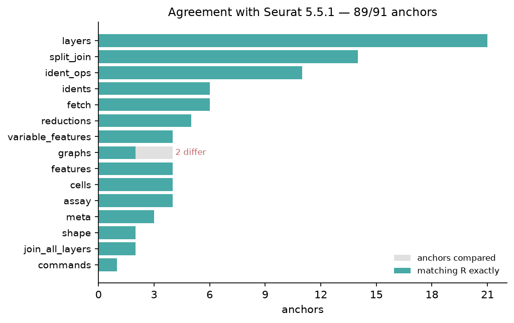
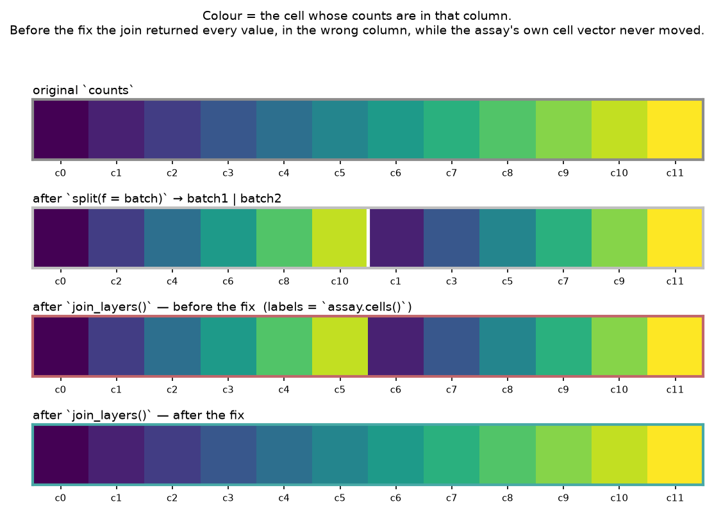
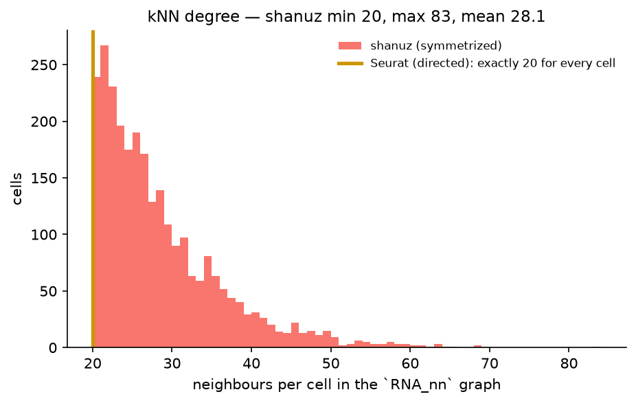

# The Object Model Itself — R Seurat vs Shanuz (Python)

Every other tutorial in this series compares an *algorithm*: does `run_pca` land
where `RunPCA` lands, does `hto_demux` call the same cells. This one compares
the **container** — the accessors, the layer machinery and the bookkeeping that
Seurat's own command cheat sheet is made of. Every R Seurat call is paired with
the Shanuz equivalent and both outputs are shown side by side.

> **Dataset:** PBMC 3k — 2,700 cells × 13,714 genes (10x Genomics), the same
> object used in [the guided tutorial](pbmc3k_tutorial.md) and
> [Tutorial T-dr](dimreduc_vignette.md). Auto-downloads (~24 MB).
> **R reference:** Seurat 5.5.1 / SeuratObject 5.4.0 · **Python:** Shanuz

| Seurat | Shanuz |
|---|---|
| `Cells(obj)` / `Features(obj)` | `cells(obj)` / `features(obj)` |
| `Layers(obj)` / `LayerData(obj, "data")` | `layers(obj)` / `layer_data(assay, "data")` |
| `obj[["RNA"]] <- split(obj[["RNA"]], f = batch)` | `assay.split_layers(batch)` |
| `JoinLayers(obj)` | `assay.join_layers()` |
| `DefaultAssay(obj)` / `Key(obj[["RNA"]])` | `default_assay(obj)` / `key(assay)` |
| `Embeddings` / `Loadings` / `Stdev` | `embeddings` / `loadings` / `stdev` |
| `FetchData(obj, c("CD3E", "PC_1"))` | `fetch_data(obj, ["CD3E", "PC_1"])` |
| `Idents` / `WhichCells` / `RenameIdents` / `subset` | `idents` / `which_cells` / `rename_idents` / `subset` |
| `Command(obj)` | `[c.key for c in obj.commands]` |

> **This tutorial found and fixed eleven defects.** The layered assay's
> `split` / `JoinLayers` pair was not a round trip — it returned the right
> numbers in the wrong columns, silently. `FetchData` returned sparse-matrix
> objects instead of expression values. The command log had never been wired up
> at all. The [findings](#what-this-tutorial-found) are written up below with
> before-and-after behaviour, and all eleven are fixed in the same pull request
> as this tutorial.

---

## Why this is the sharpest net in the series

Almost nothing here is stochastic. Cell orders, layer names, matrix dimensions,
key strings, non-zero counts and command names either match R exactly or they
are wrong — **89 of the 91 anchors are compared with no tolerance at all**. The
other tutorials have to argue about whether a 2 % gap is RNG or a bug; this one
mostly does not have that conversation.

That matters because the object layer is where a defect is quietest. A broken
`run_pca` shows up in a plot. A broken `JoinLayers` returns a matrix of exactly
the right shape, full of exactly the right numbers, in the wrong order.



---

## Headline

| Anchor | Result |
|---|---|
| **Anchors matching Seurat exactly** | **89 / 91** |
| Cells — count and order (md5 of the barcode vector) | **identical** (`e9278a0983c2`) |
| Features — count and order | **identical**, 13,714 |
| Variable features — the shared 2,000-gene basis | **identical** (`fbd5a143114e`) |
| Layers and their dimensions | `counts` 13714×2700 · `data` 13714×2700 · `scale.data` 2000×2700 — **all match** |
| Assay key / PCA key | `rna_` / `PC_` — **match** |
| Metadata columns | `orig.ident`, `nCount_RNA`, `nFeature_RNA` — **match** |
| `nCount_RNA` total | **6,386,518** on both |
| Identities (marker-gated) | T 1300 · Mono 788 · B 322 · Other 290 — **match** |
| `WhichCells(idents = "T")` — count *and order* | **1,300**, identical vector |
| `subset(idents = "Mono")` | **788** cells × 13,714 features — match |
| `FetchData` — `CD3E` column total | **2,831.901591** on both |
| **`split` → `JoinLayers` round trip** | **identity** — name, cell order and matrix all restored |
| Command log | 5 entries, `NormalizeData.RNA` … `FindNeighbors.RNA.pca` — **match** |
| PCA standard deviations | agree to ~4e-4 relative (randomized SVD vs `irlba`) |
| kNN / SNN graph edges | **differ** — see [what is left standing](#two-differences-left-standing) |

---

## Setup

Both tools read the same 10x directory, and the Python run writes the cell
barcodes and variable features it used so the R script rests on an identical
basis. If the two disagree about which cells or genes are in play, nothing below
is interpretable.

<table>
<tr><th>R (Seurat)</th><th>Python (Shanuz)</th></tr>
<tr>
<td>

```r
library(Seurat)

counts <- Read10X(data.dir = DATA)
obj <- CreateSeuratObject(
  counts = counts, project = "pbmc3k_objects",
  min.cells = 3, min.features = 200)

hvg <- gsub("_", "-", readLines("figures_objects/hvg_features.txt"))
obj <- NormalizeData(obj, verbose = FALSE)
obj <- FindVariableFeatures(obj, nfeatures = 2000, verbose = FALSE)
VariableFeatures(obj) <- hvg
obj <- ScaleData(obj, features = hvg, verbose = FALSE)
obj <- RunPCA(obj, features = hvg, npcs = 20, verbose = FALSE)
obj <- FindNeighbors(obj, dims = 1:10, verbose = FALSE)
```

</td>
<td>

```python
from shanuz.shanuz import create_shanuz_object
from shanuz.datasets import pbmc3k

counts, genes, cells = pbmc3k()
obj = create_shanuz_object(
    counts=counts, assay="RNA", project="pbmc3k_objects",
    min_cells=3, min_features=200,
    feature_names=list(genes), cell_names=list(cells))

normalize_data(obj)
find_variable_features(obj, nfeatures=2000)
hvg = list(obj.assays["RNA"].variable_features)
scale_data(obj, features=hvg)
run_pca(obj, n_pcs=20, features=hvg)
find_neighbors(obj, dims=list(range(10)))
```

</td>
</tr>
</table>

> **Gotcha, and it is not shanuz's.** `Read10X` rewrites `_` to `-` in gene
> symbols — pbmc3k carries `Y_RNA` and a long tail of `RP11-*_*` — while
> shanuz's loader leaves them alone. That belongs to the two file readers, not
> to the object model, so feature names are compared in R's spelling on both
> sides rather than failing every field that mentions a gene.

---

## Who is in the object

<table>
<tr><th>R (Seurat)</th><th>Python (Shanuz)</th></tr>
<tr>
<td>

```r
dim(obj)              # 13714  2700
head(Cells(obj), 3)   # AAACATACAACCAC-1 ...
Assays(obj)           # "RNA"
DefaultAssay(obj)     # "RNA"
Key(obj[["RNA"]])     # "rna_"
colnames(obj[[]])     # orig.ident nCount_RNA nFeature_RNA
```

</td>
<td>

```python
len(obj.cell_names()), len(obj.feature_names())   # 2700, 13714
G.cells(obj)[:3]           # ['AAACATACAACCAC-1', ...]
obj.assay_names()          # ['RNA']
obj.default_assay          # 'RNA'
G.key(obj.get_assay())     # 'rna_'
obj.meta_data.columns      # orig.ident, nCount_RNA, nFeature_RNA
```

</td>
</tr>
</table>

Order is compared, not just membership: the tutorial fingerprints the barcode
vector with an order-sensitive md5, and both sides return `e9278a0983c2`.

---

## Layers — the v5 architecture

The single biggest change from Seurat v4, and the part that had never been run.

<table>
<tr><th>R (Seurat)</th><th>Python (Shanuz)</th></tr>
<tr>
<td>

```r
Layers(obj)
# "counts" "data" "scale.data"

dim(LayerData(obj[["RNA"]], "scale.data"))
# 2000 2700

# Split the assay by a grouping factor
batch <- ifelse(seq_len(ncol(obj)) %% 2 == 1, "batch1", "batch2")
split_assay <- split(obj[["RNA"]], f = batch)
Layers(split_assay)
# "counts.batch1" "counts.batch2"

# ...and put it back
joined <- JoinLayers(split_assay)
Layers(joined)                      # "counts"
identical(colnames(LayerData(joined, "counts")),
          colnames(obj))            # TRUE
```

</td>
<td>

```python
assay = obj.get_assay("RNA")
assay.layers_list()
# ['counts', 'data', 'scale.data']

assay.layer_data("scale.data").shape
# (2000, 2700)

# Split the assay by a grouping factor
batch = batch_labels(len(obj.cell_names()))
split_assay = assay.split_layers(batch, layer="counts")
split_assay.layers_list()
# ['counts.batch1', 'counts.batch2']

# ...and put it back
joined = split_assay.join_layers()
joined.layers_list()                # ['counts']
joined.cells("counts") == assay.cells()
#                                   True
```

</td>
</tr>
</table>

> The batch column is assigned **deterministically** (alternating cells), not
> with `sample()` as Seurat's vignette does, so both tools split on identical
> membership and any difference downstream belongs to the layer code rather
> than to two different random draws.

**This is where the tutorial earned its keep.** Before the fix, that last
comparison was `False`, and nothing said so:



---

## Reductions, graphs and FetchData

<table>
<tr><th>R (Seurat)</th><th>Python (Shanuz)</th></tr>
<tr>
<td>

```r
Reductions(obj)              # "pca"
Key(obj[["pca"]])            # "PC_"
dim(Embeddings(obj[["pca"]]))   # 2700 20
dim(Loadings(obj[["pca"]]))     # 2000 20
round(Stdev(obj[["pca"]])[1:3], 4)
# 6.9345 4.4608 3.8388

Graphs(obj)                  # "RNA_nn" "RNA_snn"

round(FetchData(obj, c("nCount_RNA", "CD3E", "PC_1"))[1:2, ], 6)
#                  nCount_RNA     CD3E     PC_1
# AAACATACAACCAC-1       2419 2.226555 4.563726
# AAACATTGAGCTAC-1       4903 0.000000 0.247260
```

</td>
<td>

```python
sorted(obj.reductions)          # ['pca']
G.key(obj.reductions["pca"])    # 'PC_'
G.embeddings(obj.reductions["pca"]).shape   # (2700, 20)
G.loadings(obj.reductions["pca"]).shape     # (2000, 20)
np.round(G.stdev(obj.reductions["pca"])[:3], 4)
# [6.9344 4.4608 3.8386]

list(obj.graphs)                # ['RNA_nn', 'RNA_snn']

G.fetch_data(obj, ["nCount_RNA", "CD3E", "PC_1"]).head(2)
#                   nCount_RNA      CD3E      PC_1
# AAACATACAACCAC-1      2419.0  2.226555 -4.549421
# AAACATTGAGCTAC-1      4903.0  0.000000 -0.233127
```

</td>
</tr>
</table>

`PC_1` is addressed by the reduction's `Key`, which is what `Key()` is for.
`CD3E` agrees to the last digit shown — and to **2,831.901591** summed over all
2,700 cells.

`PC_1` does **not** agree, and should not: a principal component's sign is
arbitrary, so R's `+4.563726` and shanuz's `−4.549421` are the same axis pointed
opposite ways. That is why the tutorial compares the *absolute* column sum
across tools, and pins the exact value only *within* one tool — a fetched
embedding column must be the object's own embedding column, whatever the two
PCAs did. The residual magnitude difference (~0.1 %) is the randomized SVD
against `irlba`, which is [T-dr's subject](dimreduc_vignette.md), not this one's.

---

## Identities and the command log

<table>
<tr><th>R (Seurat)</th><th>Python (Shanuz)</th></tr>
<tr>
<td>

```r
table(Idents(obj))
# B Mono Other T
# 322  788   290 1300

length(WhichCells(obj, idents = "T"))        # 1300
levels(Idents(RenameIdents(obj, "T" = "T_cell")))
# "B" "Mono" "Other" "T_cell"
dim(subset(obj, idents = "Mono"))            # 13714 788

names(obj@commands)
# NormalizeData.RNA FindVariableFeatures.RNA
# ScaleData.RNA RunPCA.RNA FindNeighbors.RNA.pca
```

</td>
<td>

```python
ident_anchor(obj.idents)["counts"]
# {'B': 322, 'Mono': 788, 'Other': 290, 'T': 1300}

len(G.which_cells(obj, ident="T"))           # 1300
sorted(set(obj.rename_idents({"T": "T_cell"}).idents))
# ['B', 'Mono', 'Other', 'T_cell']
len(obj.subset(idents="Mono").cell_names())  # 788

[c.key for c in obj.commands]
# ['NormalizeData.RNA', 'FindVariableFeatures.RNA',
#  'ScaleData.RNA', 'RunPCA.RNA', 'FindNeighbors.RNA.pca']
```

</td>
</tr>
</table>

> Identities come from marker-gene thresholds (`CD3E` → T, `MS4A1` → B, `LYZ` →
> Mono, first gate wins) rather than from clustering, and for the same reason
> the batch split is deterministic: Louvain drifts by a cluster between the two
> tools, which would put noise into comparisons that are otherwise exact.

---

## What this tutorial found

Eleven fidelity defects: five in the layered assay, three in `FetchData`, three
in the object's bookkeeping. All are fixed in the same pull request.

### 1–5. `split` / `JoinLayers` was not a round trip

| | before | after (and R) |
|---|---|---|
| layer name after join | `joined` | `counts` |
| cell order after join | `c0 c2 c4 … c1 c3 c5` | `c0 c1 c2 …` |
| matrix restored | ✗ | ✓ |
| `join_layers()` on a prepared assay | `ValueError` | works |
| split layer names | `counts_batch1` | `counts.batch1` |
| `generics.split_layers` | `NotImplementedError` | dispatches |

The cell-order one is the serious one. The assay's own cell vector never moves
during a split, so a join that returns the columns in split order leaves the
matrix **silently transposed against the metadata that indexes it** — ask for
cell `c1`'s column and get `c2`'s. Nothing raised, the shape was right, and
every checksum was right, because every value was still present.

`join_layers()` with no arguments — R's idiom, and the only call a real script
makes — additionally raised `ValueError` on any prepared assay, because it
hstacked `counts`, `data` and a variable-features-only `scale.data` together
regardless of their differing feature counts. The fix groups layers by the stem
they were split from, and records that provenance at split time rather than
parsing it back out of the name: Seurat's own `scale.data` contains the
separator, so splitting on the last `.` would read it as layer `scale` of group
`data` and rejoin it into something that never existed.

### 6–8. `FetchData` returned objects instead of numbers

`np.asarray` on a sparse matrix yields a 0-d **object** array wrapping it, not
its contents, so `.flatten()` broadcast one `csc_matrix` down all 2,700 rows.
Every cell's "expression" was a copy of the whole matrix. This is the most-called
accessor in Seurat, on the default assay class.

It had a test. `test_fetch_data` asserted the column name and the row count —
both of which a column of identical sparse matrices satisfies perfectly.

Two smaller gaps came with it: embedding columns could not be addressed by their
`Key` (`PC_1` raised `KeyError`), and an unqualified fetch read `counts` where R
reads `data`, returning raw integers where every vignette shows normalized
values. When there is no `data` layer, shanuz now falls back to `counts` and
warns, exactly as Seurat does.

### 9–11. The bookkeeping

`log_shanuz_command` was a public export with **zero call sites**, so
`obj.commands` was always empty. Seurat logs five entries for this pipeline.
The log now records R's names (`RunPCA.RNA`, not `run_pca.RNA`) on the same
reasoning that keeps layer names `scale.data` and reduction keys `PC_`: it is a
lookup table users query, so it is data rather than decoration.

`orig.ident` — the first column of every Seurat object's metadata, and the
default identity class — was never created. And `add_meta_data` rejected the
plain vector that R's `AddMetaData` documents and every vignette passes it.

### Two differences left standing

`FindNeighbors` builds a **symmetrized** kNN graph where Seurat's is directed.
Seurat gives every cell exactly `k.param` neighbours — nnz is exactly
2,700 × 20 = 54,000 — while shanuz's runs from 20 to 83, mean 28.1, for 75,740.
Separately, its SNN drops the self-edge Seurat keeps, which accounts for about
2,700 of the 4,044-edge gap (194,924 against 198,968).



Both are `find_neighbors`, not the object model, and both change what clustering
consumes — so they belong to their own comparison rather than riding along with
an object-model change. They are recorded rather than quietly absorbed.

---

## Parity — verified against R Seurat

| Section | Anchors | Matching |
|---|---|---|
| `layers` (names, dims, nnz, sums, per-layer cells) | 21 | 21 |
| `split_join` (the round trip) | 14 | 14 |
| `ident_ops` (`WhichCells`, `RenameIdents`, `subset`) | 11 | 11 |
| `idents` | 6 | 6 |
| `fetch` (`FetchData`) | 6 | 6 |
| `reductions` | 5 | 5 |
| `variable_features` | 4 | 4 |
| `features` · `cells` · `assay` | 4 each | 4 each |
| `graphs` | 4 | **2** |
| `meta` | 3 | 3 |
| `shape` · `join_all_layers` | 2 each | 2 each |
| `commands` | 1 | 1 |
| **Total** | **91** | **89** |

The two shortfalls are the neighbour-graph differences above. Every other
anchor is an exact match; the only tolerances applied anywhere are on the two
fields that read a PCA, and they are named explicitly in `FLOAT_TOLERANCES`
rather than applied across the board.

---

## Running it

```bash
python tutorials/pbmc3k_objects_tutorial.py     # downloads ~24 MB on first run
Rscript tutorials/pbmc3k_objects_verify.R       # writes r_anchors.json
python tutorials/pbmc3k_objects_tutorial.py     # now prints the side-by-side table
python tutorials/generate_objects_plots.py      # figures
```

The R script needs `Seurat`, `SeuratObject`, `Matrix`, `jsonlite` and `digest`.
Run the Python side first: it publishes the shared variable-feature and cell
lists the R script reads back.
