# PBMC 3k Tutorial — R Seurat vs Shanuz (Python)

A step-by-step translation of the official
[Seurat PBMC 3k tutorial](https://satijalab.org/seurat/articles/pbmc3k_tutorial)
into Python using the **Shanuz** package.
Every R code block is paired with the equivalent Python code and both plots are
shown side by side so R users can follow along directly.

> **Dataset:** 3k PBMCs from a Healthy Donor — 10x Genomics (2016)  
> **R reference:** Seurat v5 · Hao et al. 2024  
> **Python:** Shanuz v0.1.0

---

## Setup

<table>
<tr><th>R (Seurat)</th><th>Python (Shanuz)</th></tr>
<tr>
<td>

```r
library(Seurat)
library(dplyr)
library(patchwork)   # combine plots
library(ggplot2)     # theming
```

</td>
<td>

```python
# Data structures + analysis
from shanuz.datasets import pbmc3k
from shanuz.shanuz import create_shanuz_object
from shanuz.preprocessing import (
    normalize_data, find_variable_features,
    scale_data, percentage_feature_set,
)
from shanuz.reduction import run_pca
from shanuz.neighbors import find_neighbors
from shanuz.clustering import find_clusters
from shanuz.umap import run_umap
from shanuz.markers import find_markers, find_all_markers

# Plotting (mirrors Seurat's plotting API)
from shanuz.plotting import (
    dim_plot, feature_plot, vln_plot,
    elbow_plot, feature_scatter,
    variable_feature_plot, dim_heatmap,
    do_heatmap, ridge_plot,
)

import matplotlib.pyplot as plt   # save / display figures
```

</td>
</tr>
</table>

> **Key difference:** R plots render to the graphics device automatically.
> Shanuz functions return a `matplotlib.Figure` — display it in a Jupyter
> notebook (it shows inline), or save it with `fig.savefig("out.png")`.

---

## Step 1 · Load Data

<table>
<tr><th>R (Seurat)</th><th>Python (Shanuz)</th></tr>
<tr>
<td>

```r
# Read 10x sparse matrix from disk
pbmc.data <- Read10X(
  data.dir = "pbmc3k/filtered_gene_bc_matrices/hg19/"
)
# 32,738 genes × 2,700 cells
```

</td>
<td>

```python
# Downloads automatically to ~/.shanuz_data/pbmc3k
# (or pass data_dir= to point at an existing folder)
counts, genes, cells = pbmc3k()
# counts : scipy.sparse.csc_matrix  (32,738 × 2,700)
# genes  : list[str]  – feature names
# cells  : list[str]  – barcode names
```

</td>
</tr>
</table>

---

## Step 2 · Create Object

<table>
<tr><th>R (Seurat)</th><th>Python (Shanuz)</th></tr>
<tr>
<td>

```r
pbmc <- CreateSeuratObject(
  counts     = pbmc.data,
  project    = "pbmc3k",
  min.cells  = 3,     # keep genes in ≥3 cells
  min.features = 200  # keep cells with ≥200 genes
)
# 13,714 features × 2,700 cells
```

</td>
<td>

```python
pbmc = create_shanuz_object(
    counts       = counts,
    project      = "pbmc3k",
    min_cells    = 3,    # keep genes in ≥3 cells
    min_features = 200,  # keep cells with ≥200 genes
    feature_names = genes,
    cell_names    = cells,
)
# 13,714 features × 2,700 cells
print(pbmc)
# Shanuz object — pbmc3k
#   2700 cells × 13714 features
#   Active assay: 'RNA'
```

</td>
</tr>
</table>

> **Naming:** `CreateSeuratObject` → `create_shanuz_object`.
> Arguments use `_` instead of `.` (`min.cells` → `min_cells`).
> The returned object exposes the same slots: `pbmc.meta_data`, `pbmc.assays`, etc.

---

## Step 3 · QC Metrics & Violin Plot

<table>
<tr><th>R (Seurat)</th><th>Python (Shanuz)</th></tr>
<tr>
<td>

```r
# Percent mitochondrial reads
pbmc[["percent.mt"]] <- PercentageFeatureSet(
  pbmc, pattern = "^MT-"
)

# Violin plot of three QC metrics
VlnPlot(
  pbmc,
  features = c("nFeature_RNA",
               "nCount_RNA",
               "percent.mt"),
  ncol = 3
)
```

</td>
<td>

```python
# Percent mitochondrial reads
percentage_feature_set(
    pbmc, pattern=r"^MT-", col_name="percent.mt"
)

# Violin plot of three QC metrics
fig = vln_plot(
    pbmc,
    features=["nFeature_RNA", "nCount_RNA", "percent.mt"],
    ncol=3,
    figsize=(12, 4),
)
fig.savefig("qc_violin.png", dpi=150, bbox_inches="tight")
```

</td>
</tr>
<tr>
<td></td>
<td>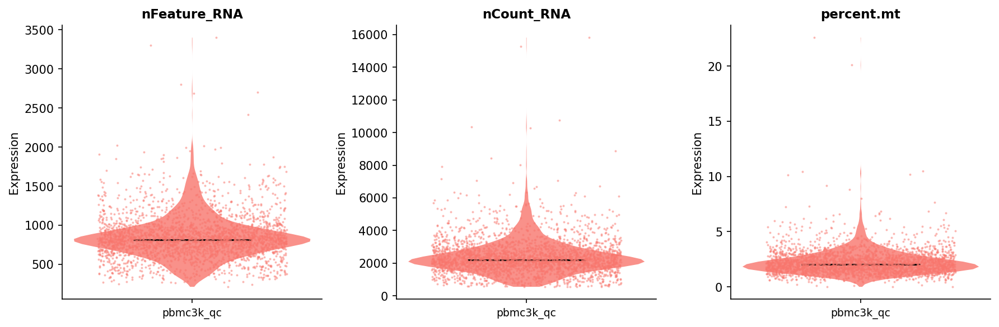</td>
</tr>
</table>

> `vln_plot` accepts both gene names and metadata column names as `features`.
> The `group_by` argument (default: active idents) controls the x-axis grouping —
> same as R's `group.by`.

---

## Step 4 · QC Scatter Plots

<table>
<tr><th>R (Seurat)</th><th>Python (Shanuz)</th></tr>
<tr>
<td>

```r
plot1 <- FeatureScatter(
  pbmc,
  feature1 = "nCount_RNA",
  feature2 = "percent.mt"
)
plot2 <- FeatureScatter(
  pbmc,
  feature1 = "nCount_RNA",
  feature2 = "nFeature_RNA"
)
plot1 + plot2   # patchwork combines them
```

</td>
<td>

```python
fig1 = feature_scatter(
    pbmc, "nCount_RNA", "percent.mt"
)
fig2 = feature_scatter(
    pbmc, "nCount_RNA", "nFeature_RNA"
)
# Save individually or combine with matplotlib subplots
```

</td>
</tr>
<tr>
<td></td>
<td>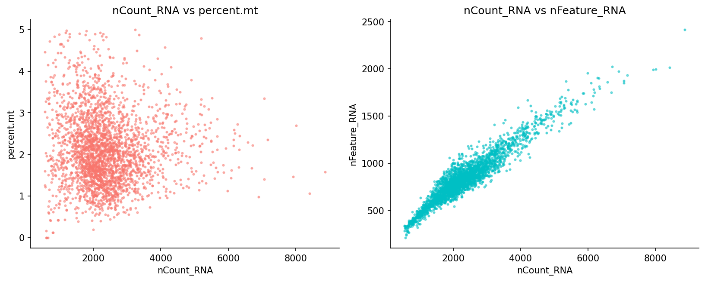</td>
</tr>
</table>

> R uses `patchwork`'s `+` operator to combine plots.
> In Python, pass `figsize` or use `matplotlib.gridspec` to arrange figures manually.

---

## Step 5 · Filter Cells

<table>
<tr><th>R (Seurat)</th><th>Python (Shanuz)</th></tr>
<tr>
<td>

```r
pbmc <- subset(
  pbmc,
  subset = nFeature_RNA > 200 &
           nFeature_RNA < 2500 &
           percent.mt < 5
)
# 2,638 cells retained
```

</td>
<td>

```python
md   = pbmc.meta_data
keep = (
    (md["nFeature_RNA"] > 200) &
    (md["nFeature_RNA"] < 2500) &
    (md["percent.mt"]   < 5)
)
pbmc = pbmc.subset(cells=list(md.index[keep]))
# 2,638 cells retained
```

</td>
</tr>
</table>

> `subset()` works in both languages. Python uses boolean pandas indexing;
> the result is identical (2,638 cells).

---

## Step 6 · Normalise Data

<table>
<tr><th>R (Seurat)</th><th>Python (Shanuz)</th></tr>
<tr>
<td>

```r
pbmc <- NormalizeData(
  pbmc,
  normalization.method = "LogNormalize",
  scale.factor = 10000
)
```

</td>
<td>

```python
normalize_data(
    pbmc,
    normalization_method = "LogNormalize",
    scale_factor         = 10000,
)
# Stored in pbmc.assays["RNA"].layers["data"]
```

</td>
</tr>
</table>

> Both apply `log1p(counts / total_counts × 10,000)`.
> Result is stored in the `data` layer of the active assay.

---

## Step 7 · Highly Variable Features

<table>
<tr><th>R (Seurat)</th><th>Python (Shanuz)</th></tr>
<tr>
<td>

```r
pbmc <- FindVariableFeatures(
  pbmc,
  selection.method = "vst",
  nfeatures = 2000
)

# Visualise
top10 <- head(VariableFeatures(pbmc), 10)
plot1 <- VariableFeaturePlot(pbmc)
plot2 <- LabelPoints(
  plot = plot1, points = top10, repel = TRUE
)
plot1 + plot2
```

</td>
<td>

```python
find_variable_features(
    pbmc,
    selection_method = "vst",
    nfeatures        = 2000,
)

# Visualise (labels top 10 automatically)
fig = variable_feature_plot(
    pbmc, label=True, n_label=10
)
# Access the list:
hvg = pbmc.assays["RNA"].variable_features
top10 = hvg[:10]
print(top10)
```

</td>
</tr>
<tr>
<td></td>
<td>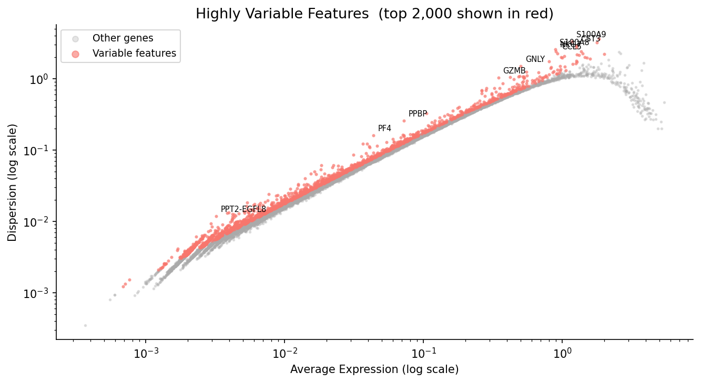</td>
</tr>
</table>

> Both plots use **Standardized Variance** on the y-axis, matching R's `VariableFeaturePlot`.
> Shanuz reproduces Seurat's `vst` algorithm faithfully: it fits the mean–variance LOESS on
> the **raw counts**, then ranks genes by the variance of the standardized values after
> clipping each to `sqrt(n_cells)` (the clip step that stops single-cell outliers from
> dominating).
> R's `LabelPoints` (with `ggrepel`) avoids label overlaps; Shanuz uses `matplotlib.annotate`
> which may overlap in dense regions.
> **Top-10 gene overlap: 9/10 (90%)** — the same `PPBP, LYZ, S100A9, IGLL5, GNLY, FTL, PF4,
> FTH1, S100A8` HVGs as the R tutorial; `GNG11` sits just outside the top 10 (rank 11).
> Minor rank differences come from the LOESS implementation (R: Fortran; Python: local
> quadratic fit).

---

## Step 8 · Scale Data

<table>
<tr><th>R (Seurat)</th><th>Python (Shanuz)</th></tr>
<tr>
<td>

```r
all.genes <- rownames(pbmc)
pbmc <- ScaleData(pbmc, features = all.genes)
# Stores z-scores in pbmc[["RNA"]]@scale.data
```

</td>
<td>

```python
all_genes = pbmc.assays["RNA"]._all_feature_names
scale_data(pbmc, features=all_genes)
# Stored in pbmc.assays["RNA"].layers["scale.data"]
```

</td>
</tr>
</table>

---

## Step 9 · PCA

<table>
<tr><th>R (Seurat)</th><th>Python (Shanuz)</th></tr>
<tr>
<td>

```r
pbmc <- RunPCA(
  pbmc,
  features = VariableFeatures(pbmc),
  npcs     = 50
)

# Top positive/negative loading genes per PC
VizDimLoadings(pbmc, dims = 1:2, reduction = "pca")

# PCA scatter
DimPlot(pbmc, reduction = "pca")
```

</td>
<td>

```python
hvg = pbmc.assays["RNA"].variable_features
run_pca(pbmc, n_pcs=50, features=hvg,
        reduction_name="pca")

# Top positive/negative loading genes per PC
# viz_dim_loadings mirrors VizDimLoadings exactly
fig = viz_dim_loadings(
    pbmc, reduction="pca", dims=[1, 2], n_features=15
)

# PCA scatter
fig = dim_plot(pbmc, reduction="pca", label=False)
```

</td>
</tr>
<tr>
<td></td>
<td>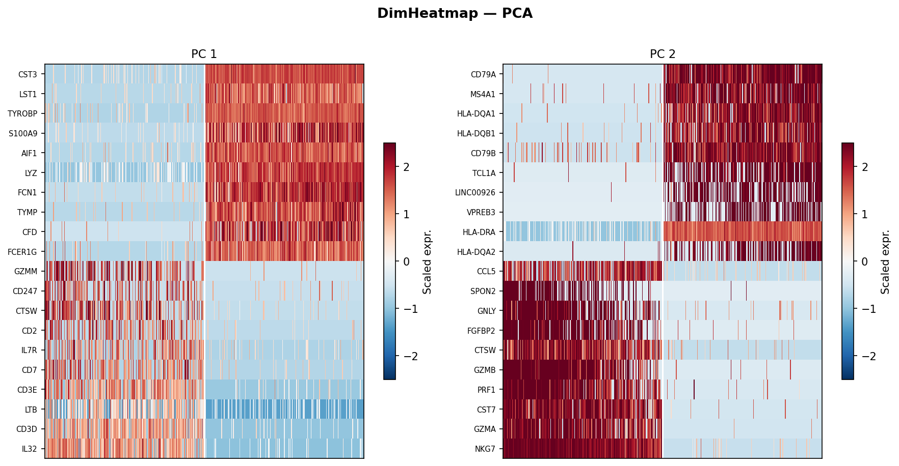</td>
</tr>
<tr>
<td></td>
<td>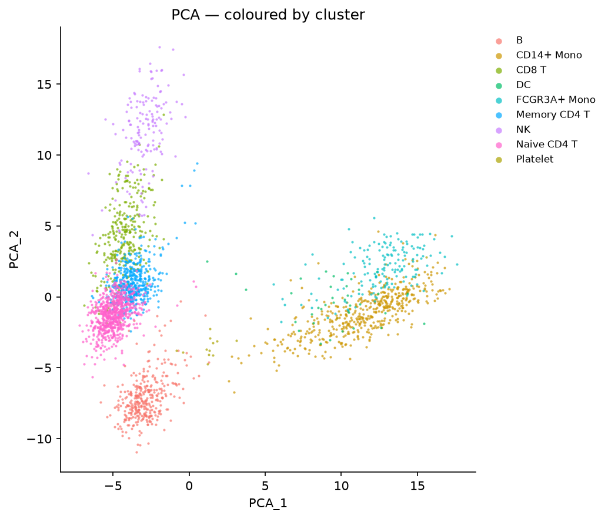</td>
</tr>
</table>

> Both show horizontal bar charts of top loading genes per PC.
> The same myeloid genes dominate PC1 positively (CST3, TYROBP, LST1, AIF1)
> and T-cell genes dominate PC1 negatively (IL7R, LTB, IL32).

---

## Step 10 · Elbow Plot — Choose Dimensionality

<table>
<tr><th>R (Seurat)</th><th>Python (Shanuz)</th></tr>
<tr>
<td>

```r
ElbowPlot(pbmc)
# Elbow visible around PC 9–10
```

</td>
<td>

```python
fig = elbow_plot(pbmc, ndims=20)
# Elbow visible around PC 9–10
```

</td>
</tr>
<tr>
<td></td>
<td>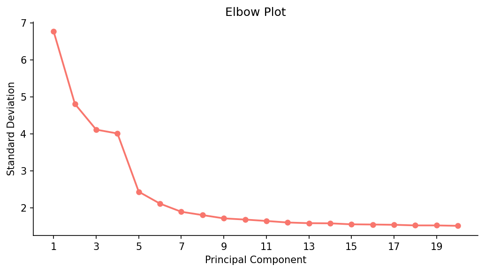</td>
</tr>
</table>

| PC | R stdev | Shanuz stdev |
|----|---------|--------------|
| 1  | ~6.8    | 6.766        |
| 2  | ~4.8    | 4.808        |
| 10 | ~1.7    | 1.684        |

---

## Step 11 · Find Neighbors & Cluster

<table>
<tr><th>R (Seurat)</th><th>Python (Shanuz)</th></tr>
<tr>
<td>

```r
pbmc <- FindNeighbors(pbmc, dims = 1:10)
pbmc <- FindClusters(
  pbmc,
  resolution = 0.5   # → 9 clusters
)
# pbmc$seurat_clusters holds the labels
```

</td>
<td>

```python
find_neighbors(pbmc, dims=range(10), k_param=20)
find_clusters(
    pbmc,
    resolution  = 0.5,   # → 9 clusters
    algorithm   = 1,     # 1=Louvain, 2=Leiden
    random_seed = 0,
)
# pbmc.meta_data["seurat_clusters"] holds labels
```

</td>
</tr>
</table>

> Both use Louvain community detection via `igraph`.
> `resolution=0.5` gives **9 clusters** in both R and Python.

---

## Step 12 · UMAP

<table>
<tr><th>R (Seurat)</th><th>Python (Shanuz)</th></tr>
<tr>
<td>

```r
pbmc <- RunUMAP(pbmc, dims = 1:10)
DimPlot(pbmc, reduction = "umap")
```

</td>
<td>

```python
run_umap(pbmc, dims=range(10),
         reduction_name="umap", seed=42)
# label=False matches R's default (no centroid labels)
fig = dim_plot(pbmc, reduction="umap", label=False)
```

</td>
</tr>
<tr>
<td></td>
<td>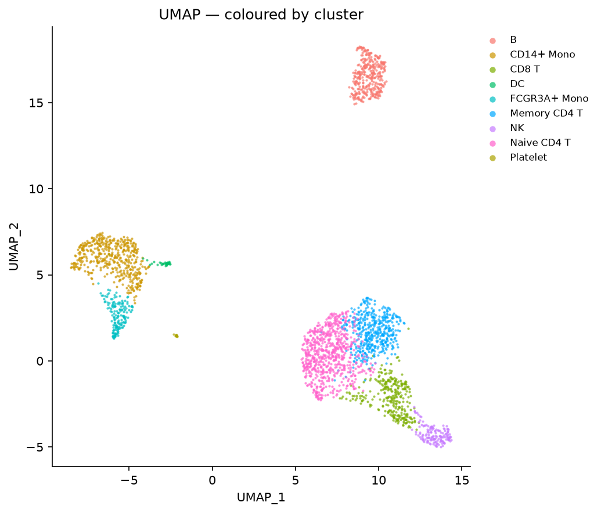</td>
</tr>
</table>

> **Note — UMAP layout difference is expected, not a bug.**
> R Seurat uses the [`uwot`](https://github.com/jlmelville/uwot) UMAP implementation
> while Python uses [`umap-learn`](https://umap-learn.readthedocs.io). Both libraries
> apply the same UMAP algorithm but differ in initialisation strategy, nearest-neighbour
> graph construction, and optimisation details. As a result, the **spatial arrangement**
> of clusters will look different even with the same random seed — clusters may be
> rotated, reflected, or positioned further apart. This is a known and well-documented
> difference between the two libraries and does **not** indicate an error in the
> analysis. The important thing is that the **same 9 biologically meaningful clusters**
> are recovered in both. Cluster label numbers may also differ (Louvain assigns IDs by
> graph traversal order) but the cell-type groupings are identical.

---

## Step 13 · Feature Plots — Canonical Markers

<table>
<tr><th>R (Seurat)</th><th>Python (Shanuz)</th></tr>
<tr>
<td>

```r
FeaturePlot(
  pbmc,
  features = c(
    "MS4A1", "CD79A",
    "NKG7",  "GNLY",
    "FCGR3A","LYZ",
    "PPBP",  "CD8A",
    "IL7R"
  )
)
```

</td>
<td>

```python
fig = feature_plot(
    pbmc,
    features=[
        "MS4A1", "CD79A",
        "NKG7",  "GNLY",
        "FCGR3A","LYZ",
        "PPBP",  "CD8A",
        "IL7R",
    ],
    reduction = "umap",
    ncol      = 3,
    colormap  = "YlOrRd",
)
```

</td>
</tr>
<tr>
<td></td>
<td>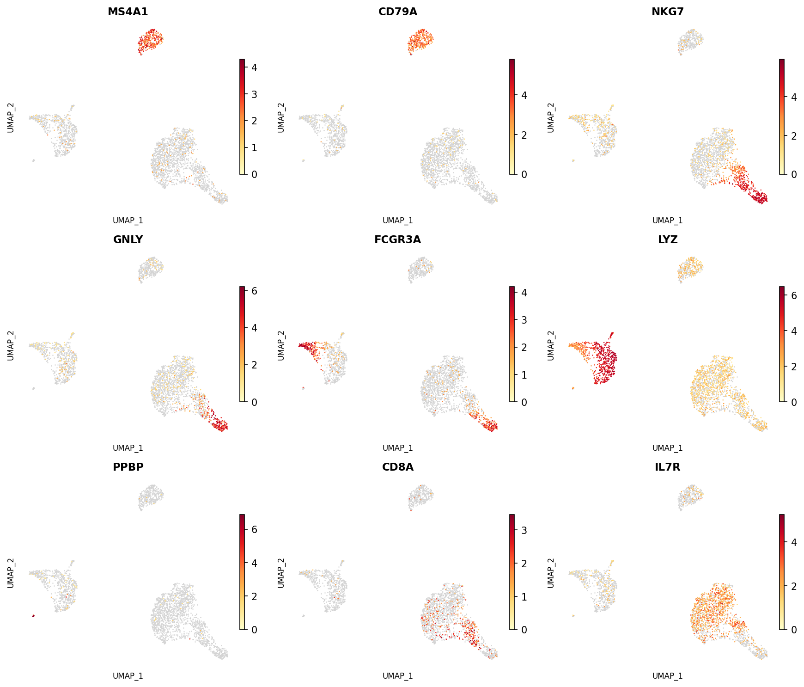</td>
</tr>
</table>

> **Note — minor visual differences are expected, not bugs.**
> Both plots use the same yellow→red expression gradient and the `order=True` behaviour
> (high-expression cells drawn on top). Cells with zero expression are rendered in light
> gray in both R and Shanuz, making the expressing cells stand out clearly.
> The **spatial layout** of the underlying UMAP differs for the same reason described
> in Step 12 (different UMAP implementations), but the **gene expression patterns are
> biologically identical**: MS4A1/CD79A in B cells, NKG7/GNLY in NK cells, LYZ/FCGR3A
> in monocytes, PPBP in platelets, CD8A in CD8 T cells, and IL7R in T cells.

---

## Step 14 · Violin Plots — Marker Expression

<table>
<tr><th>R (Seurat)</th><th>Python (Shanuz)</th></tr>
<tr>
<td>

```r
VlnPlot(
  pbmc,
  features = c("MS4A1", "CD79A")
)
VlnPlot(
  pbmc,
  features = c("NKG7", "PF4"),
  slot = "counts",
  log  = TRUE
)
```

</td>
<td>

```python
# Matches R's first VlnPlot call (MS4A1 + CD79A)
fig = vln_plot(
    pbmc,
    features=["MS4A1", "CD79A"],
    figsize=(12, 4),
)

# Matches R's second VlnPlot call (raw counts)
fig = vln_plot(
    pbmc,
    features=["NKG7", "PF4"],
    layer="counts",   # slot="counts" in R
    figsize=(12, 4),
)
```

</td>
</tr>
<tr>
<td></td>
<td>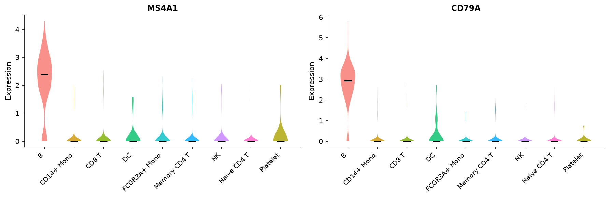</td>
</tr>
<tr>
<td></td>
<td>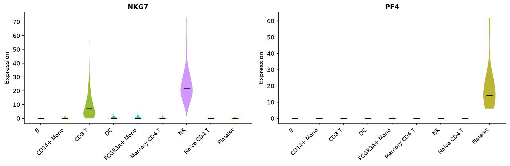</td>
</tr>
</table>

> Both show cluster-specific marker expression.
> The `layer` argument in Shanuz maps directly to Seurat's `slot` argument.

---

## Step 15 · Find Markers

<table>
<tr><th>R (Seurat)</th><th>Python (Shanuz)</th></tr>
<tr>
<td>

```r
# Markers for one cluster
cluster2.markers <- FindMarkers(
  pbmc, ident.1 = 2
)
head(cluster2.markers, 5)

# Markers for all clusters
pbmc.markers <- FindAllMarkers(
  pbmc,
  only.pos        = TRUE,
  min.pct         = 0.25,
  logfc.threshold = 0.25
)
pbmc.markers %>%
  group_by(cluster) %>%
  slice_max(n = 2, order_by = avg_log2FC)
```

</td>
<td>

```python
# Markers for one cluster
c2_markers = find_markers(
    pbmc, ident_1="2", only_pos=True
)
print(c2_markers.head(5))

# Markers for all clusters
all_markers = find_all_markers(
    pbmc,
    only_pos        = True,
    min_pct         = 0.25,
    logfc_threshold = 0.25,
)
top2 = (
    all_markers
    .groupby("cluster", group_keys=False)
    .apply(lambda x: x.nlargest(2, "avg_log2FC"))
)
print(top2)
```

</td>
</tr>
</table>

> Argument names use `_` instead of `.` (`ident.1` → `ident_1`,
> `only.pos` → `only_pos`). The returned `DataFrame` has the same columns:
> `p_val`, `avg_log2FC`, `pct.1`, `pct.2`, `p_val_adj`, `cluster`, `gene`.

---

## Step 16 · Expression Heatmap

<table>
<tr><th>R (Seurat)</th><th>Python (Shanuz)</th></tr>
<tr>
<td>

```r
top10 <- pbmc.markers %>%
  group_by(cluster) %>%
  top_n(n = 10, wt = avg_log2FC)

DoHeatmap(pbmc, features = top10$gene) +
  NoLegend()
```

</td>
<td>

```python
top10_genes = (
    all_markers
    .groupby("cluster", group_keys=False)
    .apply(lambda x: x.nlargest(10, "avg_log2FC"))
    ["gene"].tolist()
)
top10_genes = list(dict.fromkeys(top10_genes))

fig = do_heatmap(pbmc, features=top10_genes)
```

</td>
</tr>
<tr>
<td></td>
<td></td>
</tr>
</table>

> `do_heatmap` automatically sorts cells by cluster and draws a coloured cluster
> bar at the top — matching R's `DoHeatmap` layout.
> `NoLegend()` in R is handled by `do_heatmap`'s internal layout.

---

## Step 17 · Cell Type Annotation

<table>
<tr><th>R (Seurat)</th><th>Python (Shanuz)</th></tr>
<tr>
<td>

```r
new.cluster.ids <- c(
  "Naive CD4 T", "CD14+ Mono",
  "Memory CD4 T", "B",
  "CD8 T", "FCGR3A+ Mono",
  "NK", "DC", "Platelet"
)
names(new.cluster.ids) <- levels(pbmc)
pbmc <- RenameIdents(pbmc, new.cluster.ids)

DimPlot(
  pbmc,
  reduction = "umap",
  label     = TRUE,
  pt.size   = 0.5
) + NoLegend()
```

</td>
<td>

```python
cell_type_map = {
    "0": "Naive CD4 T",
    "1": "CD14+ Mono",
    "2": "Memory CD4 T",
    "3": "B",
    "4": "CD8 T",
    "5": "FCGR3A+ Mono",
    "6": "NK",
    "7": "DC",
    "8": "Platelet",
}
pbmc.rename_idents(cell_type_map)

fig = dim_plot(
    pbmc,
    reduction = "umap",
    label     = True,
    pt_size   = 0.5,
    title     = "UMAP — Cell Type Annotations",
)
```

</td>
</tr>
<tr>
<td></td>
<td>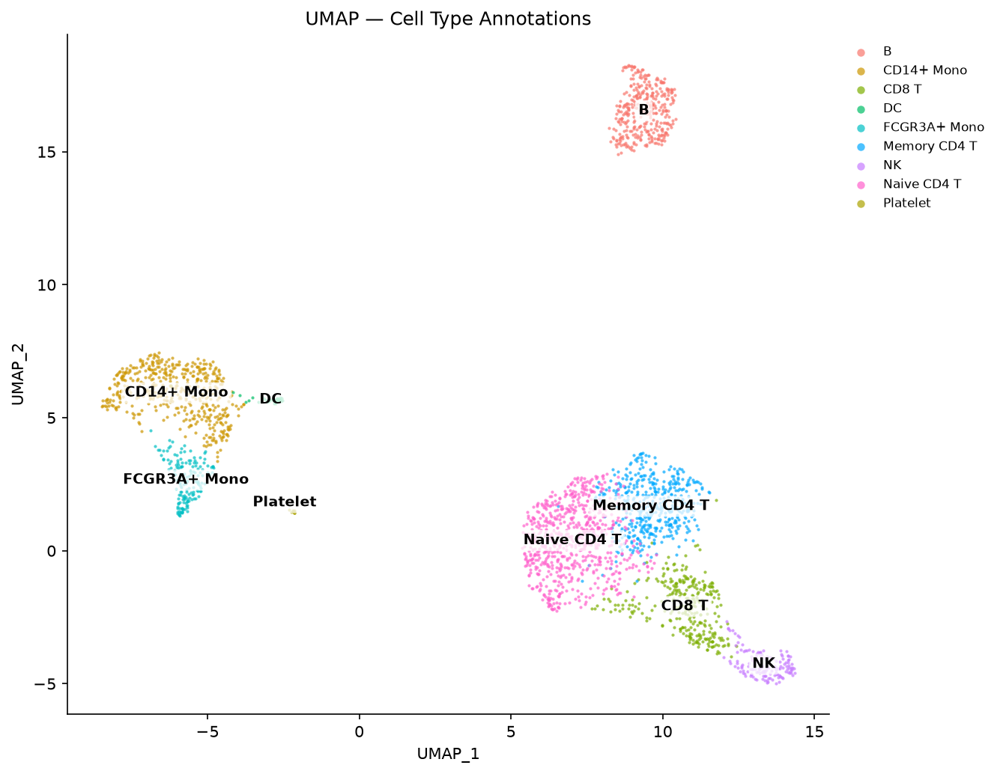</td>
</tr>
</table>

> Cluster index ordering differs between R and Shanuz (Louvain is non-deterministic
> by cluster ID), so the cluster-to-cell-type mapping uses different numeric keys.
> The biological result — 9 identical cell types — is the same.

---

## Step 18 · Ridge Plot (Bonus)

<table>
<tr><th>R (Seurat)</th><th>Python (Shanuz)</th></tr>
<tr>
<td>

```r
RidgePlot(
  pbmc,
  features = c("LYZ", "NKG7",
               "MS4A1", "CD8A"),
  ncol = 2
)
```

</td>
<td>

```python
fig = ridge_plot(
    pbmc,
    features=["LYZ", "NKG7", "MS4A1", "CD8A"],
    ncol=2,
    figsize=(12, 8),
)
```

</td>
</tr>
<tr>
<td>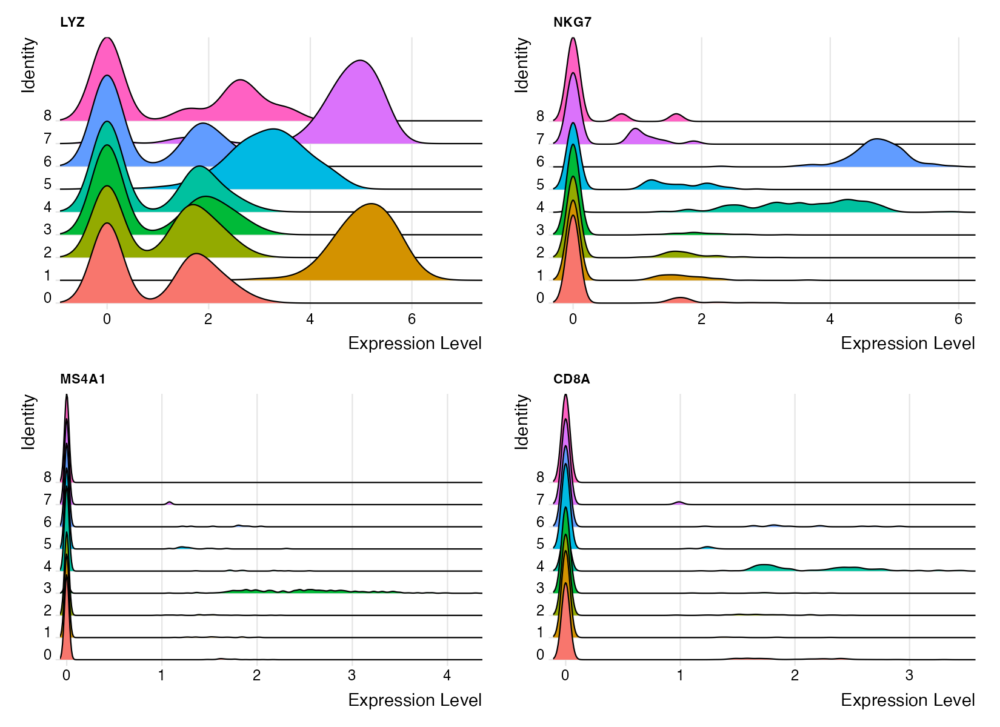</td>
<td>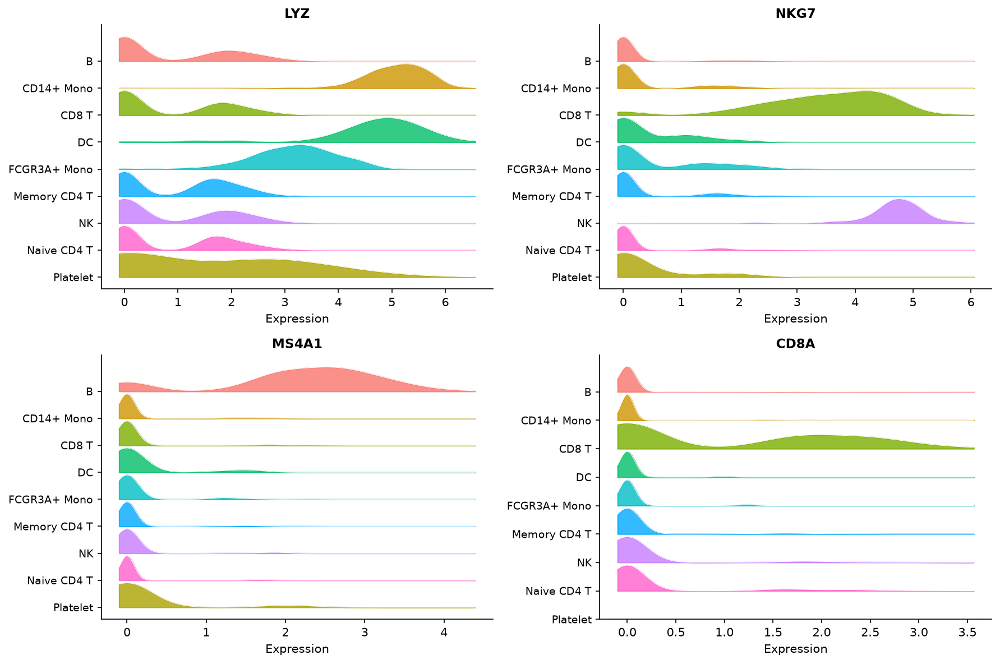</td>
</tr>
</table>

> The published Seurat vignette prints no RidgePlot, so the R panel here is
> generated by [`pbmc3k_verify.R`](pbmc3k_verify.R) (standard PBMC 3k workflow).
> R's `RidgePlot` uses the `ggridges` package; Shanuz implements equivalent KDE
> ridgelines using `scipy.stats.gaussian_kde`.

---

## Quick Reference — API Translation

| Task | R (Seurat) | Python (Shanuz) |
|------|-----------|-----------------|
| Create object | `CreateSeuratObject(counts, min.cells, min.features)` | `create_shanuz_object(counts, min_cells, min_features)` |
| % mito genes | `PercentageFeatureSet(pbmc, pattern="^MT-")` | `percentage_feature_set(pbmc, pattern=r"^MT-", col_name=...)` |
| Normalise | `NormalizeData(pbmc, normalization.method, scale.factor)` | `normalize_data(pbmc, normalization_method, scale_factor)` |
| HVGs | `FindVariableFeatures(pbmc, selection.method, nfeatures)` | `find_variable_features(pbmc, selection_method, nfeatures)` |
| Scale | `ScaleData(pbmc, features)` | `scale_data(pbmc, features)` |
| PCA | `RunPCA(pbmc, features, npcs)` | `run_pca(pbmc, features, n_pcs)` |
| Neighbors | `FindNeighbors(pbmc, dims)` | `find_neighbors(pbmc, dims, k_param)` |
| Cluster | `FindClusters(pbmc, resolution)` | `find_clusters(pbmc, resolution, algorithm)` |
| UMAP | `RunUMAP(pbmc, dims)` | `run_umap(pbmc, dims)` |
| Markers | `FindMarkers(pbmc, ident.1)` | `find_markers(pbmc, ident_1)` |
| All markers | `FindAllMarkers(pbmc, only.pos, logfc.threshold)` | `find_all_markers(pbmc, only_pos, logfc_threshold)` |
| Rename idents | `RenameIdents(pbmc, new.ids)` | `pbmc.rename_idents(mapping_dict)` |
| Subset | `subset(pbmc, subset = condition)` | `pbmc.subset(cells=keep_list)` |
| Get expression | `FetchData(pbmc, vars)` | `pbmc.fetch_data(vars)` |
| Access metadata | `pbmc@meta.data` | `pbmc.meta_data` |
| Access assay | `pbmc[["RNA"]]` | `pbmc.assays["RNA"]` |
| Active idents | `Idents(pbmc)` | `pbmc.idents` |

### Plotting API Translation

| R (Seurat) | Python (Shanuz) | Key argument changes |
|-----------|-----------------|---------------------|
| `VlnPlot(pbmc, features, ncol, slot)` | `vln_plot(pbmc, features, ncol, layer)` | `slot` → `layer` |
| `FeaturePlot(pbmc, features, order)` | `feature_plot(pbmc, features, order)` | same |
| `DimPlot(pbmc, reduction, label, pt.size)` | `dim_plot(pbmc, reduction, label, pt_size)` | `.` → `_` |
| `ElbowPlot(pbmc)` | `elbow_plot(pbmc)` | same |
| `FeatureScatter(pbmc, feature1, feature2)` | `feature_scatter(pbmc, feature1, feature2)` | same |
| `VariableFeaturePlot(pbmc)` | `variable_feature_plot(pbmc)` | same |
| `VizDimLoadings(pbmc, dims, reduction)` | `viz_dim_loadings(pbmc, dims, reduction)` | same |
| `DimHeatmap(pbmc, dims, cells, balanced)` | `dim_heatmap(pbmc, dims, cells, balanced)` | same |
| `DoHeatmap(pbmc, features)` | `do_heatmap(pbmc, features)` | same |
| `RidgePlot(pbmc, features, ncol)` | `ridge_plot(pbmc, features, ncol)` | same |

### Plot output difference

```r
# R — plots render to graphics device automatically
VlnPlot(pbmc, features = "LYZ")
```

```python
# Python — functions return a Figure; display or save explicitly
fig = vln_plot(pbmc, features="LYZ")

# In a Jupyter notebook: just call the function — it displays inline
# To save:
fig.savefig("lyz_violin.png", dpi=150, bbox_inches="tight")
# To display interactively:
plt.show()
```

---

## Reproducing All Plots

```bash
git clone https://github.com/GenomicAI/shanuz.git
cd shanuz
uv venv && source .venv/bin/activate   # Windows: .venv\Scripts\activate
uv pip install -e ".[analysis]"
python tutorials/generate_plots.py     # Shanuz plots -> tutorials/figures/
Rscript tutorials/pbmc3k_verify.R      # R Seurat RidgePlot -> tutorials/figures/r_12_ridge_plot.png
```

Every other R panel in this tutorial links the canonical
[Seurat vignette](https://satijalab.org/seurat/articles/pbmc3k_tutorial) image;
only the RidgePlot (which the vignette omits) is generated locally by
`pbmc3k_verify.R`.

---

## References

> Hao Y, Stuart T, Kowalski MH, et al. (2024).
> **Dictionary learning for integrative, multimodal and scalable single-cell analysis.**
> *Nature Biotechnology*, 42, 293–304. https://doi.org/10.1038/s41587-023-01767-y

> Stuart T, Butler A, Hoffman P, et al. (2019).
> **Comprehensive Integration of Single-Cell Data.**
> *Cell*, 177(7), 1888–1902. https://doi.org/10.1016/j.cell.2019.05.031

> 10x Genomics (2016). *3k PBMCs from a Healthy Donor*.
> https://www.10xgenomics.com/resources/datasets/3-k-pb-mcs-from-a-healthy-donor-1-standard-1-1-0
