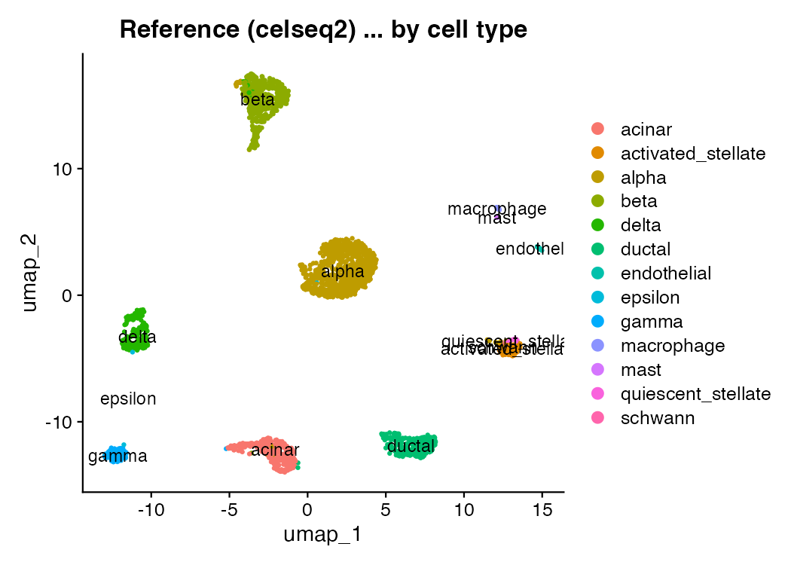
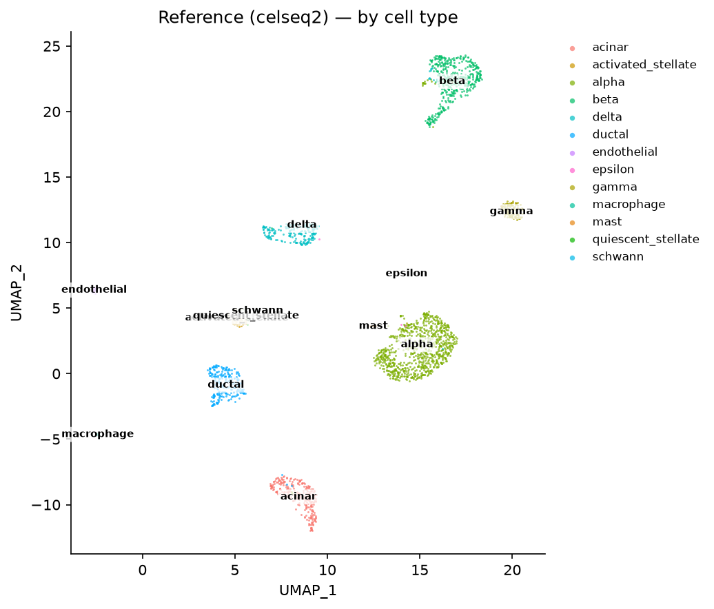
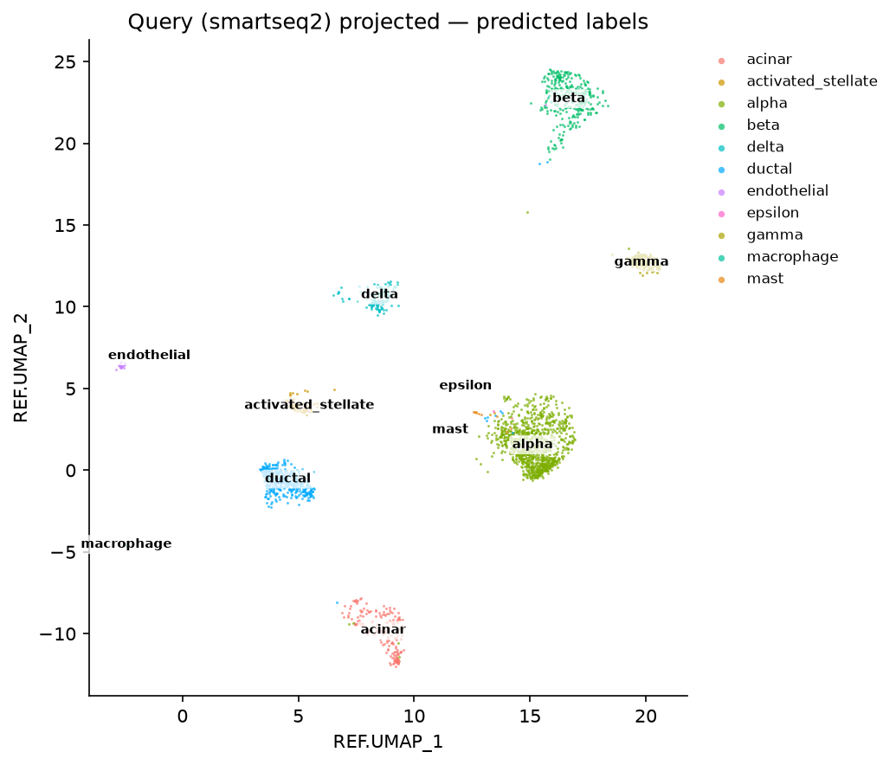
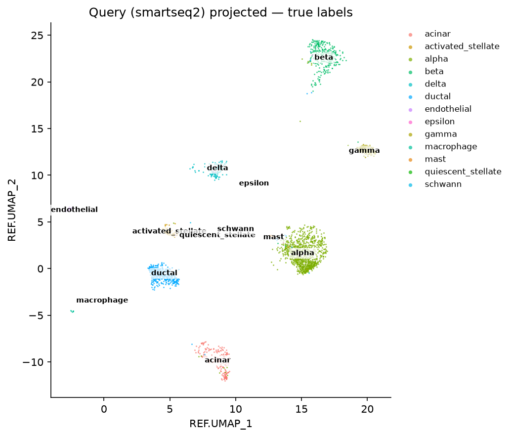

# Reference mapping — label transfer (R Seurat vs Shanuz)

A side-by-side port of Seurat's [reference mapping vignette](https://satijalab.org/seurat/articles/integration_mapping)
on the pancreatic-islet dataset (`panc8`): ~14,900 human islet cells profiled
across five technologies (CEL-seq, CEL-seq2, SMART-seq2, Fluidigm C1, inDrop).
Each technology is its own batch with its own capture chemistry, so the same
cell type looks measurably different from one to the next — which is exactly what
makes cross-technology **annotation transfer** a real test.

The task reference mapping solves: **you have an annotated atlas you trust (the
reference) and a new, unlabelled dataset (the query); borrow the atlas's labels
to annotate the query — without ever moving or re-clustering the reference.**
Unlike [integration](integration_vignette.md), which corrects several datasets
*onto each other*, mapping is deliberately asymmetric: the reference is fixed,
the query is projected into the reference's own PCA, and labels are carried
across scored mutual-nearest-neighbour anchors. Shanuz ships the whole workflow,
and this walkthrough runs it against its Seurat reference on identical counts:

- **`find_transfer_anchors`** ↔ `FindTransferAnchors(reduction="pcaproject")` —
  project the query into the reference's PCA and find scored anchors.
- **`transfer_data`** ↔ `TransferData` — a per-query-cell weighted vote over the
  reference labels (`predicted.id` + `prediction.score.*`).
- **`map_query`** / **`project_umap`** ↔ `MapQuery` / `ProjectUMAP` — place the
  query in the reference's own UMAP, so the new cells land on the atlas you
  already know how to read.

> **Why this tutorial exists.** The whole reference-mapping stack
> (`find_transfer_anchors` / `transfer_data` / `map_query` / `project_umap`)
> landed with only synthetic `default_rng` fixtures for tests — two cell types, a
> planted batch block, balanced sizes. This is the first time it meets a real
> atlas with thirteen cell types (several of them rare), genuine cross-technology
> batch structure, and a Seurat reference to match. The projected embedding is not
> coordinate-comparable across tools (irlba-vs-scikit-learn PCA sign,
> uwot-vs-umap-learn transform) — but the transferred *labels* are a robust
> weighted argmax, so they compare **per cell**: does shanuz assign each query
> cell the same `predicted.id` as Seurat, and does each tool recover the query's
> true cell type.

---

## Reference and query — one technology each

Seurat's vignette builds a multi-technology *integrated* reference. This tutorial
deliberately uses a **single-technology reference** and a **single-technology
query**, for two reasons: it isolates the label-transfer machinery from the
integration machinery the [integration tutorial](integration_vignette.md)
already checks, and it is still a genuine cross-chemistry transfer.

```
Reference: celseq2   2,285 cells   (tag-based CEL-seq2)     — all 13 cell types
Query:     smartseq2 2,394 cells   (full-length SMART-seq2) — all 13 cell types
```

Both technologies carry every one of the 13 annotated cell types, so the transfer
has a fair target for each. The query's own `celltype` labels ship with the data
but are **held back as ground truth** — never fed to the transfer — so the result
can be scored directly for *accuracy*, not merely for agreement with R.

`panc8` is a curated SeuratData object with no clean raw source, so both languages
read the **same counts**, exported once from R by `tutorials/export_seuratdata.R`
into a 10x-style matrix folder (byte-identical input and cell order, the same
discipline the [integration tutorial](integration_vignette.md) gets from the same
bridge).

---

## Step 1 · Load, split by technology, prep on one shared basis

Both objects are built from one gene universe (split from a single object, so the
reference and query share an identical feature set) and prepped the standard way.
One wrinkle keeps the cross-tool comparison fair, exactly as in the integration and
Mixscape tutorials: **both tools use the same variable features.** The Python run
writes the 2,000 reference HVGs it selected to `figures_refmap/hvg_features.txt`,
and the R script reads them back — so the only divergences left are the genuinely
method-level ones (PCA numerics, the anchor/weight kernels, kNN ties). The query
is scaled on the *reference's* HVGs so the projection lines up gene-for-gene.

<table>
<tr><th>R (Seurat)</th><th>Python (Shanuz)</th></tr>
<tr><td>

```r
# same exported counts Python reads
counts <- Read10X("~/.shanuz_data/panc8")
full <- CreateSeuratObject(counts, min.cells = 3,
                           meta.data = meta)
reference <- subset(full, subset = tech == "celseq2")
query     <- subset(full, subset = tech == "smartseq2")

hvg <- readLines("figures_refmap/hvg_features.txt")
reference <- NormalizeData(reference, verbose = FALSE)
VariableFeatures(reference) <- hvg      # Python's HVGs
reference <- ScaleData(reference, features = hvg)
reference <- RunPCA(reference, features = hvg, npcs = 30)

query <- NormalizeData(query, verbose = FALSE)
query <- ScaleData(query, features = hvg)
```

</td><td>

```python
from shanuz.datasets import panc8
from shanuz.shanuz import create_shanuz_object
from shanuz.preprocessing import (
    normalize_data, find_variable_features, scale_data)
from shanuz.reduction import run_pca

counts, genes, cells, meta = panc8()
full = create_shanuz_object(counts=counts, assay="RNA",
        min_cells=3, feature_names=genes,
        cell_names=cells, meta_data=meta)
reference = full.subset(cells=celseq2_cells)
query     = full.subset(cells=smartseq2_cells)

normalize_data(reference, assay="RNA")
find_variable_features(reference, assay="RNA", nfeatures=2000)
scale_data(reference, assay="RNA")
run_pca(reference, assay="RNA", n_pcs=30)   # writes hvg file

normalize_data(query, assay="RNA")
scale_data(query, assay="RNA", features=hvg)
```

</td></tr>
</table>

---

## Step 2 · Transfer anchors and labels

`FindTransferAnchors(reduction="pcaproject")` projects the query through the
reference's PCA loadings — the principal axes are learned once on the reference
and the query is pushed through the same map, so batch-specific structure the
reference never saw simply lands nowhere. `TransferData` then turns the scored
anchors into a per-query-cell weighted vote over the reference's `celltype`.

<table>
<tr><th>R (Seurat)</th><th>Python (Shanuz)</th></tr>
<tr><td>

```r
anchors <- FindTransferAnchors(
  reference = reference, query = query,
  reference.reduction = "pca", reduction = "pcaproject",
  features = hvg, dims = 1:30, k.filter = 200)

predictions <- TransferData(
  anchorset = anchors, refdata = reference$celltype,
  dims = 1:30, k.weight = 50)
# predictions$predicted.id, $prediction.score.max, ...
```

</td><td>

```python
from shanuz.transfer import find_transfer_anchors, transfer_data

anchors = find_transfer_anchors(
    reference, query, anchor_features=hvg,
    reduction="pcaproject", dims=30, k_anchor=5, k_filter=200)

predictions = transfer_data(anchors, refdata="celltype",
                            k_weight=50)
# predictions["predicted.id"], ["prediction.score.max"], ...
```

</td></tr>
</table>

Both tools find a healthy anchor set on the shared HVG basis (shanuz **3,551**
anchors) and transfer with high confidence — mean `prediction.score.max` 0.986
(shanuz) vs 0.988 (Seurat).

---

## Step 3 · Score the transfer

Because the query's true `celltype` is known, the headline metric is plain
**accuracy** — the fraction of query cells whose transferred `predicted.id`
matches the truth — read per cell type. The Shanuz result:

| cell type | support | recall ↑ |
|-----------|---:|---:|
| alpha | 1,008 | 0.987 |
| ductal | 444 | 0.996 |
| beta | 308 | 0.990 |
| gamma | 213 | 0.991 |
| acinar | 188 | 1.000 |
| delta | 127 | 0.984 |
| activated_stellate | 55 | 1.000 |
| endothelial | 21 | 1.000 |
| epsilon | 8 | 0.375 |
| macrophage | 7 | 0.714 |
| mast | 7 | 1.000 |
| quiescent_stellate | 6 | 0.000 |
| schwann | 2 | 0.000 |
| **overall** | **2,394** | **0.985** |

**2,357 of 2,394 query cells (98.5%) are annotated correctly.** Every abundant
cell type is recovered at ≥98%; the whole error budget is the handful of **rare
types** (epsilon, macrophage, quiescent_stellate, schwann) for which the
2,285-cell single-technology reference simply carries too few examples to anchor
reliably — the macro-averaged recall (0.77, every class weighted equally) is what
exposes that tail. This is the honest limit of a small single-tech reference, not
a defect: Seurat's transfer stumbles on exactly the same rare types.

<table>
<tr><th>R — reference atlas (celseq2)</th><th>Shanuz — reference atlas (celseq2)</th></tr>
<tr>
<td></td>
<td></td>
</tr>
</table>

`map_query` / `project_umap` place the query into the reference's fitted UMAP, so
the SMART-seq2 cells land on the CEL-seq2 atlas. Coloured by the transferred label
(left) and by the held-out truth (right), the two agree wherever the transfer
succeeded — the projection is a visual read of the accuracy above:

<table>
<tr><th>Shanuz — query projected, predicted label</th><th>Shanuz — query projected, true label</th></tr>
<tr>
<td></td>
<td></td>
</tr>
</table>

---

## The headline · R-vs-Python concordance

Because the transferred labels are directly comparable per cell — both tools pick
a `predicted.id` from the same reference label set — the concordance is a plain
**per-cell label agreement**, alongside each tool's accuracy against the known
`celltype`. All computed from Seurat's `predicted.id` in the verify script's
`r_calls.csv`.

| tool | accuracy vs truth ↑ | mean score |
|------|---:|---:|
| **shanuz** | **0.9845** | 0.9857 |
| **Seurat R** | **0.9879** | 0.9875 |

> **Label concordance — same `predicted.id` per cell: 0.9871 (2,363 / 2,394 query cells).**

**shanuz and Seurat annotate the query almost identically.** 2,363 of 2,394 query
cells (98.71%) receive the *same* label from both tools, and each tool is ~98.5%
accurate against the held-out truth — shanuz 0.9845, Seurat 0.9879, a 0.3-point
gap that is entirely the rare-type tail where a few cells tip between neighbours.
The two tools even fail *together*: both recover epsilon poorly, both nearly
perfect on the abundant types. This is the confirmation the initiative was built
to get — the reference-mapping stack, previously checked only on a synthetic
two-type fixture, reproduces Seurat's annotation on a real thirteen-type
cross-technology atlas.

**No defect found.** Unlike the integration tutorial — where the first real Seurat
comparison turned up a crash and a 4× under-integration in the RPCA path — the
transfer stack ports faithfully. That is the other outcome the R-fidelity net can
return, and worth stating plainly: `find_transfer_anchors`, `transfer_data`,
`map_query` and `project_umap` are confirmed against real Seurat on their first
real-data benchmark.

---

## Running it yourself

```bash
Rscript tutorials/export_seuratdata.R panc8            # one-time counts export (~117 MB SeuratData pkg)
python  tutorials/panc8_reference_mapping_tutorial.py  # writes HVGs, prints accuracy + per-class recall
Rscript tutorials/panc8_reference_mapping_verify.R     # Seurat reference → r_calls.csv + r_*.png
python  tutorials/panc8_reference_mapping_tutorial.py  # re-run → prints the R-vs-Python concordance
python  tutorials/generate_refmap_plots.py             # Shanuz figures → figures_refmap/py_*.png
```

**Figures** (`tutorials/figures_refmap/`, `r_*` = R Seurat, `py_*` = Shanuz):

| Figure | Description |
|---|---|
| `py_01_reference_umap_celltype.png` | The reference atlas UMAP, by cell type — the space the query maps into |
| `py_02_query_projected_predicted.png` | The query projected into the reference UMAP, by transferred label |
| `py_03_query_projected_truth.png` | The same projection, by the held-out true label |
| `py_04_perclass_recall.png` | Per-cell-type transfer recall vs support — where it works, where it is noisy |

---

## R Seurat → Shanuz API

| Task | R (Seurat) | Python (Shanuz) |
|------|-----------|-----------------|
| Transfer anchors | `FindTransferAnchors(reference, query, reduction="pcaproject", dims=1:30)` | `find_transfer_anchors(reference, query, reduction="pcaproject", dims=30)` |
| Transfer labels | `TransferData(anchors, refdata=reference$celltype)` | `transfer_data(anchors, refdata="celltype")` |
| Impute expression | `TransferData(anchors, refdata=GetAssayData(reference)[genes, ])` | `transfer_data(anchors, refdata=ref_expr, refdata_features=genes)` |
| Project into reference UMAP | `ProjectUMAP(query, reference, reduction.model="umap")` | `project_umap(query, reference)` |
| Map query (annotate + place) | `MapQuery(anchors, query, reference, refdata=list(id="celltype"))` | `map_query(anchors, refdata="celltype")` |
| CCA transfer space (cross-modality) | `FindTransferAnchors(..., reduction="cca")` | `find_transfer_anchors(..., reduction="cca")` |

---

## References

Baron M, Veres A, Wolock SL, et al. (2016) **A single-cell transcriptomic map of
the human and mouse pancreas reveals inter- and intra-cell population structure.**
*Cell Systems* 3, 346-360. <https://doi.org/10.1016/j.cels.2016.08.011>

Stuart T, Butler A, Hoffman P, et al. (2019) **Comprehensive integration of
single-cell data.** *Cell* 177, 1888-1902. <https://doi.org/10.1016/j.cell.2019.05.031>
