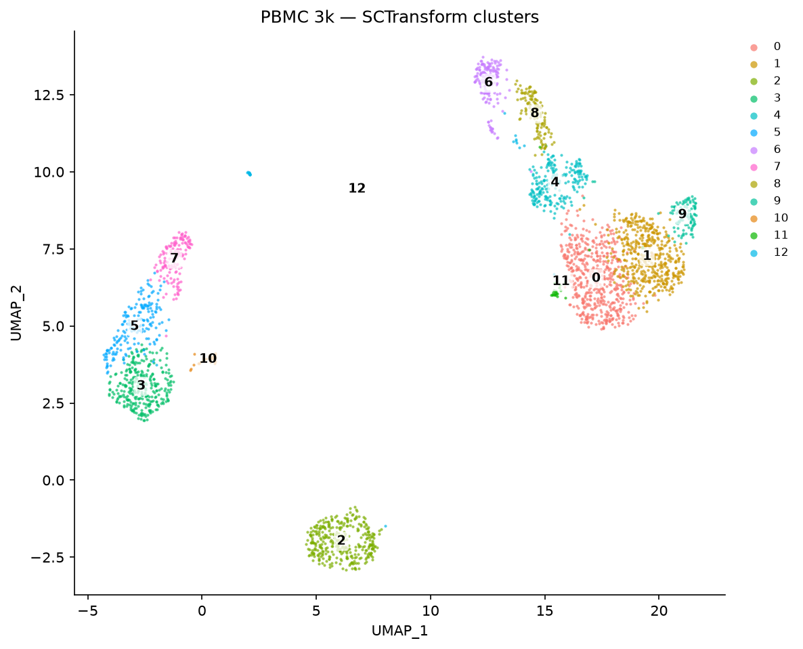
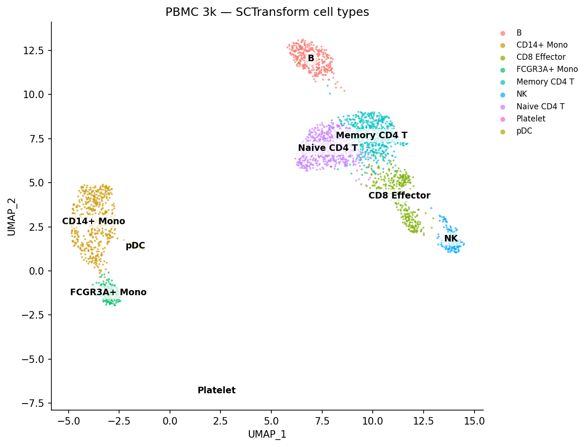
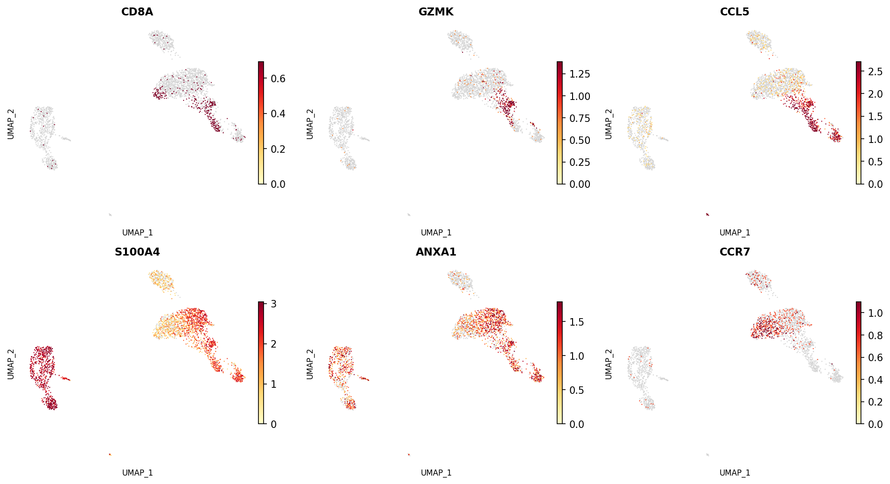
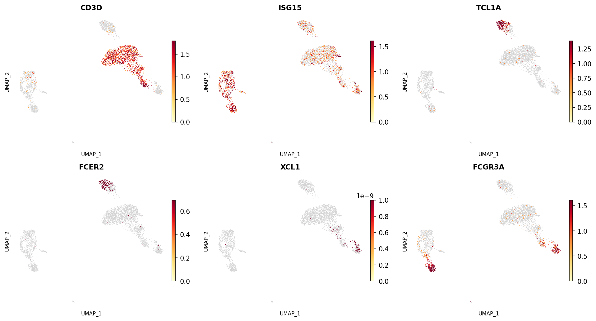
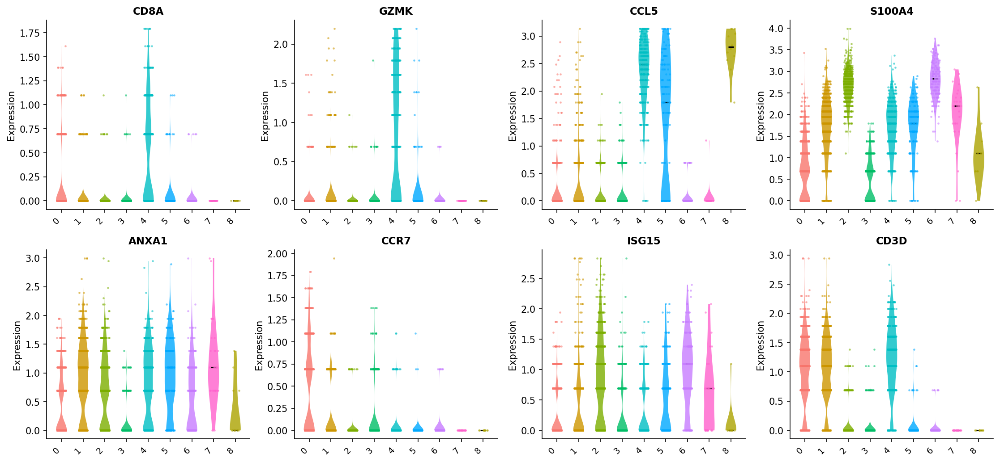
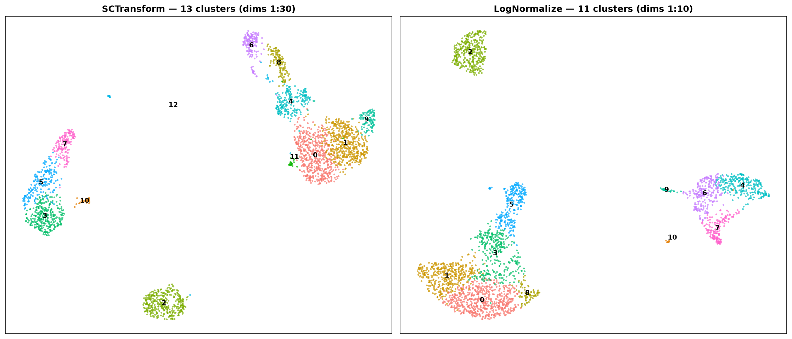

# SCTransform Tutorial — R Seurat vs Shanuz (Python)

A Python port of Seurat's
[sctransform vignette](https://satijalab.org/seurat/articles/sctransform_vignette)
on the **PBMC 3k** dataset. `SCTransform` replaces the
`NormalizeData → FindVariableFeatures → ScaleData` trio with a single
**regularized negative-binomial model**: counts are modelled per gene as a
function of cell sequencing depth, the per-gene parameters are smoothed across
genes, and the model's **Pearson residuals** become the normalized values. The
vignette's point is that this removes technical effects more effectively, so —
run over more PCs (dims 1:30) — it resolves finer immune subsets.

> **Dataset:** 3k PBMCs — 10x Genomics (2016)
> **Python:** Shanuz v0.1.0

```bash
python tutorials/pbmc3k_sctransform_tutorial.py   # printed validation + comparison
python tutorials/generate_sctransform_plots.py    # writes figures_sctransform/
```

---

## Step 1 · Load data & QC metric

<table>
<tr><th>R (Seurat)</th><th>Python (Shanuz)</th></tr>
<tr><td>

```r
library(Seurat)
pbmc_data <- Read10X("pbmc3k/filtered_gene_bc_matrices/hg19/")
pbmc <- CreateSeuratObject(counts = pbmc_data)
pbmc <- PercentageFeatureSet(pbmc, pattern = "^MT-",
                             col.name = "percent.mt")
```

</td><td>

```python
from shanuz.datasets import pbmc3k
from shanuz.shanuz import create_shanuz_object
from shanuz.preprocessing import percentage_feature_set

counts, genes, cells = pbmc3k()
pbmc = create_shanuz_object(counts=counts, assay="RNA", min_cells=3,
                            min_features=200, feature_names=genes,
                            cell_names=cells, project="pbmc3k")
percentage_feature_set(pbmc, pattern=r"^MT-", col_name="percent.mt")
```

</td></tr>
</table>

---

## Step 2 · SCTransform (one call replaces three)

`SCTransform` regresses `percent.mt` out of the residuals and returns **3,000**
variable features in a new **`SCT`** assay.

<table>
<tr><th>R (Seurat)</th><th>Python (Shanuz)</th></tr>
<tr><td>

```r
pbmc <- SCTransform(pbmc, vars.to.regress = "percent.mt",
                    verbose = FALSE)
# -> 3000 variable features, assay "SCT"
```

</td><td>

```python
from shanuz.sctransform import sctransform

sctransform(pbmc, vars_to_regress=["percent.mt"], n_features=3000)
# -> obj.assays["SCT"] with counts / data / scale.data layers
#    3000 variable features; SCT is now the active assay
```

</td></tr>
</table>

> Shanuz's `sctransform` fits the model with a vectorised per-gene Poisson IRLS,
> a moment estimate of the NB dispersion, and LOESS regularization of the
> parameters across genes — the same algorithm as the R/C++ `sctransform`, in
> pure NumPy. `scale.data` holds the clipped Pearson residuals for the 3,000
> variable features (a genuine feature-subset layer).

---

## Step 3 · PCA → UMAP → clustering over 30 PCs

<table>
<tr><th>R (Seurat)</th><th>Python (Shanuz)</th></tr>
<tr><td>

```r
pbmc <- RunPCA(pbmc, verbose = FALSE)
pbmc <- RunUMAP(pbmc, dims = 1:30)
pbmc <- FindNeighbors(pbmc, dims = 1:30)
pbmc <- FindClusters(pbmc)            # resolution 0.8
DimPlot(pbmc, label = TRUE)
```

</td><td>

```python
from shanuz.reduction import run_pca
from shanuz.neighbors import find_neighbors
from shanuz.clustering import find_clusters
from shanuz.umap import run_umap

run_pca(pbmc, n_pcs=50, features=pbmc.assays["SCT"].variable_features)
find_neighbors(pbmc, dims=range(30), k_param=20)
find_clusters(pbmc, resolution=0.8, random_seed=0)
run_umap(pbmc, dims=range(30), seed=42)
```

</td></tr>
<tr>
<td></td>
<td></td>
</tr>
</table>

The T-cell mass resolves as a **cytotoxicity gradient** — Naive CD4 → Memory
CD4 → CD8 Effector → NK — alongside two monocyte types, B cells, DC/pDC, and
platelets. After manual annotation the Python UMAP looks like this:



> *Python (Shanuz) only — the R vignette does not include a cell-type-annotated
> plot; labels were assigned by inspecting the marker feature plots below.*

---

## Step 4 · Marker feature plots (the vignette panels)

<table>
<tr><th>R (Seurat)</th><th>Python (Shanuz)</th></tr>
<tr><td>

```r
FeaturePlot(pbmc, features = c("CD8A","GZMK","CCL5",
                               "S100A4","ANXA1","CCR7"), ncol = 3)
FeaturePlot(pbmc, features = c("CD3D","ISG15","TCL1A",
                               "FCER2","XCL1","FCGR3A"), ncol = 3)
```

</td><td>

```python
from shanuz.plotting import feature_plot

feature_plot(pbmc, ["CD8A","GZMK","CCL5","S100A4","ANXA1","CCR7"],
             reduction="umap", assay="SCT", ncol=3,
             min_cutoff="q05", max_cutoff="q95")
feature_plot(pbmc, ["CD3D","ISG15","TCL1A","FCER2","XCL1","FCGR3A"],
             reduction="umap", assay="SCT", ncol=3,
             min_cutoff="q05", max_cutoff="q95")
```

</td></tr>
<tr>
<td></td>
<td></td>
</tr>
<tr>
<td></td>
<td></td>
</tr>
</table>

`CD8A`/`GZMK`/`CCL5` mark the CD8 effector tip; `CCR7` marks the naive end;
`S100A4`/`ANXA1` mark memory T cells; `FCGR3A` marks the CD16⁺ monocytes and NK;
`TCL1A`/`FCER2` pick out B-cell sub-structure — matching the vignette.

---

## Step 5 · Violin plots

<table>
<tr><th>R (Seurat)</th><th>Python (Shanuz)</th></tr>
<tr><td>

```r
VlnPlot(pbmc, features = c("CD8A","GZMK","CCL5","S100A4",
        "ANXA1","CCR7","ISG15","CD3D"), pt.size = 0.2, ncol = 4)
```

</td><td>

```python
from shanuz.plotting import vln_plot
vln_plot(pbmc, ["CD8A","GZMK","CCL5","S100A4","ANXA1","CCR7","ISG15","CD3D"],
         group_by="sct_clusters", assay="SCT", ncol=4, pt_size=2.0)
# pt_size overlays jittered cells, matching R's VlnPlot(pt.size = 0.2);
# matplotlib sizes points by area, so the numeric value differs.
```

</td></tr>
<tr>
<td></td>
<td></td>
</tr>
</table>

> Both panels plot the SCT `data` layer (`log1p` of corrected counts) — R's
> `VlnPlot` default for an SCT assay — with cells jittered over each violin. The
> distributions track gene-for-gene: `CD8A`/`GZMK` spike on the cytotoxic CD8
> cluster, `CCL5` across the CD8/NK end, `CD3D` over all T clusters, `CCR7` low
> and naive-restricted. The **x-axes differ in length** — Shanuz resolves **9
> clusters (0–8)** here versus the vignette's **12 (0–11)** — so a given cluster
> number is *not* the same population across the two plots; compare the
> per-gene shapes, not column positions. (See the accuracy note below on why the
> exact cluster count differs.)

---

## Step 6 · SCTransform vs standard log-normalization *(Python only)*

The R vignette does not include this comparison figure. Shanuz runs both
pipelines on the same cells and renders them side by side for a direct view
of the resolution difference:



> *Python (Shanuz) only — left: SCTransform (dims 1:30), right: LogNormalize (dims 1:10)*

---

## Accuracy vs the R vignette

| Aspect | R Seurat (vignette) | Shanuz | Match |
|--------|---------------------|--------|:-----:|
| Normalization model | NB Pearson residuals | NB Pearson residuals | ✅ |
| Variable features | **3,000** | **3,000** | ✅ |
| PCs used | 30 (dims 1:30) | 30 (dims 1:30) | ✅ |
| `vars.to.regress` | `percent.mt` | `percent.mt` | ✅ |
| Major populations | T, NK, B, 2× Mono, DC, platelet | all recovered | ✅ |
| CD8 effector split (CCL5/GZMK) from CD4 | yes | yes | ✅ |
| Naive vs memory CD4 (CCR7 vs S100A4) | yes | yes | ✅ |
| Clusters at resolution 0.8 | sharper / more than std | 9 (vs 11 for log-norm here) | ⚠️ |

**Where it matches.** The model, the 3,000 variable features, the 30-PC
embedding, and the **biology** all reproduce: the CD8-effector / CD4 / NK split
and the marker patterns the vignette highlights are all recovered.

**Where it differs — and why.** The exact cluster *count* is not a fixed target
(the vignette reports none) and is implementation-dependent. Shanuz's
`sctransform` is a faithful re-implementation of the algorithm but **not
bit-identical** to the C++/R version (LOESS and `theta.ml` internals differ),
and clustering/UMAP use different libraries (python-igraph / umap-learn vs
SLM / uwot). As in the PBMC 3k and 8k tutorials, this shifts cluster boundaries
and numbering without changing the recovered cell types. Cluster granularity is
tunable via `resolution`.

---

## API Translation (SCTransform additions)

| Task | R (Seurat) | Python (Shanuz) |
|------|-----------|-----------------|
| SCTransform | `SCTransform(obj, vars.to.regress="percent.mt")` | `sctransform(obj, vars_to_regress=["percent.mt"])` |
| Use SCT assay | `DefaultAssay(obj) <- "SCT"` (automatic) | active assay set to `"SCT"` automatically |
| Variable features | `VariableFeatures(obj)` | `obj.assays["SCT"].variable_features` |
| Residuals | `GetAssayData(obj, "scale.data")` | `obj.assays["SCT"].layers["scale.data"]` |

---

## References

> Hafemeister C, Satija R (2019). **Normalization and variance stabilization of
> single-cell RNA-seq data using regularized negative binomial regression.**
> *Genome Biology* 20, 296. https://doi.org/10.1186/s13059-019-1874-1

> Choudhary S, Satija R (2022). **Comparison and evaluation of statistical error
> models for scRNA-seq.** *Genome Biology* 23, 27. (sctransform v2)

> Seurat sctransform vignette:
> https://satijalab.org/seurat/articles/sctransform_vignette
