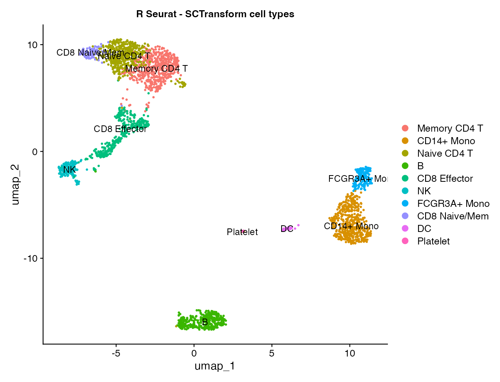
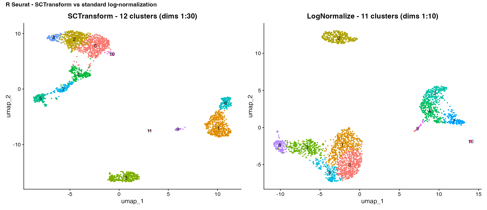

# SCTransform Tutorial — R Seurat vs Shanuz (Python)

A Python port of Seurat's
[sctransform vignette](https://satijalab.org/seurat/articles/sctransform_vignette)
on the **PBMC 3k** dataset. `SCTransform` replaces the
`NormalizeData → FindVariableFeatures → ScaleData` trio with a single
**regularized negative-binomial model**: counts are modelled per gene as a
function of cell sequencing depth, the per-gene parameters are smoothed across
genes, and the model's **Pearson residuals** become the normalized values. The
vignette's point is that this removes technical effects more effectively, so —
run over more PCs (dims 1:30) — it resolves finer immune subsets.

> **Dataset:** 3k PBMCs — 10x Genomics (2016)
> **Python:** Shanuz v0.2.0

```bash
python tutorials/pbmc3k_sctransform_tutorial.py   # printed validation + comparison
python tutorials/generate_sctransform_plots.py    # writes figures_sctransform/  (Shanuz)
Rscript tutorials/pbmc3k_sctransform_verify.R     # writes figures_sctransform/r_02, r_06  (R Seurat)
```

Most R figures below link the canonical
[Seurat vignette](https://satijalab.org/seurat/articles/sctransform_vignette)
images; the two the vignette omits (cell-type UMAP, SCT-vs-standard) are
generated locally by `pbmc3k_sctransform_verify.R`.

---

## Step 1 · Load data & QC metric

<table>
<tr><th>R (Seurat)</th><th>Python (Shanuz)</th></tr>
<tr><td>

```r
library(Seurat)
pbmc_data <- Read10X("pbmc3k/filtered_gene_bc_matrices/hg19/")
pbmc <- CreateSeuratObject(counts = pbmc_data)
pbmc <- PercentageFeatureSet(pbmc, pattern = "^MT-",
                             col.name = "percent.mt")
```

</td><td>

```python
from shanuz.datasets import pbmc3k
from shanuz.shanuz import create_shanuz_object
from shanuz.preprocessing import percentage_feature_set

counts, genes, cells = pbmc3k()
pbmc = create_shanuz_object(counts=counts, assay="RNA", min_cells=3,
                            min_features=200, feature_names=genes,
                            cell_names=cells, project="pbmc3k")
percentage_feature_set(pbmc, pattern=r"^MT-", col_name="percent.mt")
```

</td></tr>
</table>

---

## Step 2 · SCTransform (one call replaces three)

`SCTransform` regresses `percent.mt` out of the residuals and returns **3,000**
variable features in a new **`SCT`** assay.

<table>
<tr><th>R (Seurat)</th><th>Python (Shanuz)</th></tr>
<tr><td>

```r
pbmc <- SCTransform(pbmc, vars.to.regress = "percent.mt",
                    verbose = FALSE)
# -> 3000 variable features, assay "SCT"
```

</td><td>

```python
from shanuz.sctransform import sctransform

sctransform(pbmc, vars_to_regress=["percent.mt"], n_features=3000)
# -> obj.assays["SCT"] with counts / data / scale.data layers
#    3000 variable features; SCT is now the active assay
```

</td></tr>
</table>

> Shanuz's `sctransform` follows R's algorithm step for step, in pure NumPy: a
> vectorised per-gene GLM, `theta.ml` for the NB dispersion, and regularization
> of the parameters across genes by Nadaraya–Watson smoothing against the log10
> **geometric** mean, with a Sheather–Jones bandwidth. Like Seurat 5 it defaults
> to `vst.flavor="v2"` (`vst_flavor="v2"`) — depth slope fixed at `log(10)`,
> non-overdispersed genes modelled as pure Poisson, and a variance floor — with
> `vst_flavor="v1"` available for the original 2019 model. `scale.data` holds the
> clipped Pearson residuals for the 3,000 variable features (a genuine
> feature-subset layer).

---

## Step 3 · PCA → UMAP → clustering over 30 PCs

<table>
<tr><th>R (Seurat)</th><th>Python (Shanuz)</th></tr>
<tr><td>

```r
pbmc <- RunPCA(pbmc, verbose = FALSE)
pbmc <- RunUMAP(pbmc, dims = 1:30)
pbmc <- FindNeighbors(pbmc, dims = 1:30)
pbmc <- FindClusters(pbmc)            # resolution 0.8
DimPlot(pbmc, label = TRUE)
```

</td><td>

```python
from shanuz.reduction import run_pca
from shanuz.neighbors import find_neighbors
from shanuz.clustering import find_clusters
from shanuz.umap import run_umap

run_pca(pbmc, n_pcs=50, features=pbmc.assays["SCT"].variable_features)
find_neighbors(pbmc, dims=range(30), k_param=20)
find_clusters(pbmc, resolution=0.8, random_seed=0)
run_umap(pbmc, dims=range(30), seed=42)
```

</td></tr>
<tr>
<td></td>
<td></td>
</tr>
</table>

The T-cell mass resolves as a **cytotoxicity gradient** — Naive CD4 → Memory
CD4 → CD8 Effector → NK — alongside two monocyte types, B cells, DC/pDC, and
platelets. Annotating by relative marker enrichment gives:

<table>
<tr><th>R (Seurat)</th><th>Python (Shanuz)</th></tr>
<tr>
<td></td>
<td></td>
</tr>
</table>

> The published Seurat vignette stops at clusters and prints no
> cell-type-annotated plot, so the R panel is generated by
> [`pbmc3k_sctransform_verify.R`](pbmc3k_sctransform_verify.R): the same SCT
> workflow, annotated by the same relative marker-enrichment rule Shanuz uses.
> Both resolve the fine T subsets SCTransform is meant to sharpen.

---

## Step 4 · Marker feature plots (the vignette panels)

<table>
<tr><th>R (Seurat)</th><th>Python (Shanuz)</th></tr>
<tr><td>

```r
FeaturePlot(pbmc, features = c("CD8A","GZMK","CCL5",
                               "S100A4","ANXA1","CCR7"), ncol = 3)
FeaturePlot(pbmc, features = c("CD3D","ISG15","TCL1A",
                               "FCER2","XCL1","FCGR3A"), ncol = 3)
```

</td><td>

```python
from shanuz.plotting import feature_plot

feature_plot(pbmc, ["CD8A","GZMK","CCL5","S100A4","ANXA1","CCR7"],
             reduction="umap", assay="SCT", ncol=3,
             min_cutoff="q05", max_cutoff="q95")
feature_plot(pbmc, ["CD3D","ISG15","TCL1A","FCER2","XCL1","FCGR3A"],
             reduction="umap", assay="SCT", ncol=3,
             min_cutoff="q05", max_cutoff="q95")
```

</td></tr>
<tr>
<td></td>
<td></td>
</tr>
<tr>
<td></td>
<td></td>
</tr>
</table>

`CD8A`/`GZMK`/`CCL5` mark the CD8 effector tip; `CCR7` marks the naive end;
`S100A4`/`ANXA1` mark memory T cells; `FCGR3A` marks the CD16⁺ monocytes and NK;
`TCL1A`/`FCER2` pick out B-cell sub-structure — matching the vignette.

---

## Step 5 · Violin plots

<table>
<tr><th>R (Seurat)</th><th>Python (Shanuz)</th></tr>
<tr><td>

```r
VlnPlot(pbmc, features = c("CD8A","GZMK","CCL5","S100A4",
        "ANXA1","CCR7","ISG15","CD3D"), pt.size = 0.2, ncol = 4)
```

</td><td>

```python
from shanuz.plotting import vln_plot
vln_plot(pbmc, ["CD8A","GZMK","CCL5","S100A4","ANXA1","CCR7","ISG15","CD3D"],
         group_by="sct_clusters", assay="SCT", ncol=4, pt_size=2.0)
# pt_size overlays jittered cells, matching R's VlnPlot(pt.size = 0.2);
# matplotlib sizes points by area, so the numeric value differs.
```

</td></tr>
<tr>
<td></td>
<td></td>
</tr>
</table>

> Both panels plot the SCT `data` layer (`log1p` of corrected counts) — R's
> `VlnPlot` default for an SCT assay — with cells jittered over each violin. The
> distributions track gene-for-gene: `CD8A`/`GZMK` spike on the cytotoxic CD8
> cluster, `CCL5` across the CD8/NK end, `CD3D` over all T clusters, `CCR7` low
> and naive-restricted. The **x-axes differ by one column** — Shanuz resolves
> **13 clusters (0–12)** here versus the vignette's **12 (0–11)** — and cluster
> numbering is not shared across the two plots anyway, so compare the per-gene
> shapes, not column positions. (See the accuracy note below.)

---

## Step 6 · SCTransform vs standard log-normalization

The published Seurat vignette does not include this comparison figure, but both
toolkits can produce it — running SCTransform (dims 1:30) and LogNormalize
(dims 1:10) on the same cells and rendering them side by side for a direct view
of the resolution difference:

<table>
<tr><th>R (Seurat)</th><th>Python (Shanuz)</th></tr>
<tr>
<td></td>
<td></td>
</tr>
</table>

> Each panel: left = SCTransform (dims 1:30), right = LogNormalize (dims 1:10).
> The R panels come from [`pbmc3k_sctransform_verify.R`](pbmc3k_sctransform_verify.R).

---

## Accuracy vs the R vignette

| Aspect | R Seurat (vignette) | Shanuz | Match |
|--------|---------------------|--------|:-----:|
| Normalization model | NB Pearson residuals | NB Pearson residuals | ✅ |
| Variable features | **3,000** | **3,000** | ✅ |
| PCs used | 30 (dims 1:30) | 30 (dims 1:30) | ✅ |
| `vars.to.regress` | `percent.mt` | `percent.mt` | ✅ |
| Major populations | T, NK, B, 2× Mono, DC, platelet | all recovered | ✅ |
| CD8 effector split (CCL5/GZMK) from CD4 | yes | yes | ✅ |
| Naive vs memory CD4 (CCR7 vs S100A4) | yes | yes | ✅ |
| `vst.flavor` default | v2 | v2 | ✅ |
| Resolves more than log-norm | yes (the vignette's claim) | yes — 13 vs 11 | ✅ |
| Clusters at resolution 0.8 | 12 (live run; vignette prints none) | 13 | ⚠️ ±1 |
| Variable features shared with R | 3,000 | 2,913 (97.1%) | ✅ |
| Regularized theta vs R (Spearman) | — | 0.96 | ✅ |
| Residual variance vs R (Spearman) | — | 0.9986 | ✅ |

**Where it matches.** The model, the 3,000 variable features, the 30-PC
embedding, and the **biology** all reproduce: the CD8-effector / CD4 / NK split
and the marker patterns the vignette highlights are all recovered. Against a live
Seurat 5.5.1 / sctransform 0.4.3 run on the same cells, the regularized intercept
matches at Spearman 1.0000, theta at 0.96, and residual variance at 0.9986 —
Shanuz's top variable features are R's list, in R's order. Run with
`vst_flavor="v1"`, Shanuz and R land on **13 clusters each**.

**Where it differs — and why.** At the v2 default Shanuz resolves 13 clusters
where R resolves 12. R is stable at 12 across seeds, so this is a real
one-cluster difference rather than sampling noise, and it comes from the two
places the implementations cannot line up exactly: `vst` samples its 2,000
step-1 genes at random, and clustering/UMAP use different libraries
(python-igraph / umap-learn vs SLM / uwot). That is the same ±1 tolerance the
PBMC 3k and 8k tutorials carry, and it shifts boundaries without changing the
recovered cell types. Cluster granularity is tunable via `resolution`.

> **This was wrong until recently.** Shanuz used to resolve **9** clusters here —
> *fewer* than log-normalization's 11, which inverts the vignette's entire point.
> A moment estimator stood in for `theta.ml`, the regularization smoothed against
> the arithmetic rather than geometric gene mean and targeted `log(theta)` rather
> than the overdispersion factor, and residual variance was computed from
> residuals clipped at `sqrt(N/30)` instead of `sqrt(N)`. The result flattened
> every residual: the regularized theta came out *anti*-correlated with R's
> (Spearman −0.89) and only 414 of 3,000 variable features agreed. See the
> CHANGELOG and `tests/test_sctransform_r_fidelity.py`.

---

## API Translation (SCTransform additions)

| Task | R (Seurat) | Python (Shanuz) |
|------|-----------|-----------------|
| SCTransform | `SCTransform(obj, vars.to.regress="percent.mt")` | `sctransform(obj, vars_to_regress=["percent.mt"])` |
| Model flavor | `SCTransform(obj, vst.flavor="v2")` (default) | `sctransform(obj, vst_flavor="v2")` (default) |
| Use SCT assay | `DefaultAssay(obj) <- "SCT"` (automatic) | active assay set to `"SCT"` automatically |
| Variable features | `VariableFeatures(obj)` | `obj.assays["SCT"].variable_features` |
| Residuals | `GetAssayData(obj, "scale.data")` | `obj.assays["SCT"].layers["scale.data"]` |
| Per-gene model fit | `SCTResults(obj, slot="feature.attributes")` | `obj.assays["SCT"].meta_data` (`theta`, `residual_variance`, `gmean`) |

---

## References

> Hafemeister C, Satija R (2019). **Normalization and variance stabilization of
> single-cell RNA-seq data using regularized negative binomial regression.**
> *Genome Biology* 20, 296. https://doi.org/10.1186/s13059-019-1874-1

> Choudhary S, Satija R (2022). **Comparison and evaluation of statistical error
> models for scRNA-seq.** *Genome Biology* 23, 27. (sctransform v2)

> Seurat sctransform vignette:
> https://satijalab.org/seurat/articles/sctransform_vignette
