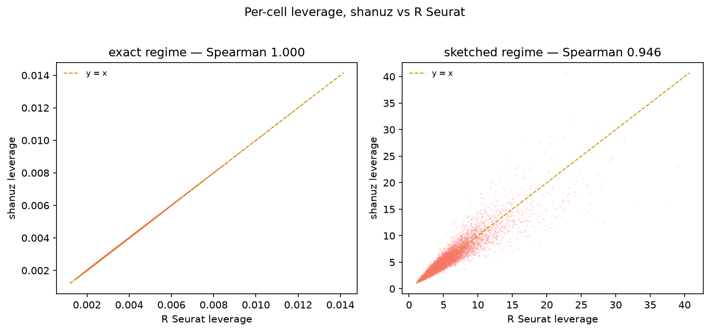
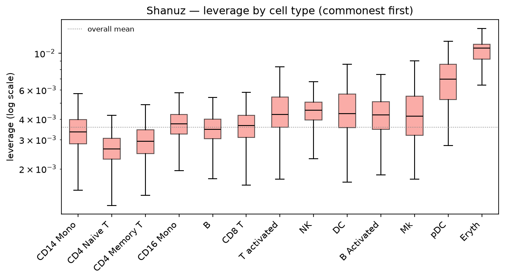
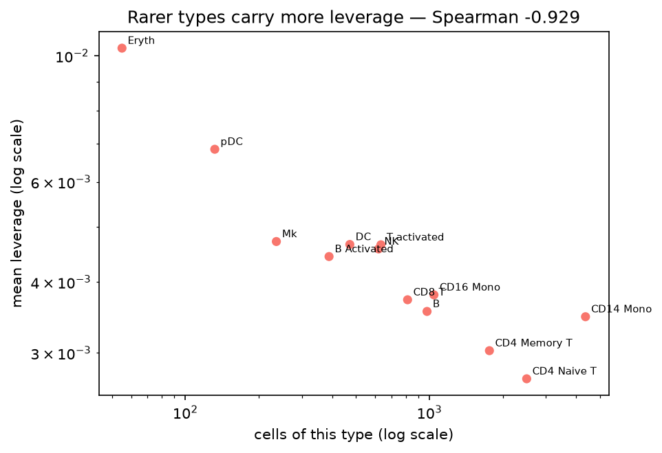
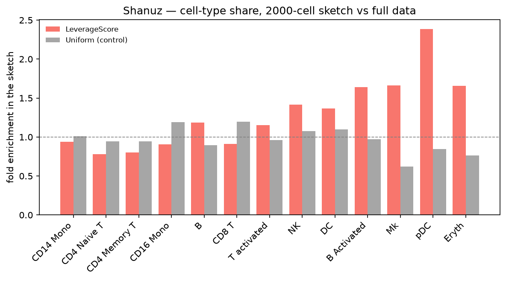
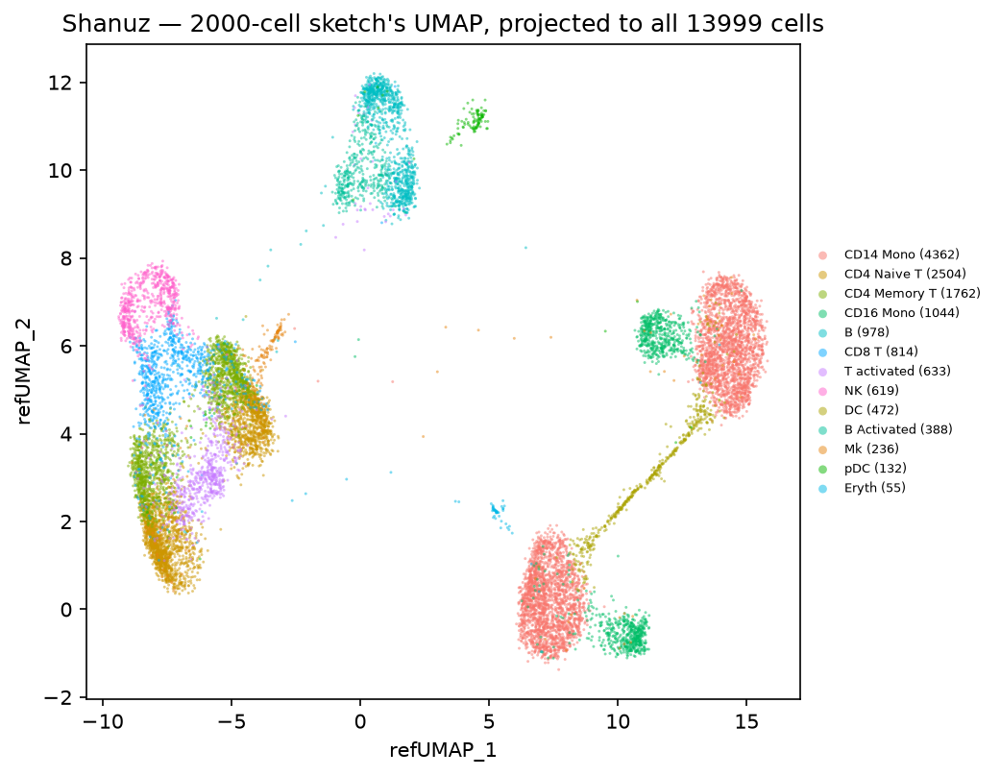

# Leverage-Score Sketching — R Seurat vs Shanuz (Python)

The Seurat v5 answer to "this atlas has two million cells and I have a laptop":
don't subsample uniformly, subsample by **statistical leverage**, analyse the
small subset, then push the answers back onto every cell. Every R Seurat call is
paired with the Shanuz equivalent and both outputs are shown side by side.

> **Dataset:** ifnb — 13,999 human PBMCs, half stimulated with interferon-beta
> (Kang et al. 2018), the same object used in
> [Tutorial 8](integration_vignette.md). Exported once from SeuratData.
> **R reference:** Seurat 5.5.1 · **Python:** Shanuz

| Seurat | Shanuz |
|---|---|
| `LeverageScore(obj, features = hvg)` | `leverage_score(obj, features=hvg)` |
| `SketchData(obj, ncells = 2000, method = "LeverageScore")` | `sketch_data(obj, ncells=2000, method="LeverageScore")` |
| `SketchData(obj, ncells = 2000, method = "Uniform")` | `sketch_data(obj, ncells=2000, method="Uniform")` |
| `ProjectData(obj, refdata = list(...))` | `project_data(full, sketch, refdata={...})` |

> **This tutorial found and fixed two defects.** `leverage_score` whitened
> against the full rank instead of Seurat's rank-50 truncation, flattening the
> sampling weights until leverage sampling was uniform sampling. `project_data`
> transferred labels through integration anchors, which is not what Seurat does
> and costs exactly what sketching exists to remove. Both are fixed in the same
> pull request; the [findings](#what-this-tutorial-found) are written up below
> with before-and-after numbers.

---

## Headline

| Metric | Result |
|---|---|
| **Leverage, exact regime** — per-cell Spearman vs R | **1.000000** (max abs diff 3.4e-6) |
| Leverage, exact regime — top-200 / top-1000 cells shared | **100 %** / 99.9 % |
| Leverage, sketched regime — Spearman vs R | 0.946 (differing RNGs) |
| **Does leverage track rarity?** Spearman(mean leverage, type size) | **shanuz −0.929 · R −0.929** |
| Rarest type (Eryth, n = 55) mean leverage vs overall | **2.89×** |
| `project_data` labels — per-cell agreement with R | **94.9 %** (98.1 % on a shared sketch) |
| `project_data` accuracy vs held-out annotations | **shanuz 0.9050 · R 0.9050** |
| Lazy on-disk matrix — leverage vs in-memory | identical (2.3e-16) |

---

## Setup

Both tools read the same exported counts, and the Python run writes the exact
cell barcodes and variable features it used so the R script can subset to them.
Leverage is a property of a *matrix*: if the two disagree about which cells or
genes are in play, nothing below is interpretable.

<table>
<tr><th>R (Seurat)</th><th>Python (Shanuz)</th></tr>
<tr>
<td>

```r
library(Seurat)

cells <- readLines("figures_sketch/cells.txt")
hvg   <- readLines("figures_sketch/hvg_features.txt")
hvg   <- gsub("_", "-", hvg)      # Read10X rewrites underscores

ifnb <- CreateSeuratObject(Read10X(DATA), min.cells = 3)
ifnb <- subset(ifnb, cells = cells)
ifnb <- NormalizeData(ifnb)
```

</td>
<td>

```python
import shanuz
from tutorials.ifnb_sketch_tutorial import (
    load_ifnb_sketch_object, prep)

obj = load_ifnb_sketch_object()
hvg = prep(obj)     # normalize + HVG, writes both lists
```

</td>
</tr>
</table>

```
ifnb: 13999 cells x 2000 variable features
Cell types: 13, sizes 55..4362
```

### Pass `features` explicitly — this one bites

`VariableFeatures(obj) <- hvg` does **not** register for `layer = "data"`.
`LeverageScore` looks up variable features for that layer, finds none, falls
back, and silently scores **all 13,714 genes** instead of the 2,000 you meant.
No error, no warning, a completely different matrix, and a divergence that looks
exactly like a port bug. It cost an hour of chasing a difference that was never
there.

```r
# Wrong: scores all 13,714 genes, silently
VariableFeatures(ifnb) <- hvg
LeverageScore(ifnb, seed = 123L)

# Right
LeverageScore(ifnb, features = hvg, seed = 123L)
```

---

## Leverage, and the two regimes

Seurat picks between two algorithms on cell count, and this tutorial exercises
both on one dataset by moving the threshold rather than the data:

| `nsketch` | condition | algorithm | scores sum to |
|---|---|---|---|
| 10000 | `13999 < 1.5 × 10000` | rank-50 truncated SVD | **50** |
| 5000 | `13999 ≥ 1.5 × 5000` | CountSketch → QR → Johnson–Lindenstrauss | ~70,000 |

<table>
<tr><th>R (Seurat)</th><th>Python (Shanuz)</th></tr>
<tr>
<td>

```r
ifnb <- LeverageScore(ifnb, features = hvg,
                      nsketch = 10000L, seed = 123L)
s <- ifnb[["leverage.score"]][, 1]
c(sum = sum(s), cv = sd(s) / mean(s))
#>      sum       cv
#> 50.00000  0.35060
```

</td>
<td>

```python
s = shanuz.leverage_score(
    obj, features=hvg, nsketch=10_000, seed=123)
s.sum(), s.std() / s.mean()
#> (50.000000, 0.350600)
```

</td>
</tr>
</table>

The exact regime is a per-cell match:



| regime | Spearman | Pearson | top-200 shared | max abs diff |
|---|---|---|---|---|
| exact | **1.000000** | 1.000000 | **100 %** | 3.4e-6 |
| sketched | 0.946 | 0.923 | 61.5 % | 21.6 |

The exact panel is a clean diagonal — 3.4e-6 is *below* R's own run-to-run noise,
because `irlba` starts from a random vector and Seurat never seeds it (two R runs
with the same `seed` argument differ by 1.3e-4). The sketched panel scatters
symmetrically about the diagonal, which is what two different RNGs drawing the
same random matrices should look like; see [the residuals](#the-residuals).

---

## Does leverage track rarity?

This is the question the method exists to answer, and the one no
"do the numbers match" check would have caught. ifnb's annotations span 4,362
cells (CD14 Mono) down to 55 (Eryth), so it is directly measurable.



| cell type | n | mean leverage / overall |
|---|---|---|
| CD14 Mono | 4362 | 0.97× |
| CD4 Naive T | 2504 | 0.76× |
| CD4 Memory T | 1762 | 0.85× |
| CD16 Mono | 1044 | 1.06× |
| B | 978 | 0.99× |
| CD8 T | 814 | 1.04× |
| T activated | 633 | 1.30× |
| NK | 619 | 1.28× |
| DC | 472 | 1.30× |
| B Activated | 388 | 1.24× |
| Mk | 236 | 1.32× |
| pDC | 132 | 1.92× |
| **Eryth** | **55** | **2.89×** |

**Spearman(mean leverage, type size) = −0.929 in both tools.** A near-monotone
inverse relationship with abundance — exactly the claim. It is also *not* a
sequencing-depth statistic in disguise: Spearman against `nCount_RNA` is +0.014.



---

## What the sketch keeps

A 2,000-cell sketch (14 % of the data), against a same-size **uniform** draw.
The control is not decoration: a 2,000-cell sample contains rare cells by
accident, so "the sketch has rare cells" means nothing without it.



| cell type | n | leverage | uniform |
|---|---|---|---|
| CD14 Mono | 4362 | 0.94× | 1.01× |
| CD4 Naive T | 2504 | 0.78× | 0.94× |
| B Activated | 388 | 1.64× | 0.97× |
| Mk | 236 | 1.66× | 0.62× |
| pDC | 132 | **2.39×** | 0.85× |
| Eryth | 55 | 1.65× | 0.76× |

The leverage bars climb with rarity; the uniform bars scatter around 1.0 without
trend. That is the method working.

---

## `project_data` — the sketch's analysis on every cell

Cluster and embed the 2,000-cell sketch, then extend both, plus its labels, to
all 13,999 cells.

<table>
<tr><th>R (Seurat)</th><th>Python (Shanuz)</th></tr>
<tr>
<td>

```r
sk <- ProjectData(
  object = sk, assay = "RNA",
  sketched.assay = "sketch",
  sketched.reduction = "pca",
  full.reduction = "pca.full",
  umap.model = "umap", dims = 1:30,
  refdata = list(projected.celltype = "seurat_annotations"))
#> label accuracy = 0.9050
```

</td>
<td>

```python
project_data(
    obj, sketch, reduction="pca",
    full_reduction="pca.full",
    umap_reduction="umap",
    full_umap_reduction="ref.umap",
    refdata={"projected.celltype": CELLTYPE})
#> label accuracy = 0.9050
```

</td>
</tr>
</table>



| | shanuz | R |
|---|---|---|
| accuracy, all cells | **0.9050** | **0.9050** |
| accuracy, cells *not* in the sketch | 0.8984 | — |
| per-cell agreement, each tool's own sketch | 94.9 % | 94.9 % |
| per-cell agreement, both on **R's** sketch cells | **98.1 %** | **98.1 %** |

Analysing 14 % of the cells and projecting recovers 90 % of the annotations on
the 86 % never analysed.

---

## Lazy matrices — no R counterpart

`LazyMatrix` / `open_lazy_matrix` are shanuz's on-disk backing; R's equivalent is
BPCells, which is not installed here. So this is **not** a side-by-side — it
checks the one property that matters, reported separately so it is not mistaken
for an R comparison:

```python
#> lazy matrix round-trip: identical=True, max|diff|=2.3e-16
```

Going through disk does not change the answer.

---

## What this tutorial found

### 1. Leverage was computed against the full rank

Seurat computes leverage from a **rank-50 truncated SVD** —
`ℓ = rowSums(V²)` over the leading 50 right singular vectors, so the scores sum
to 50. Shanuz whitened against the **full rank** instead.

Both are defensible as "leverage": the full-rank version is the classical
hat-matrix definition, and shanuz's own test asserted it to six decimals. But
full-rank leverage is useless on data shaped like this. Scores sum to the rank
and are capped at 1, so with 2,000 variable features over a few thousand cells
every score is crushed towards `d/n`:

| PBMC 3k, same 2000 HVGs | before | after | R |
|---|---|---|---|
| sum of scores | 2000.0 | **50.0** | 50.0 |
| coefficient of variation | 0.085 | **0.384** | 0.384 |
| max / median | 1.34 | **6.48** | 6.48 |
| Spearman vs R | 0.238 | **1.000** | — |

A max/median of 1.34 means the single most influential cell in the dataset was
only 34 % more likely to be drawn than a median one — against 6.48× in Seurat,
and **1.00 for uniform sampling**. Sketching was an expensive way to sample
uniformly, which is the exact thing leverage sampling exists to avoid. Nothing
about the output looked wrong.

### 2. `project_data` transferred through the wrong machinery

`ProjectData` does not use integration anchors. It calls `TransferSketchLabels`,
a weighted k-nearest-neighbour vote *inside the projected reduction*, with the
sketch's own rows as the reference. Shanuz ran the full
`find_transfer_anchors` → `transfer_data` path.

**The wrong version scored better.** On ifnb the anchor route reached 0.936
against Seurat's 0.905, which is why it survived review. It was still wrong, and
not only on fidelity: finding anchors between the sketch and the full dataset
costs precisely what sketching exists to remove, so on the million-cell objects
this API is written for the anchor route is unusable rather than merely
different.

| | before | after | R |
|---|---|---|---|
| accuracy (R's sketch cells) | 0.9321 | **0.9031** | 0.9050 |
| per-cell agreement (R's sketch cells) | — | **98.1 %** | — |
| accuracy (own sketch, end to end) | 0.9363 | **0.9050** | 0.9050 |

Matching Seurat made the headline number **worse**. A regression here would look
like an improvement, so the test guarding it checks the mechanism — that no
anchor object is built — rather than the score.

Seurat's weight kernel was recovered term-for-term from `FindWeightsC`:
distances `(0, 0.25, 0.5, 1.0)` give `(0, 0.151737, 0.2942806, 0.5539824)` in
both tools.

### Why the old tests missed both

`tests/test_sketch.py` was green throughout. Its leverage test compared shanuz
against *shanuz's own* definition of exact leverage, and asserted
`scores.sum() == rank` — pinning the wrong answer to six decimals. Its sampling
test used a 200-cell, 80-feature fixture, which is **outside the algorithm's
regime**: keeping 50 of at most 80 components is barely a truncation. Exporting
that exact fixture to R settles it — R returns identical numbers (Spearman
1.000000) and shows no rare-cell enrichment either, and even warns
*"You're computing too large a percentage of total singular values"*.

The new regression tests were **mutation-tested**: each was verified to fail
against the restored old implementation.

---

## The residuals

Three differences survive. All three were checked distribution-against-
distribution over matched seeds, because single-pair comparisons were actively
misleading here.

**The sketched regime** differs at Spearman 0.946. Over seeds 123/1/7/42/2024:

| | shanuz | R |
|---|---|---|
| sum of scores | 69,611 – 70,968 | 70,278 – 70,867 |
| coefficient of variation | 0.5600 – 0.5770 | 0.5657 – 0.5776 |

The distributions overlap, so this is the two RNGs, not the algorithm.

**Sketch composition.** Over the same seeds:

| type | n | shanuz | R |
|---|---|---|---|
| Eryth | 55 | 1.44× (1.15–1.91) | 1.29× (**0.64–2.04**) |
| pDC | 132 | 2.26× (1.91–2.49) | 2.23× (1.70–3.02) |
| Mk | 236 | 1.58× (1.33–1.87) | 1.47× (1.33–1.57) |

A single-seed comparison made Eryth look like a real divergence — 0.89× against
1.65×. It was two draws from overlapping distributions landing at opposite ends,
and R's spread is the wider of the two. With ~11 erythrocytes in a 2,000-cell
sketch, that is Poisson noise on a small count.

**The two regimes against each other.** Seurat's sketched approximation tracks
its *own* exact scores at Spearman only **0.31**. The JL projection is a large
approximation and Seurat leaves it unscaled, so the sketched scores are not even
on the same scale. Shanuz reproduces that gap at 0.31 too (R 0.309, shanuz
0.307), which is the useful evidence that the sketched path is faithful.
**Compare scores within one regime, never across the two.**

---

## Reproducing this

```bash
Rscript tutorials/export_seuratdata.R ifnb      # one-time counts export
python  tutorials/ifnb_sketch_tutorial.py       # writes the shared lists
Rscript tutorials/ifnb_sketch_verify.R          # ~3 min
python  tutorials/generate_sketch_plots.py
```

The R script writes `r_leverage.csv`, `r_sketch_composition.csv`,
`r_sketch_cells.csv` and `r_projection.csv` into `figures_sketch/`; the Python
tutorial reads them back and prints the comparison. Without them the Python half
still runs and reports its own numbers.

---

## Notes

- **Compare within a regime.** The exact regime's scores sum to 50; the sketched
  regime's sum to ~70,000 and are on the JL projection's own scale. They are not
  interchangeable, in either tool.
- **`irlba` is unseeded in Seurat.** The exact regime is reproducible to ~1e-4
  in R, not exactly. shanuz uses a deterministic truncated SVD and lands inside
  that band.
- **`nsketch` is bumped, not rejected.** Below 1.1× the feature count Seurat
  raises it and warns; shanuz does the same. Two hard stops are also ported: more
  than 5,000 features ("too slow") and a matrix with too few cells per feature
  ("too square").
- **`leverage_score` reads the `data` layer**, not `scale.data` — matching
  Seurat. This changed in the same pull request.
- **`project_data` no longer takes `seed`.** The label vote is a deterministic
  weighted k-NN, so there is nothing left to seed.
