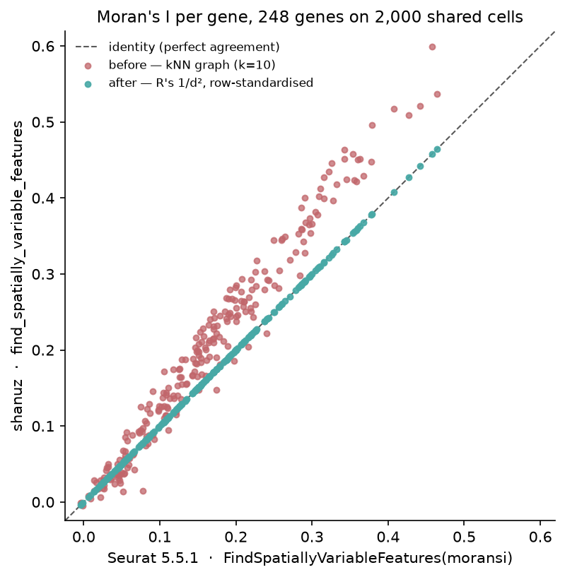
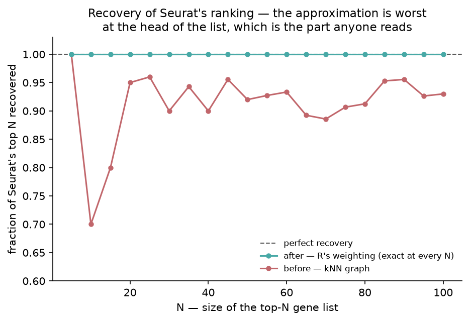
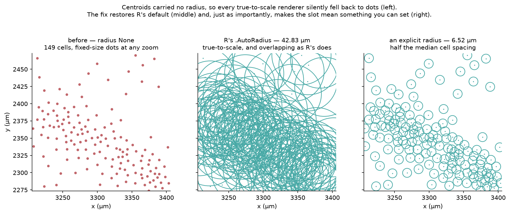

# Spatial Statistics and the Spatial Container — R Seurat vs Shanuz (Python)

Wave 2's last side-by-side, and the first one to check two things the existing
[Xenium tutorial](xenium_spatial_tutorial.md) left alone: the **container** —
`FOV`, `Centroids`, `Segmentation` — and the one real spatial **statistic** in
the library, `FindSpatiallyVariableFeatures`. Every R Seurat call is paired with
the Shanuz equivalent and both outputs are shown side by side.

> **Dataset:** 10x Xenium mouse brain, coronal CTX + HP section.
> **36,602 cells × 248 genes**, one FOV. Auto-downloads (~14 MB).
> **R reference:** Seurat 5.5.1 / SeuratObject 5.4.0 · **Python:** Shanuz

| Seurat | Shanuz |
|---|---|
| `LoadXenium(dir, molecule.coordinates = FALSE)` | `load_xenium(dir)` |
| `CreateCentroids(coords)` | `create_centroids(coords)` |
| `CreateFOV(coords, type = "centroids")` | `create_fov(coords, type_="centroids")` |
| `CreateSegmentation(coords)` | `create_segmentation(coords)` |
| `GetTissueCoordinates(fov)` · `Radius(centroids)` | `fov.get_tissue_coordinates()` · `centroids.radius()` |
| `FindSpatiallyVariableFeatures(obj, selection.method = "moransi")` | `find_spatially_variable_features(obj, method="moransi")` |

> **This tutorial found and fixed three defects.** Moran's I was computed on a
> k-nearest-neighbour graph rather than Seurat's row-standardised inverse-square
> weights, so it answered a different question under the same name. `Centroids`
> never received a radius, which silently disabled every true-to-scale spot
> renderer. And `Segmentation` stored polygons open where R closes them. Two
> further divergences are left standing **on purpose**, and the reasoning is
> written up in [what this tutorial found](#what-this-tutorial-found).

---

## Headline

| Metric | Result |
|---|---|
| **Anchors matching Seurat exactly** | **38 / 39** |
| **Moran's I per gene vs R** (248 genes, 2,000 cells) | **max abs diff 1.6e-14**, Pearson 1.0000000000 |
| Moran's I — Seurat's top 10 recovered | **10 / 10**, in the same order |
| *Before the fix* — kNN weighting vs R | Pearson 0.986, but **7/10** top genes and a median **1.23×** bias |
| `Centroids.radius()` — auto radius vs `.AutoRadius` | **42.82543** vs 42.82543 |
| `Segmentation` ring vertices (square, per cell) | **5** vs 5 |
| Full-slide Moran's I, R's exact weights | **5.3 s, 0.95 GB** — Seurat needs a **10.7 GB** dense matrix |

The one anchor that does not match is `GetTissueCoordinates`' shape, and it is a
difference in how the two languages carry a row label rather than in the data.

---

## Setup

<table>
<tr><th>R (Seurat)</th><th>Python (Shanuz)</th></tr>
<tr>
<td>

```r
library(Seurat)
library(SeuratObject)

obj <- LoadXenium(
  "~/.shanuz_data/xenium_mouse_brain",
  fov = "fov", assay = "Xenium",
  molecule.coordinates = FALSE
)
obj <- NormalizeData(obj, verbose = FALSE)
```

</td>
<td>

```python
from shanuz.datasets import xenium_mouse_brain
from shanuz.preprocessing import normalize_data
from shanuz.spatial import load_xenium

obj = load_xenium(xenium_mouse_brain(), assay="Xenium")
normalize_data(obj)
```

</td>
</tr>
</table>

`molecule.coordinates = FALSE` is not optional on the public cache: it ships the
cell-feature matrix and `cells.csv.gz` but no `transcripts.parquet`, and
`LoadXenium` raises rather than skipping the molecules. `load_xenium` reads the
same directory and simply leaves `molecules` empty — the first of several places
where the two loaders are permissive about different things.

Both read **36,602 cells × 248 genes**, with identical cell and feature names in
identical order (the name digests match).

---

## What is in the object

<table>
<tr><th>R (Seurat)</th><th>Python (Shanuz)</th></tr>
<tr>
<td>

```r
Images(obj)                 # "fov"
fov <- obj[["fov"]]
Boundaries(fov)             # "centroids"
DefaultBoundary(fov)        # "centroids"
Radius(fov)                 # NULL
Radius(fov[["centroids"]])  # 42.82543
```

</td>
<td>

```python
list(obj.images)            # ['xenium']
fov = obj.images["xenium"]
list(fov.boundaries)        # ['centroids']
fov.default_boundary()      # 'centroids'
fov.radius()                # None
fov.boundaries["centroids"].radius()   # 42.82543
```

</td>
</tr>
</table>

The FOV's *name* differs because it is a parameter with different defaults —
`LoadXenium(fov = "fov")` against `load_xenium`'s `"xenium"` — and shanuz does not
currently expose a way to choose it, so R code indexing `obj[["fov"]]` needs
adjusting. Everything about the FOV other than what it is filed under is the same.

`Radius()` on the FOV is empty in **both** tools — that is R's design, and the
number lives on the boundary underneath. Getting that right matters more than it
looks: shanuz's plotting code read the radius off the *FOV*, so it always saw
`None`. See [defect 2](#2-centroids-never-carried-a-radius).

R routes the control probes into three extra assays (`BlankCodeword`,
`ControlCodeword`, `ControlProbe` — 225 / 41 / 27 features). `load_xenium` drops
them by default and `keep_controls=True` keeps all 541 rows in the one assay
instead. A documented difference in shape, not in content.

---

## The constructors

Small enough to check by eye, which is the point — the slide-scale anchors say
*whether* the tools agree, these say *what* they agree on.

<table>
<tr><th>R (Seurat)</th><th>Python (Shanuz)</th></tr>
<tr>
<td>

```r
coords <- data.frame(
  x = c(1, 2, 3, 4), y = c(10, 20, 30, 40),
  cell = c("a", "b", "c", "d"))

cen <- CreateCentroids(coords)
Radius(cen)                  # 0.165
slot(cen, "nsides")          # 0

fov <- CreateFOV(coords, type = "centroids",
                 assay = "RNA")
Cells(subset(fov, cells = c("b", "d")))
#> "b" "d"
```

</td>
<td>

```python
coords = pd.DataFrame({
    "x": [1., 2, 3, 4], "y": [10., 20, 30, 40],
    "cell": list("abcd")})

cen = create_centroids(coords)
cen.radius()                 # 0.165
cen.nsides                   # 0

fov = create_fov(coords, type_="centroids",
                 assay="RNA")
fov.subset(cells=["b", "d"]).cells()
#> ['b', 'd']
```

</td>
</tr>
</table>

`0.165` is `SeuratObject`'s `.AutoRadius`: `0.01 × mean(width, height)` of the
bounding box, so `0.01 × mean(3, 30)`. shanuz returned `None` here before this
tutorial.

Polygons are where the two most visibly parted company:

<table>
<tr><th>R (Seurat)</th><th>Python (Shanuz)</th></tr>
<tr>
<td>

```r
square <- data.frame(
  x = c(0,1,1,0, 5,6,6,5),
  y = c(0,0,1,1, 5,5,6,6),
  cell = rep(c("a","b"), each = 4))

nrow(GetTissueCoordinates(
  CreateSegmentation(square)))
#> 10          # 5 vertices per cell
```

</td>
<td>

```python
square = pd.DataFrame({
    "x": [0.,1,1,0, 5,6,6,5],
    "y": [0.,0,1,1, 5,5,6,6],
    "cell": ["a"]*4 + ["b"]*4})

len(create_segmentation(square)
    .get_tissue_coordinates())
#> 10          # was 8 before this tutorial
```

</td>
</tr>
</table>

---

## Spatially variable features

This is the section the tutorial exists for.

<table>
<tr><th>R (Seurat)</th><th>Python (Shanuz)</th></tr>
<tr>
<td>

```r
svf <- FindSpatiallyVariableFeatures(
  data, spatial.location = pos,
  selection.method = "moransi")
head(svf[order(-svf$observed), ], 3)
#>          observed  p.value
#> Arc      0.464193  0.000976
#> Slc17a7  0.458071  0.000976
#> Satb2    0.442162  0.000976
```

</td>
<td>

```python
svf = find_spatially_variable_features(
    obj, method="moransi")
svf.head(3)
#>          moransi  moransi_pval  moransi_rank
#> Arc     0.464193      0.000000             1
#> Slc17a7 0.458071      0.000000             2
#> Satb2   0.442162      0.000000             3
```

</td>
</tr>
</table>

The statistic agrees to **1.6e-14** across all 248 genes and the top ten come out
in the same order. The p-values do not agree, and that is deliberate — see
[the two differences left standing](#two-differences-left-standing).



**A note on scale.** `RunMoransI` builds `as.matrix(dist(pos))` — the full n × n
weight matrix. On this slide that is a **10.7 GB** allocation, which is why the
comparison above runs on a shared 2,000-cell subset. shanuz evaluates the same
weights in row blocks and runs the whole slide in **5.3 s at 0.95 GB peak**. The
answers are R's; the ceiling is not.

---

## What this tutorial found

### 1. Moran's I was built on the wrong weight matrix

Seurat's `RunMoransI` constructs `weights <- 1 / pos.dist.mat ^ 2` over every
pair of cells, and `Rfast2::moranI` row-standardises it before computing
`cor(y, x) · sd(y) / sd(x)`. shanuz used a **k-nearest-neighbour graph** with
`k = 10`.

Both are legitimate Moran's I. Only one is the one the function said it was
computing, and a Moran's I is defined *relative to its weights* — change them and
you change the answer.

What made it survive is that it is a **good** approximation. Pearson 0.986
against R, Spearman 0.982, 46 of R's top 50 genes. Nothing about it looks wrong
in a plot. But it runs a median **1.23×** high, differs by up to **0.14** in
absolute I, and recovers only **7 of R's top 10** — and the top of the ranking is
the entire output anyone reads off this function.



Fixed by making R's weighting the default, evaluated in row blocks so the n × n
matrix is never materialised. `weights="knn"` still selects the old behaviour for
slides where the O(n²) pass is genuinely too slow, now documented as the
approximation it is. After the fix: **max abs diff 1.6e-14, 10/10**.

### 2. `Centroids` never carried a radius

`SeuratObject` always computes one — `.AutoRadius`, 1% of the mean bounding-box
dimension, **42.83** on this slide. shanuz left the slot `None`.

The consequence was invisible. `_spot_collection` returns `None` for a `None`
radius and the caller falls back to a fixed-size scatter, so **every true-to-scale
spot renderer silently stopped being true-to-scale** on every FOV that did not
come from a Visium `scalefactors_json.json`. No warning, no exception; the plots
simply stopped meaning what they claimed. This is the same shape as T-obj's
`FetchData` bug — a function returning something plausible rather than something
right.

Two things were wrong, and only fixing both helps: `Centroids` did not compute
the radius, *and* `_spatial_panel` read it off the FOV, where it is `None` in R
too. It now reads the default boundary, which is where R keeps it.



The middle panel is worth dwelling on. R's default radius overlaps badly at this
cell density, because 1% of a bounding box is a slide-scale hint and not a
measurement of a cell. Seurat draws this slide the same way. The fix is not that
shanuz now draws prettier spots — it is that the slot means something, and can be
set.

### 3. `Segmentation` stored polygons open

R closes each ring by repeating the first vertex: a four-vertex square comes back
as five rows. shanuz stored four.

Anything that measures a perimeter from the vertex list, or strokes an outline
without asking the renderer to close the path, is short exactly one edge. Fixed,
and idempotent — an already-closed ring is left alone. Concave shapes survive:
an L-shape goes in with six vertices and comes back with seven, notch intact, in
both tools.

R also traverses the ring in the opposite direction. That is the same polygon
described backwards, so it is left alone.

### Two differences left standing

**The Moran's I p-value.** R runs a 999-permutation test through
`Rfast2::moranI`. On this 248-gene panel that produces **14 distinct p-values**
and ties **233 of 248 genes** at its floor of 1/1025 — it cannot tell the most
spatially variable gene in the panel from the two-hundredth. shanuz's
normal-approximation p-value is continuous, deterministic and the standard
closed form for Moran's I. Matching R would have cost real information and bought
nothing, so the statistic was fixed and the p-value deliberately was not.

This is the one judgement call in the tutorial, and it cuts the other way from
T-sk's `project_data`, where the better-scoring implementation was the wrong one
because it cost what the API existed to provide. The test is not "which number is
nicer" — it is whether the divergence costs the user something they came for.
Here it does not.

**The FOV `Key`.** R derives it from the assay (`CreateFOV(coords, assay="RNA")`
gives `RNA_`); shanuz hardcodes `fov_`. It appears in `__repr__` and nowhere
else — no lookup, no prefixing, no `FetchData` path — so changing a default to
correct a display string was not worth the churn. Recorded rather than fixed.

### The anchor that does not match

`GetTissueCoordinates` returns **three** columns in R (`x`, `y`, `cell`) and
**two** in shanuz, which carries the cell as the DataFrame index. The information
is identical; only the container differs, and shanuz's object-level
`get_tissue_coordinates()` already materialises `cell` as a column. Adding a
duplicate column that mirrors the index would give the two ways to drift apart.
Left as it is, and reported here rather than quietly excluded from the table —
39 anchors, 38 matching.

---

## Parity — verified against R Seurat

| Section | Anchors | Matching | Tolerance |
|---|---|---|---|
| `container` — cells, features, boundaries, radius, coordinate frame | 22 | 21 | exact except 3 float anchors |
| `toy` — the constructors on 4 cells and 2 squares | 10 | 10 | exact except `auto_radius` |
| `moransi` — top genes, I values, ranking digest | 7 | 7 | exact except 3 float anchors |
| **Total** | **39** | **38** | |

Thirty-two of the thirty-nine anchors are compared with **no tolerance at all** —
names, orders, counts, digests, boundary sets, vertex counts. The seven floating
point ones are named individually in `FLOAT_TOLERANCES` rather than covered by a
blanket rule, so a new anchor cannot inherit slack nobody chose for it.

---

## Running it

```bash
# 1. Python side — writes figures_svf/py_anchors.json and cells.txt
python tutorials/xenium_svf_tutorial.py

# 2. R side — writes figures_svf/r_anchors.json (needs Rfast2)
Rscript tutorials/xenium_svf_verify.R

# 3. Compare
python tutorials/xenium_svf_tutorial.py --report

# 4. Figures
python tutorials/generate_svf_plots.py
```

The R side needs `Rfast2`; without it Seurat falls back to `ape::Moran.I`, a
different estimator, and the comparison would silently be against something other
than Seurat's documented default. The verify script checks for it and stops
rather than producing numbers that look fine and mean something else.
