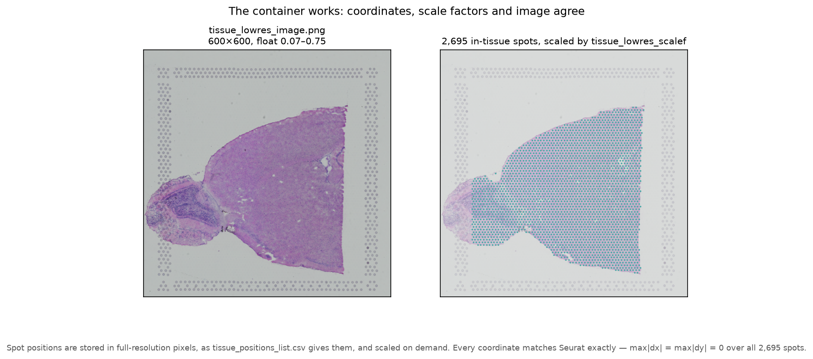
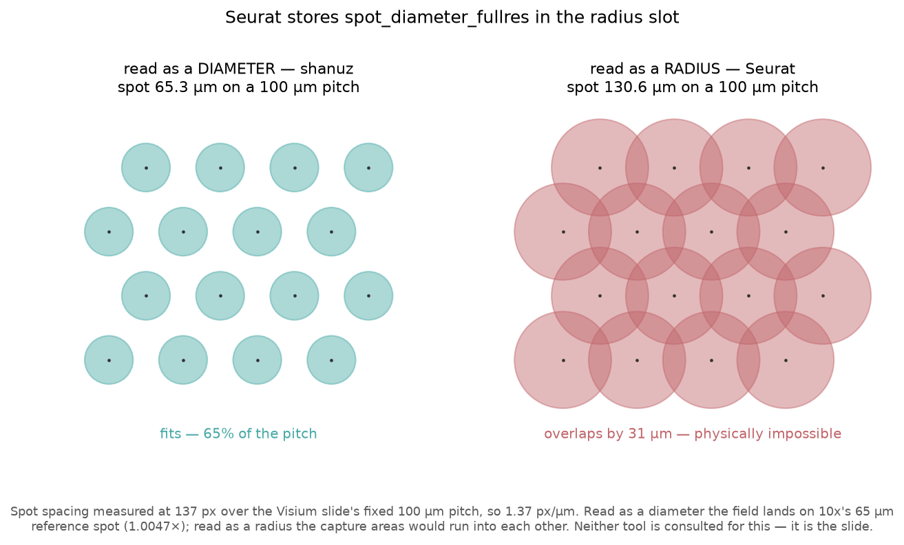
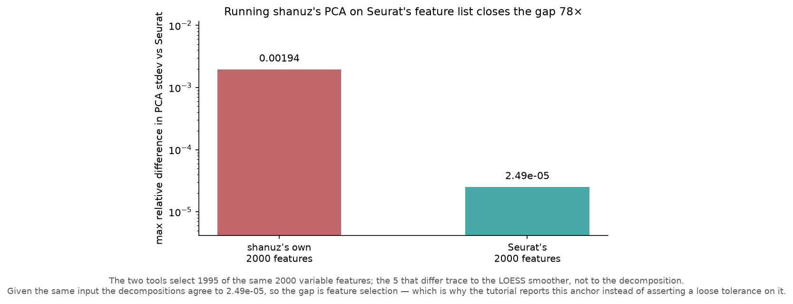

# Visium: the tutorial where Seurat is the one that's wrong

**Dataset** — 10x V1_Mouse_Brain_Sagittal_Anterior, Space Ranger 1.1.0 · 2,695 in-tissue spots (of 4,992 on the slide) × 32,285 genes
**R side** — Seurat 5.5.1 · `tutorials/visium_verify.R`
**Python side** — `tutorials/visium_tutorial.py`

---

## What this compares, and why the method changed

The sixteen tutorials before this one shared a rule: Seurat is the reference, and
a difference is shanuz's defect until proved otherwise. That rule was right. It
found 29 real defects and it never once cost anything.

Here it would have introduced one.

Seurat builds the Visium field of view like this:

```r
fov <- CreateFOV(coordinates[, c("imagecol", "imagerow")],
                 type = "centroids", radius = scale.factors[["spot"]], ...)
```

and `Read10X_ScaleFactors` fills that field from `spot_diameter_fullres`. A
**diameter** goes into a slot named **radius**. Matching Seurat here means
being wrong by exactly 2×, so this tutorial *reports* the number instead of
asserting it — and proves which reading is correct without consulting either
tool.

---

## Result

**24 of 24 compared anchors match**, 17 of them exactly. Coordinates agree to
`max|dx| = max|dy| = 0` across all 2,695 spots, all four scale factors are
exact, and the tissue image matches to **1.68e-08** — float32 epsilon.



---

## The R-side findings

### 1. `spot_diameter_fullres` is a diameter, and Seurat stores it as a radius

The Visium slide settles this. Capture spots sit on a **fixed 100 µm
centre-to-centre grid**, so the measured spacing fixes the pixel scale, and the
rest is arithmetic:

| | |
|---|---|
| measured spot spacing | 137.000 px |
| ⇒ scale | 1.3700 px/µm |
| `spot_diameter_fullres` read as a **diameter** | **65.31 µm** — 65 % of the pitch |
| read as a **radius** | **130.62 µm** — overlaps its neighbour by 31 µm |



Capture spots are physically distinct wells. They cannot overlap. That argument
needs no documentation and no reference implementation — and as a corroboration
rather than a premise, read as a diameter the field lands on 10x's 65 µm
reference spot to **1.0047×**.

| | radius |
|---|---|
| Seurat 5.5.1 | 89.47199235723474 |
| **shanuz** | **44.73599617861737** |

Ratio **2.000000**. shanuz keeps its value, and
`test_shanuz_radius_is_half_seurats_on_purpose` pins the divergence so a later
"parity fix" cannot quietly introduce the bug.

### 2. `Radius()` returns `NULL` on a `VisiumV2`

```r
> Radius(img)
NULL
> Radius(img@boundaries[["centroids"]])
[1] 89.47199
```

`methods("Radius")` lists Centroids, STARmap, SlideSeq, SpatialImage and
**VisiumV1** — there is no `Radius.VisiumV2`. The value is stored and reachable
one level down, but the accessor on Seurat 5's own current-generation Visium
class returns nothing. shanuz's `VisiumV2.radius()` answers.

---

## What the work found on shanuz's side

### The tissue image depended on which package you had installed

`_imread` tried matplotlib and fell back to Pillow. Those do not agree:

| backend | dtype | range |
|---|---|---|
| matplotlib | float32 | 0.0667 – 0.7490 |
| Pillow | uint8 | 17 – 191 |
| R `png::readPNG` | double | 0.0667 – 0.7490 |

**255× apart, with different dtypes, from the same file** — and neither
matplotlib nor Pillow is a declared dependency of shanuz, so which branch ran
was environment luck. Plotting hid it completely, because `imshow` accepts both.

Normalised to float in [0, 1]. Both backends now return bit-identical arrays
that match Seurat to float32 epsilon. The guard that matters is not a dtype
assertion on one backend — that passes either way — but
`test_both_image_backends_return_the_same_array`, which reads the file twice and
compares, plus a third test confirming the Pillow branch is actually reached.

### Three defaults that silently disagreed with Seurat

Breaking change, made deliberately:

| | before | now | Seurat |
|---|---|---|---|
| in-tissue filter | `filter_by_tissue=False` | **`True`** | `filter.matrix = TRUE` |
| image resolution | `hires` | **`lowres`** | `tissue_lowres_image.png` |
| image key | `"spatial"` | **`"slice1"`** | `slice1` |

The last one is the one users hit: `obj.images["slice1"]` — what every ported
Seurat script writes — used to raise `KeyError`.

The filter default was invisible on this bundle, because
`filtered_feature_bc_matrix` already excludes off-tissue spots, so both tools
answered 2,695 for different reasons. Point shanuz at `raw_feature_bc_matrix`
and they part, 4,992 against 2,695.

The old behaviour is still reachable:

```python
load_visium(path, image_resolution="hires", filter_by_tissue=False,
            slice_name="spatial")
```

### `GetTissueCoordinates` now returns Seurat's frame

R returns `x, y, cell` *and* sets the rownames to the cells. shanuz returned
`x, y` with cell on the index — the pandas idiom, no information lost, but not
the same frame, and `coords$cell` ported from R would fail on it. Both now.

---

## The one real residual

`variance.standardized` differs, the two tools select **1995 of the same 2000**
variable features, and the PCA that follows differs by 1.9e-3. That chain is
unchanged from the out-of-core tutorial: shanuz's `_loess2` is a NumPy
local-quadratic fit and R's `loess` is the cloess Fortran with kd-tree
interpolation.

The question worth answering is whether the PCA is *also* wrong. It is not:



| PCA stdev, max relative difference vs Seurat | |
|---|---|
| on shanuz's own 2000 features | 0.00194 |
| **on Seurat's 2000 features** | **2.49e-05** |

**78× closer** given the same input. The decomposition is fine; the gap is the
five features upstream of it. So `pca.stdev_head` is reported rather than
matched — asserting a loose tolerance on it would have hidden exactly this.

---

## Reproducing

```bash
# Python side — downloads the bundle (~64 MB) and writes anchors
python tutorials/visium_tutorial.py

# R side
Rscript tutorials/visium_verify.R

# compare
python tutorials/visium_tutorial.py --report

# figures
python tutorials/generate_visium_plots.py
```

The dataset is fetched as the **raw Space Ranger output**, not through
SeuratData. A loader can only be tested against the files it is meant to read,
and the curated `.rda` carries a built object with no `spatial/` directory. This
is Space Ranger 1.1.0, so positions arrive as the headerless
`tissue_positions_list.csv` — the older of the two layouts both
`Read10X_Image` and `load_visium` have to handle.

---

## A note on measurement

`visium_verify.R` serialises with **`digits = 22`**, not `digits = NA`:

```
digits=NA  -> 89.4719923572347    round-trips: FALSE
digits=22  -> 89.47199235723474   round-trips: TRUE
```

`NA` writes 15 significant digits, which does not round-trip a double. The 4.26e-14
gap that leaves is larger than several residuals under test. In the out-of-core
tutorial that floor produced three "findings" that were not real, and the fix
applied then — moving from `round(x, 10)` to `digits = NA` — was an improvement
rather than a cure. `lazy_bpcells_verify.R` still carries it; every tolerance
there sits well above 1e-14 so no conclusion changes, but it is worth correcting.

The first run of this comparison reported the scale factors as differing, for
precisely that reason. They are exact. The tutorial now compares against the
source `scalefactors_json.json` rather than against R's re-serialisation of it.
