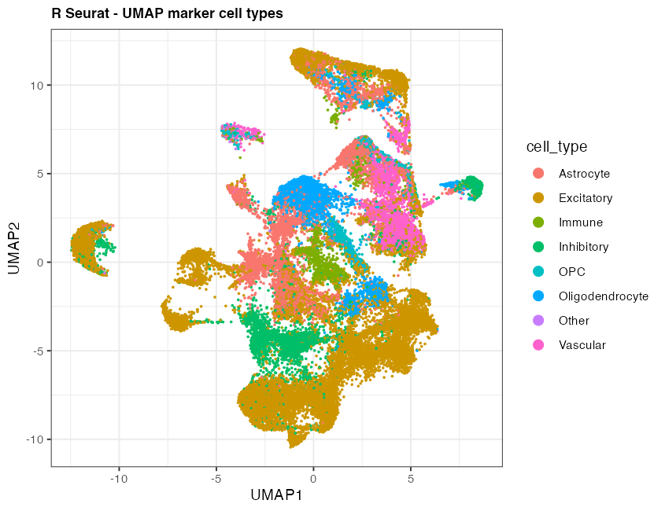
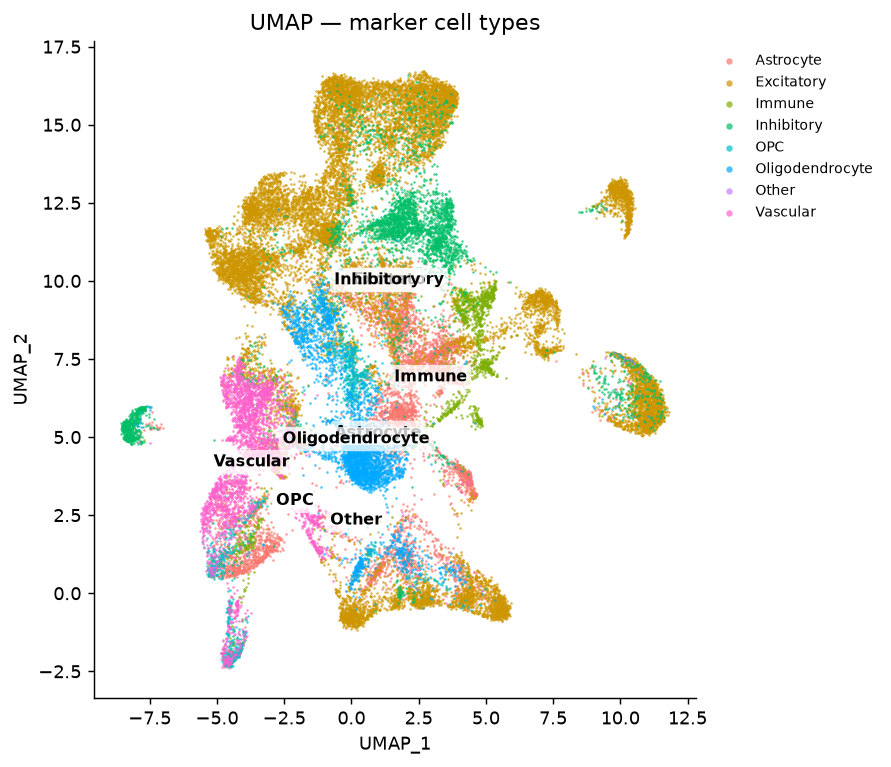
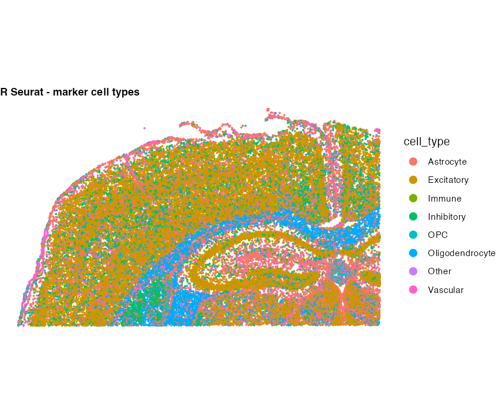
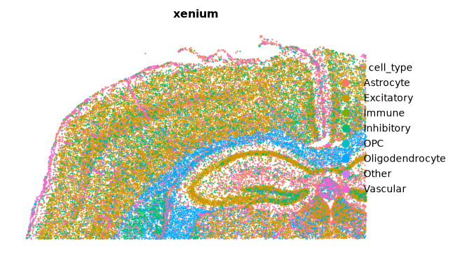
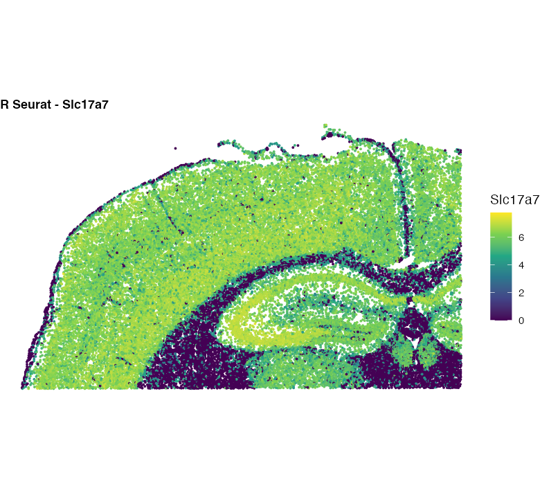
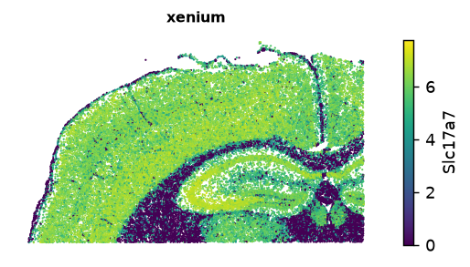
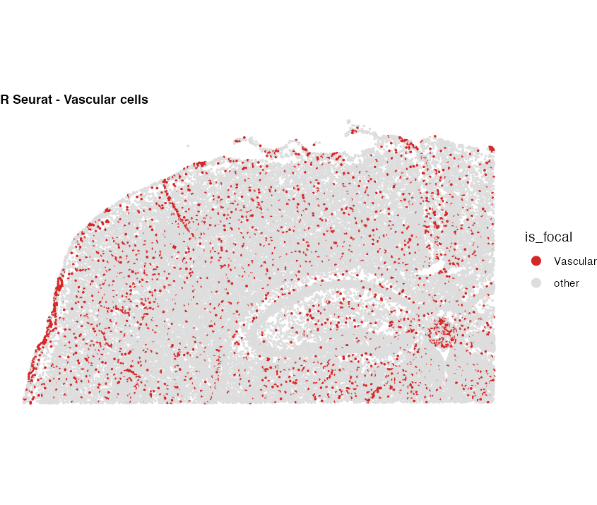
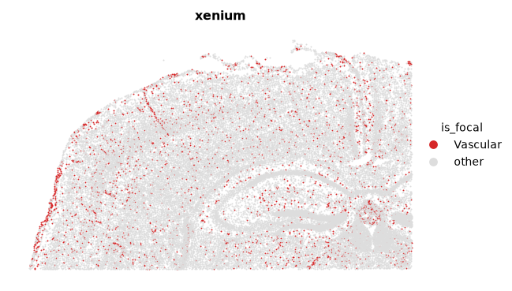
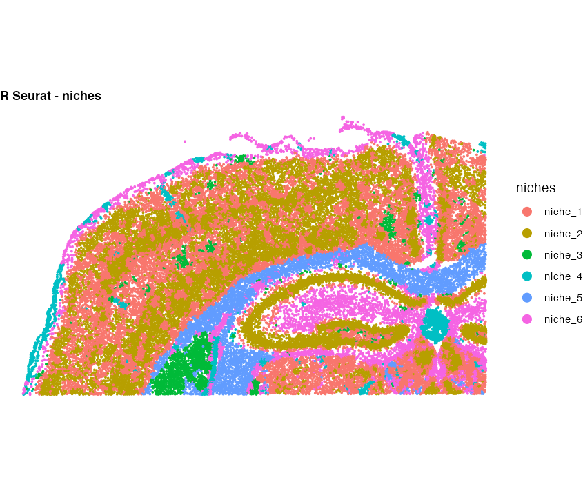
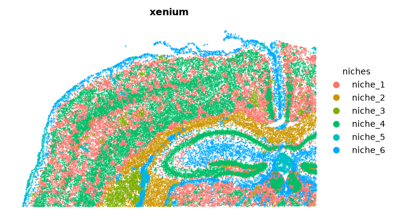

# Xenium Spatial Tutorial — R Seurat vs Shanuz (Python)

A step-by-step **spatial** analysis of a 10x Genomics **Xenium** dataset, with
every R Seurat call paired with the equivalent **Shanuz** Python code and both
outputs shown side by side. This mirrors the spatial mast-cell / neighbourhood
workflow used on internal celiac Xenium data — reproduced here on a fully public
section so it can be shared.

> **Dataset:** Xenium mouse brain, coronal **CTX + HP** subset — 10x Genomics
> (the same section featured in
> [Seurat's spatial vignette](https://satijalab.org/seurat/articles/spatial_vignette_2)).
> **36,602 cells × 248 genes**, single FOV. Auto-downloads (~20 MB).  
> **R reference:** Seurat v5 · **Python:** Shanuz (branch `feature/spatial-seurat-parity`)

This tutorial exercises the spatial Seurat-parity layer added to Shanuz:
`load_xenium` · `get_tissue_coordinates` · `image_dim_plot` ·
`image_feature_plot` · `nearest_neighbor_distance` · `local_neighborhood` ·
`build_niche_assay` · `composition_test`.

> **How faithful is the port?** Every *deterministic* step below (cell counts,
> marker-defined cell types, spatial nearest-neighbour distances, local density,
> the region composition test) matches R Seurat **to 8 significant figures** —
> see the [parity table](#parity--verified-against-r-seurat) at the end.
> Clustering / UMAP / niche layout are stochastic and agree in structure only,
> exactly as in the [PBMC 3k tutorial](pbmc3k_tutorial.md).

---

## Setup

<table>
<tr><th>R (Seurat)</th><th>Python (Shanuz)</th></tr>
<tr>
<td>

```r
library(Seurat)
library(FNN)       # spatial k-NN (get.knn / get.knnx)
library(ggplot2)
```

</td>
<td>

```python
import numpy as np

from shanuz.datasets import xenium_mouse_brain
from shanuz.spatial import load_xenium
from shanuz.preprocessing import (
    normalize_data, find_variable_features, scale_data,
)
from shanuz.reduction import run_pca
from shanuz.neighbors import find_neighbors
from shanuz.clustering import find_clusters
from shanuz.umap import run_umap

# Spatial Seurat-parity layer
from shanuz import (
    get_tissue_coordinates, nearest_neighbor_distance,
    local_neighborhood, build_niche_assay, composition_test,
)
from shanuz.plotting import (
    image_dim_plot, image_feature_plot, dim_plot, vln_plot,
)
```

</td>
</tr>
</table>

---

## Step 1 · Load the Xenium output

<table>
<tr><th>R (Seurat)</th><th>Python (Shanuz)</th></tr>
<tr>
<td>

```r
# Full LoadXenium reads the whole outs/ bundle:
obj <- LoadXenium("Xenium_mouse_brain/", assay = "Xenium")

# Here we read just the analysis components:
raw    <- Read10X("Xenium_mouse_brain/cell_feature_matrix")
counts <- raw[["Gene Expression"]]          # drop control probes
obj    <- CreateSeuratObject(counts, assay = "Xenium")
# 248 genes × 36,602 cells
```

</td>
<td>

```python
# Downloads (~20 MB) to ~/.shanuz_data/xenium_mouse_brain
path = xenium_mouse_brain()

obj = load_xenium(path, assay="Xenium")
# 248 genes × 36,602 cells — keeps only "Gene Expression"
# features (like Seurat); pass keep_controls=True to retain
# the Negative-Control / Blank codewords.
print(obj.image_names())     # ['xenium']  — centroids populated
```

</td>
</tr>
</table>

> **Key difference:** `LoadXenium` / `load_xenium` both build the expression
> assay **and** a populated `images` slot (per-FOV centroids). Only the 248
> `Gene Expression` features go into the assay — the Negative-Control Probe /
> Codeword / Blank features are dropped by default in both.

---

## Step 2 · QC filter

<table>
<tr><th>R (Seurat)</th><th>Python (Shanuz)</th></tr>
<tr>
<td>

```r
obj <- subset(obj, subset = nCount_Xenium >= 10)
# 36,419 cells retained
```

</td>
<td>

```python
md   = obj.meta_data
keep = list(md.index[md["nCount_Xenium"] >= 10])
obj  = obj.subset(cells=keep)
# 36,419 cells retained  (images subset too)
```

</td>
</tr>
</table>

> `subset()` filters the assay, metadata **and** the spatial centroids together,
> so every downstream spatial function stays aligned.

---

## Step 3 · Cell types from marker panels

A deterministic classifier: each cell is assigned to the cell type whose
canonical marker panel it expresses most (arg-max of summed raw counts). Because
it is a pure function of the identical count matrix, R and Python produce
**byte-identical labels** — the anchor for every spatial comparison that follows
(the same idea as the internal `KIT+ TPSAB1+` mast-cell rule).

<table>
<tr><th>R (Seurat)</th><th>Python (Shanuz)</th></tr>
<tr>
<td>

```r
markers <- list(
  Excitatory = c("Slc17a7","Slc17a6","Satb2","Fezf2","Neurod6"),
  Inhibitory = c("Gad1","Gad2","Pvalb","Sst","Vip","Lamp5"),
  Astrocyte  = c("Aqp4","Gfap","Ntsr2"),
  Oligodendrocyte = c("Sox10","Opalin","Gjc3"),
  OPC        = c("Pdgfra","Cspg4"),
  Vascular   = c("Cldn5","Pecam1","Kdr","Emcn","Adgrl4"),
  Immune     = c("Cd68","Trem2","Siglech","Laptm5","Cd53"))

cmat  <- GetAssayData(obj, layer = "counts")
score <- sapply(markers, \(g)
           Matrix::colSums(cmat[intersect(g, rownames(cmat)), ]))
best  <- max.col(score, ties.method = "first")
ct    <- names(markers)[best]
ct[apply(score, 1, max) == 0] <- "Other"
obj$cell_type <- ct
```

</td>
<td>

```python
CELLTYPE_MARKERS = {
    "Excitatory": ["Slc17a7","Slc17a6","Satb2","Fezf2","Neurod6"],
    "Inhibitory": ["Gad1","Gad2","Pvalb","Sst","Vip","Lamp5"],
    "Astrocyte":  ["Aqp4","Gfap","Ntsr2"],
    "Oligodendrocyte": ["Sox10","Opalin","Gjc3"],
    "OPC":        ["Pdgfra","Cspg4"],
    "Vascular":   ["Cldn5","Pecam1","Kdr","Emcn","Adgrl4"],
    "Immune":     ["Cd68","Trem2","Siglech","Laptm5","Cd53"],
}
counts = obj.assays["Xenium"].layer_data("counts").tocsr()
feats  = {g: i for i, g in enumerate(obj.assays["Xenium"].features())}
score  = np.column_stack([
    counts[[feats[g] for g in gs if g in feats], :].sum(0).A1
    for gs in CELLTYPE_MARKERS.values()])
best   = score.argmax(1)
ct     = np.where(score.max(1) > 0,
                  np.array(list(CELLTYPE_MARKERS))[best], "Other")
obj.meta_data["cell_type"] = ct
```

</td>
</tr>
</table>

Identical counts in both:

| cell_type | n | | cell_type | n |
|-----------|---:|-|-----------|---:|
| Excitatory | 18,044 | | Oligodendrocyte | 3,570 |
| Astrocyte | 5,513 | | Vascular | 3,016 |
| Inhibitory | 3,759 | | Immune | 1,311 |
| OPC | 1,157 | | Other | 49 |

---

## Step 4 · Normalise, cluster, UMAP (unsupervised view)

<table>
<tr><th>R (Seurat)</th><th>Python (Shanuz)</th></tr>
<tr>
<td>

```r
obj <- NormalizeData(obj)
obj <- FindVariableFeatures(obj, nfeatures = 248)
obj <- ScaleData(obj, features = rownames(obj))
obj <- RunPCA(obj, features = rownames(obj), npcs = 30)
obj <- FindNeighbors(obj, dims = 1:20)
obj <- FindClusters(obj, resolution = 0.3)
obj <- RunUMAP(obj, dims = 1:20)
```

</td>
<td>

```python
normalize_data(obj, normalization_method="LogNormalize",
               scale_factor=10000)
find_variable_features(obj, selection_method="vst", nfeatures=248)
genes = obj.assays["Xenium"].features()
scale_data(obj, features=genes)
run_pca(obj, n_pcs=30, features=genes, reduction_name="pca")
find_neighbors(obj, dims=range(20), k_param=20)
find_clusters(obj, resolution=0.3, algorithm=1, random_seed=0)
run_umap(obj, dims=range(20), reduction_name="umap", seed=42)
```

</td>
</tr>
<tr>
<td></td>
<td></td>
</tr>
</table>

> Louvain clustering is stochastic and the two UMAP libraries (`uwot` vs
> `umap-learn`) place clusters differently — R found 20 clusters, Shanuz 18 — but
> the same cell-type structure separates cleanly in both (see the
> [PBMC 3k note](pbmc3k_tutorial.md#step-12--umap)).

---

## Step 5 · Cells in tissue space — `ImageDimPlot`

<table>
<tr><th>R (Seurat)</th><th>Python (Shanuz)</th></tr>
<tr>
<td>

```r
ImageDimPlot(obj, group.by = "cell_type", size = 1.5)
```

</td>
<td>

```python
fig = image_dim_plot(obj, group_by="cell_type", size=1.5)
fig.savefig("image_celltype.png", dpi=130)
```

</td>
</tr>
<tr>
<td></td>
<td></td>
</tr>
</table>

> Both recover the same anatomy: excitatory neurons filling the cortex,
> oligodendrocytes tracing the white-matter tracts, and the hippocampal
> formation clearly outlined.
> **Note — under `ggplot2` 4.x, Seurat's `ImageDimPlot` renders blank**; the R
> panel here is drawn from `GetTissueCoordinates()` with `geom_point`. Shanuz's
> `image_dim_plot` draws centroids directly with matplotlib, so it is immune to
> that issue.

---

## Step 6 · A gene in tissue space — `ImageFeaturePlot`

<table>
<tr><th>R (Seurat)</th><th>Python (Shanuz)</th></tr>
<tr>
<td>

```r
ImageFeaturePlot(obj, features = "Slc17a7")
```

</td>
<td>

```python
fig = image_feature_plot(obj, "Slc17a7", cmap="viridis")
```

</td>
</tr>
<tr>
<td></td>
<td></td>
</tr>
</table>

> `Slc17a7` (VGLUT1) marks excitatory neurons — bright across cortex, dark in
> the white matter and ventricles, in both implementations.

---

## Step 7 · Tissue coordinates & nearest-neighbour distance

We treat **Vascular** cells as the focal population (the analog of mast cells in
the internal analysis) and measure, per cell, the distance to its nearest other
vascular cell. Seurat users reach for `FNN::get.knn`; Shanuz wraps the identical
KD-tree in `nearest_neighbor_distance`.

<table>
<tr><th>R (Seurat)</th><th>Python (Shanuz)</th></tr>
<tr>
<td>

```r
xy  <- GetTissueCoordinates(obj)[, c("x","y")]
foc <- xy[obj$cell_type == "Vascular", ]

# distance to nearest *other* vascular cell
d <- FNN::get.knn(foc, k = 1)$nn.dist[, 1]
median(d)   # 24.0739 µm
```

</td>
<td>

```python
coords = get_tissue_coordinates(obj)   # x, y, cell, image

nn = nearest_neighbor_distance(obj, "cell_type", "Vascular")
nn["distance"].median()                # 24.0739 µm
```

</td>
</tr>
</table>

| metric | R Seurat (FNN) | Shanuz | 
|--------|---------------:|-------:|
| n Vascular | 3,016 | 3,016 |
| nearest-neighbour **median** | 24.0739 µm | 24.0739 µm |
| nearest-neighbour **mean** | 30.5612 µm | 30.5612 µm |

---

## Step 8 · Local neighbourhood density

For every vascular cell, what fraction of its 10 nearest neighbours are also
vascular? (Local "clumpiness" of the focal type.)

<table>
<tr><th>R (Seurat)</th><th>Python (Shanuz)</th></tr>
<tr>
<td>

```r
knn  <- FNN::get.knnx(xy, foc, k = 11)$nn.index[, -1]  # drop self
prop <- rowMeans(matrix((obj$cell_type == "Vascular")[knn],
                        nrow = nrow(foc)))
mean(prop)     # 0.18107
```

</td>
<td>

```python
nb = local_neighborhood(obj, "cell_type",
                        reference="Vascular", k=10)
nb["prop_Vascular"].mean()      # 0.18107
```

</td>
</tr>
</table>

Both give a mean local vascular density of **0.18107** — 8-figure agreement.

<table>
<tr><td></td>
<td></td></tr>
</table>

---

## Step 9 · Composition test across a spatial region

Split the section into dorsal / ventral halves (median *y*) and test which cell
types are enriched where. Seurat users build this table by hand (Fisher +
`p.adjust`); Shanuz packages it as `composition_test`.

<table>
<tr><th>R (Seurat)</th><th>Python (Shanuz)</th></tr>
<tr>
<td>

```r
obj$region <- ifelse(obj$y >= median(obj$y),
                     "ventral", "dorsal")
tab <- table(obj$cell_type, obj$region)
# per cell type: Fisher (group vs rest), log2 ratio, BH
# ... (a dozen lines of bookkeeping) ...
```

</td>
<td>

```python
obj.meta_data["region"] = np.where(
    coords["y"].values >= coords["y"].median(),
    "ventral", "dorsal")

comp = composition_test(obj, group_by="cell_type",
                        split_by="region", reference="dorsal")
comp.attrs["chisq_p"]     # 1.14e-163
```

</td>
</tr>
</table>

Identical enrichment in both (`log2 > 0` ⇒ enriched **ventral**):

| cell_type | log2 ratio | BH padj | enriched in |
|-----------|-----------:|--------:|:-----------:|
| Other | +1.180 | 1.2e-02 | ventral |
| OPC | +1.037 | 8.5e-33 | ventral |
| Astrocyte | +0.748 | 8.5e-93 | ventral |
| Oligodendrocyte | +0.279 | 2.3e-09 | ventral |
| Vascular | +0.059 | 0.281 (ns) | ventral |
| Immune | +0.051 | 0.536 (ns) | ventral |
| Excitatory | −0.267 | 9.3e-68 | dorsal |
| Inhibitory | −0.448 | 3.4e-23 | dorsal |

> Overall χ² p = **1.14e-163** in both. Neurons concentrate dorsally (cortex);
> glial/progenitor types (OPC, astrocyte, oligodendrocyte) skew ventrally.
> `composition_test` reports a **sample** odds ratio (`a·d / b·c`); R's
> `fisher.test` returns the **conditional-MLE** odds ratio — they differ in the
> 4th decimal by definition, but the log2 ratios and p-values are identical.

---

## Step 10 · Niche analysis — `BuildNicheAssay`

Cluster cells by the composition of their spatial neighbourhood into spatial
"niches" (Seurat v5's `BuildNicheAssay`).

<table>
<tr><th>R (Seurat)</th><th>Python (Shanuz)</th></tr>
<tr>
<td>

```r
obj <- BuildNicheAssay(obj, fov = "fov",
                       group.by = "cell_type",
                       niches.k = 6, neighbors.k = 20)
ImageDimPlot(obj, group.by = "niches")
```

</td>
<td>

```python
build_niche_assay(obj, "cell_type",
                  k=20, niches=6, seed=0)
fig = image_dim_plot(obj, group_by="niches", size=1.5)
```

</td>
</tr>
<tr>
<td></td>
<td></td>
</tr>
</table>

> Both build a neighbourhood-composition matrix and k-means it into niches. The
> k-means initialisation differs between R and Python so niche *labels* differ,
> but both partition the section into the same spatial domains — cortical
> layers, white matter, and hippocampal subfields.

---

## Parity — verified against R Seurat

Cross-checked by `compare_xenium_anchors.py` (R reference ↔ Shanuz). Every
deterministic anchor matches to **8 significant figures**:

| anchor | R Seurat | Shanuz | |
|--------|---------:|-------:|:-:|
| cells (raw / QC) | 36,602 / 36,419 | 36,602 / 36,419 | ✓ |
| genes | 248 | 248 | ✓ |
| cell-type counts (×8) | *exact* | *exact* | ✓ |
| Vascular nearest-neighbour median | 24.073884 | 24.073884 | ✓ |
| Vascular nearest-neighbour mean | 30.561227 | 30.561227 | ✓ |
| Vascular local density mean | 0.18106764 | 0.18106764 | ✓ |
| composition log2 ratios (×8) | *exact* | *exact* | ✓ |
| composition Fisher p / BH padj | *exact* | *exact* | ✓ |
| composition χ² p | 1.138165e-163 | 1.138165e-163 | ✓ |
| clusters / niches (stochastic) | 20 / 6 | 18 / 6 | structure |

---

## Quick Reference — Spatial API Translation

| Task | R (Seurat) | Python (Shanuz) |
|------|-----------|-----------------|
| Load Xenium | `LoadXenium(dir)` | `load_xenium(dir)` |
| Load Visium / CosMx | `Load10X_Spatial` / `LoadNanostring` | `load_visium` / `load_cosmx` |
| Tissue coordinates | `GetTissueCoordinates(obj)` | `get_tissue_coordinates(obj)` |
| Spatial k-NN | `FNN::get.knn` / `get.knnx` | `spatial_knn(coords, k, query)` |
| Nearest-type distance | `FNN::get.knn` idiom | `nearest_neighbor_distance(obj, group_by, ref)` |
| Neighbourhood composition | *(hand-rolled)* | `local_neighborhood(obj, group_by, ref, k)` |
| Niche clustering | `BuildNicheAssay(obj, fov, group.by)` | `build_niche_assay(obj, group_by, k, niches)` |
| Composition / enrichment | *(hand-rolled Fisher + `p.adjust`)* | `composition_test(obj, group_by, split_by)` |
| Cells in space | `ImageDimPlot(obj, group.by)` | `image_dim_plot(obj, group_by)` |
| Feature in space | `ImageFeaturePlot(obj, features)` | `image_feature_plot(obj, feature)` |

---

## Reproducing this tutorial

```bash
git clone https://github.com/GenomicAI/shanuz.git
cd shanuz
git checkout feature/spatial-seurat-parity
uv venv && source .venv/bin/activate
uv pip install -e ".[analysis]"

# 1. Python side (auto-downloads the ~20 MB dataset) — writes figures_spatial/
python tutorials/generate_spatial_plots.py

# 2. R reference figures + figures_spatial/r_reference.json
#    (needs Seurat, FNN, ggplot2, jsonlite; reads the cache from step 1)
Rscript tutorials/xenium_spatial_verify.R

# 3. Print the R-vs-Python parity table shown above
python tutorials/compare_xenium_anchors.py
```

All three scripts live in `tutorials/` and read/write
`tutorials/figures_spatial/`, so the whole comparison is self-contained.

---

## References

> 10x Genomics (2023). *Xenium In Situ — Fresh Frozen Mouse Brain (Coronal),
> CTX + HP subset.*
> https://www.10xgenomics.com/datasets

> Hao Y, et al. (2024). **Dictionary learning for integrative, multimodal and
> scalable single-cell analysis.** *Nature Biotechnology* 42, 293–304.

> Seurat spatial vignette (Xenium):
> https://satijalab.org/seurat/articles/spatial_vignette_2
